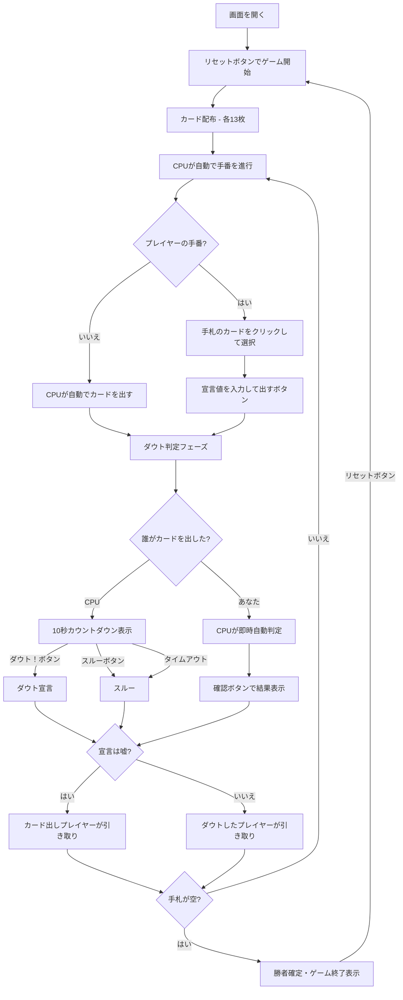

# ダウト（Web版）遊び方

## ゲーム概要

4人（プレイヤー1人 + CPU 3人）で遊ぶカードゲームです。カードを場に出す際に宣言する値が本当かどうかを見極めながら、手札を最初になくしたプレイヤーが勝者です。

## 起動方法

```sh
go run ./cmd/cli web        # CLI経由でWebサーバーを起動
go run ./cmd/server         # 直接Webサーバーを起動
```

ブラウザで `http://localhost:8080` にアクセスし、ナビゲーションバーから「ダウト」を選択します。
ナビバーのJA/ENボタンで日本語・英語を切り替えられます。

## ルール

### 基本ルール

- 52枚のトランプを4人に配布（1人13枚）
- 順番にカードを1枚以上場に出し、出した枚数と宣言する値を伝える
- 宣言する値は本当でも嘘でも構わない（ブラフ可）
- 他のプレイヤーは「ダウト（嘘だ）」または「スルー（信じる）」を選択する
- **ダウトの結果**:
  - 宣言が嘘だった場合 → カードを出したプレイヤーが場のカードをすべて引き取る
  - 宣言が本当だった場合 → ダウトしたプレイヤーが場のカードをすべて引き取る
- 最初に手札をなくしたプレイヤーが勝者

### ダウト判定ウィンドウ

- CPU がカードを出した後、設定した秒数（デフォルト **10秒**）のカウントダウンが表示される
- カウントダウン中に「ダウト！」または「スルー」ボタンをクリックして判断する
- あなたがカードを出した後は CPU が即時自動判定し、「確認」ボタンで結果を確認する
- ゲーム設定パネル（▶ 設定）でカウントダウン秒数を変更できる（3秒 / 5秒 / 10秒）

### CPU のメモリ・推理 AI

- CPU は公開されたカード（ダウト解決時）を記憶する
- 記憶したカードと自分の手札を合わせて「**物理的に不可能な宣言**」を検出すると 100% ダウトを宣言する
  （例: 既に4枚すべての「7」が確認済みなのにさらに「7」が宣言された場合）
- 通常時は 30% の確率でランダムにダウトを宣言する
- ゲーム設定パネル（▶ 設定）で CPU の記憶精度を変更できる:
  - **Easy**: 約 30% 保持（CPU がよく忘れる）
  - **Normal**: 約 70% 保持（デフォルト）
  - **Hard**: 100% 保持（CPU が完璧に記憶）

### 記憶の減衰

- CPU の記憶はターンが進むにつれて確率的に忘れていく（人間らしい忘却）
- 忘却確率 = 減衰率 × 経過ターン数（古い記憶ほど忘れやすい）
- 減衰率は記憶力レベルに連動:
  - **Easy**: 0.15/ターン（忘れやすい）
  - **Normal**: 0.05/ターン
  - **Hard**: 0.0（忘れない）

### ペナルティ上限（PenaltyDrawLimit）

- ダウト敗者が引き取るカードの上限枚数を設定できる
- 0（デフォルト）= 無制限（敗者が場のカードをすべて引き取る）
- 上限を超えた分のカードはゲームから除外される（誰の手札にも入らない）
- ゲーム設定パネル（▶ 設定）で「ペナルティ上限」を変更できる（無制限 / 3枚 / 5枚 / 10枚）
- ダウト結果表示時に除外されたカード枚数が表示される

### 動的ブラフ確率

- CPU のブラフ確率は状況に応じて変動する（基本 40%）
- 手札残り1枚: 10%（リスク回避）
- テーブルに20枚以上: 基本から −15%（引き取りリスクが大きい）
- テーブルに10枚以上: 基本から −10%

### CPU テル（緊張の兆候）

- CPU がブラフでカードを出した際、確率的に「テル」（💧マーク）が表示される
- テルが表示された CPU は嘘をついている可能性が高い（ダウトの判断材料になる）
- テルの表示確率は CPU の記憶力レベル（難易度）に連動:
  - **Easy**: 40%（テルが出やすい → ブラフを見破りやすい）
  - **Normal**: 20%
  - **Hard**: 5%（テルがほぼ出ない → 上級者向け）
- テルはブラフ時のみ発生し、正直なプレイでは表示されない

### CPU 迷い時間ディレイ

設定で「CPU迷い時間ディレイ」を有効にすると、CPUがカードを出す際の表示ディレイがブラフ状態に応じて変化する。

| 状態 | ディレイ範囲 | 直感 |
|------|-------------|------|
| ブラフ（60%確率） | 300–500ms（速い） | 緊張して急ぐ |
| ブラフ（40%確率） | 1200–1800ms（遅い） | 考えすぎて遅れる |
| 正直 | 600–1000ms（中間） | 落ち着いた反応 |

## ゲームの流れ



## 画面の操作方法

### カードの出し方（プレイフェーズ）

1. 画面下部の手札エリアに自分のカードが表示されます
2. 出したいカードをクリックすると選択状態になり、カードが少し上に浮き上がります（緑枠）
3. 複数枚選択することで一度に複数枚出せます
4. カードを選択すると「宣言する値」入力欄が表示され、自動的にフォーカスされます
5. 宣言する値（1〜13）を入力します（1=A、11=J、12=Q、13=K）
6. **「出す」** ボタンをクリックしてカードを場に出します

### ダウトの判断（CPU がカードを出した後）

1. CPU がカードを出すと「ダウトしますか？」エリアが表示されます
2. カウントダウンタイマー（残り N 秒）が表示されます
3. **「ダウト！」** ボタン: ダウトを宣言する
4. **「スルー」** ボタン: ダウトせずに次のターンへ進む
5. カウントダウンが 0 になると自動的にスルーになります

### 結果の確認（あなたがカードを出した後）

1. あなたがカードを出すと「CPUがダウトを判定中...」エリアが表示されます
2. CPU がダウトした場合は CPU 名が表示されます
3. **「確認」** ボタンをクリックしてダウト判定結果を確認します

## 画面構成

```
┌────────────────────────────────────────────┐
│  ▶ 設定 (クリックで展開)                   │
│    ダウト判定時間: [10秒▼]                 │
│    CPU の記憶力:  [Normal▼]               │
│    ペナルティ上限: [無制限▼]               │
├────────────────────────────────────────────┤
│           CPU プレイヤーエリア              │
│ ┌──────────┐ ┌──────────┐ ┌──────────┐    │
│ │ CPU 1    │ │ CPU 2    │ │ CPU 3    │    │
│ │ 12枚     │ │考え中... │ │ 上がり   │    │
│ └──────────┘ └──────────┘ └──────────┘    │
├────────────────────────────────────────────┤
│               テーブルエリア                │
│  場のカード: 5枚                            │
│  CPU 2が3枚出しました (宣言: 7)             │
├────────────────────────────────────────────┤
│          ダウト判定フェーズ (CPU プレイ時)  │
│  ダウトしますか？                           │
│  残り 8 秒                                 │
│  ダウト宣言CPU: CPU 1                      │
│  [ダウト！] [スルー]                        │
├────────────────────────────────────────────┤
│             ダウト結果                      │
│  ウソでした！                               │
│  CPU 2が5枚引き取りました                   │
│  2枚がゲームから除外されました              │
│  [♠3][♥J] (公開カード)                    │
├────────────────────────────────────────────┤
│         フッター: あなた (13枚)              │
│  [♠2][♣5][♥9][♦J]...                     │
│    宣言する値: [5▲▼] (5)                   │
│  [リセット] [出す]                          │
└────────────────────────────────────────────┘
```

- **CPU プレイヤーエリア**: 各 CPU の手札枚数を表示
  - 手番の CPU は金色枠 + 「考え中...」バッジ
  - 上がったプレイヤーは「上がり」バッジ（緑色）
  - ブラフ時に「テル」が出た CPU は 💧 マークが表示される（2秒間のアニメーション後にフェードアウト）
- **テーブルエリア**: 場に積まれているカードの枚数と最後のプレイ情報
- **ダウト判定フェーズ**（CPU プレイ後）:
  - カウントダウンタイマーと「ダウト！」「スルー」ボタン
  - CPU がダウトを宣言している場合はその CPU 名を表示
- **ダウト判定フェーズ**（あなたプレイ後）:
  - 「CPUがダウトを判定中...」と「確認」ボタン
- **ダウト結果**: 嘘/本当の判定結果、引き取り情報、除外枚数（ペナルティ上限設定時）、公開されたカード
- **フッター（あなたの手札）**:
  - クリックで選択（緑枠 + 上に浮き上がる）
  - 「宣言する値」入力欄（カード選択時に表示）
  - 「出す」ボタン（カードを選択すると有効化）
- **設定パネル（▶ 設定）**:
  - 「ダウト判定時間」セレクト: 3秒 / 5秒 / 10秒 から選択
  - 「CPU の記憶力」セレクト: Easy / Normal / Hard から選択
  - 「ペナルティ上限」セレクト: 無制限 / 3枚 / 5枚 / 10枚 から選択
  - 「Meta-AI」チェックボックス: 有効にすると、CPUがセッション内のゲーム履歴（プレイヤーのブラフ率・ダウト正答率）を学習し、ブラフやダウトの戦略を適応的に調整する
  - 次のリセット時に設定が適用される

## 遊び方のコツ

- 手持ちのカードを見て、宣言と一致するカードが多い値を宣言すると安全です
- 相手がブラフを続けているようであれば積極的にダウトしましょう
- 場のカードが多いときにダウトして成功すると、相手に大量のカードを引き取らせられます
- カウントダウン中にダウトするかどうか迷う場合は、場に積まれたカード枚数も判断材料にしましょう
- 複数枚まとめてカードを出すと手札を素早く減らせます
