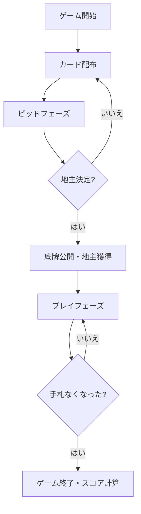

# 斗地主（Web版）遊び方

## ゲーム概要

斗地主（Dou Dizhu / Fight the Landlord）は、中国で最も人気のある3人用カードゲームです。1人の「地主」と2人の「農民」チームに分かれ、手札を先に出し切ることを目指します。

## 起動方法

```sh
go run ./cmd/trumpcards web  # CLI経由でWebサーバーを起動
go run ./cmd/server          # 直接Webサーバーを起動
```

ブラウザで `http://localhost:8080` にアクセスし、ナビゲーションバーから「斗地主」を選択します。
ナビバーのJA/ENボタンで日本語・英語を切り替えられます。

## ルール

- 54枚のカード（ジョーカー2枚含む）を使用
- 各プレイヤーに17枚ずつ配り、3枚を底牌として伏せる
- ビッドで地主を決定。地主は底牌3枚を獲得し20枚で戦う
- カードの強さ: 3 < 4 < ... < K < A < 2 < 小ジョーカー < 大ジョーカー
- 役: 単張、対子、三条、三帯一、三帯二、順子(5+)、連対(3+)、飛機、爆弾(4枚)、火箭(ジョーカー2枚)
- 爆弾と火箭はどんな役にも勝てる

## ゲームの流れ



## 画面の操作方法

- **ビッドフェーズ**: 「1で叫ぶ」「2で叫ぶ」「3で叫ぶ」「パス」ボタンで入札
- **プレイフェーズ**: カードをクリックして選択し、「出す」ボタンで出す。「パス」で見送り
- **リセット**: 「新しいゲーム」ボタンで再開

## 画面構成

- 上部: CPUプレイヤーの情報（カード枚数、役割）
- 中央: 底牌表示、場のカード
- 下部: 自分の手札、操作ボタン

## 遊び方のコツ

- 弱いカードから出して強いカードを温存しましょう
- 爆弾は決定的な場面まで取っておく
- 農民同士は協力して地主を倒す
