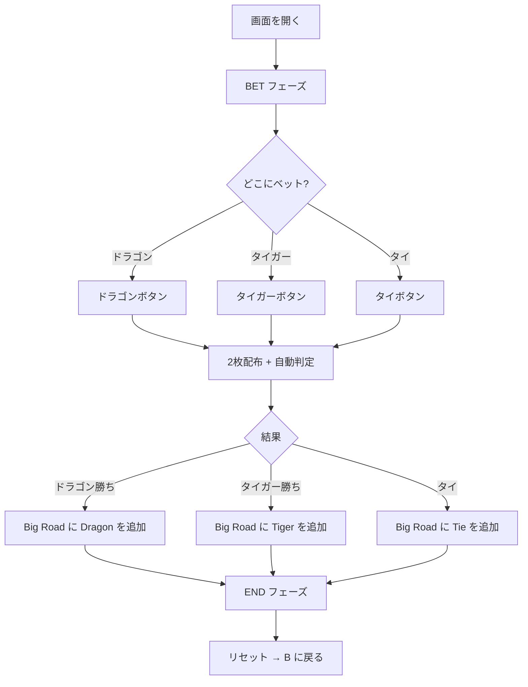

# ドラゴンタイガー（Web版）遊び方

## ゲーム概要

Dragon Tiger（ドラゴンタイガー）は、アジアンカジノで人気の超高速 1 対 1 比較ゲーム。ドラゴン枠とタイガー枠に 1 枚ずつカードを配り、ランクの高い側が勝つ。Aceが最弱、Kingが最強。プレイヤーはドラゴン勝ち / タイガー勝ち / タイ（同ランク）の 3 つから 1 つにベットする。

## 起動方法

```sh
go run ./cmd/trumpcards web  # CLI経由でWebサーバーを起動
go run ./cmd/server          # 直接Webサーバーを起動
```

ブラウザで `http://localhost:8080` にアクセスし、「テーブルゲーム > ドラゴンタイガー」を選択します。

## ルール

### 基本ルール

- ドラゴン / タイガーの 2 枠に 1 枚ずつカードが配られる
- ランク比較: A=1（最弱） < 2 < 3 < … < J=11 < Q=12 < K=13（最強）
- スートは無視する（ランクのみで勝敗を決める）
- 勝った側にベットしていれば的中

### ベット種別と配当

| ベット | 結果 | 配当 |
|---|---|---|
| ドラゴン | ドラゴン勝ち | 1:1（賭け金 + 同額） |
| ドラゴン | タイガー勝ち | 没収 |
| ドラゴン | タイ | **賭け金の半分が返還** |
| タイガー | タイガー勝ち | 1:1 |
| タイガー | ドラゴン勝ち | 没収 |
| タイガー | タイ | **賭け金の半分が返還** |
| タイ | タイ | **8:1**（賭け金 + 8 倍） |
| タイ | ドラゴン or タイガー勝ち | 没収 |

### ベット制限

- 最低ベット: 10 チップ
- 最大ベット: 10,000 チップ
- ベット額は 10 の倍数で指定

## ゲームの流れ



## 画面の操作方法

### ベットフェーズ

1. **チップ額を入力** — フッターの数値入力欄でベット額を設定
2. **3 つのボタンから 1 つを選んでクリック** — ドラゴン / タイガー / タイ
3. キーボードショートカット: `D` = Dragon, `T` = Tiger, `E` = Tie

### 結果フェーズ

- **リセット** ボタンで次ラウンド開始（キーボード: `R`）
- **履歴クリア** ボタンで Big Road をリセット
- **棋譜** ボタンでアクションログを表示

## 画面構成

- **ヘッダー**: 現在のチップ残高 + CLI モードトグル
- **メインエリア**: ドラゴン / タイガー の 2 枚カード表示、Big Road（履歴）
- **フッター**: ベット額入力 + ベットボタン群（BET フェーズ）または リセット / 履歴クリア / 棋譜（END フェーズ）

### Big Road（罫線）の見方

- 🔴 **D**（赤い丸）: ドラゴン勝ち
- 🟡 **T**（黄色い丸）: タイガー勝ち
- ⚪ **=**（灰色の丸）: タイ

## 遊び方のコツ

1. **ハウスエッジを意識する**:
   - ドラゴン / タイガーベット: 約 3.73%（タイで半額返還を含む）
   - タイベット: 約 32%（高配当だが期待値が悪い）
   - 統計的にはドラゴン or タイガーへのベットが堅実
2. **Big Road の偏りを観察する** — 直近の流れに従うか逆らうかは戦略次第（数学的な期待値は変わらないが、エンタメ的な楽しみ）
3. **タイ返還ルールを忘れない** — タイになっても全額没収ではないので、長期的にはバンキー（カジノ側）の取り分が小さく抑えられる
