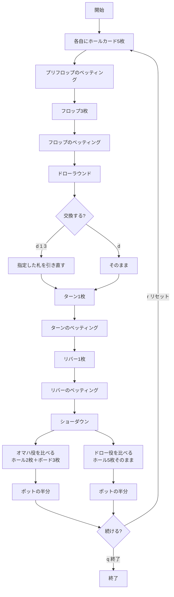

# ドラマハ（Web版）遊び方

## ゲーム概要

アメリカのミックスゲームで遊ばれるスプリットポットのポーカーです。**同じ5枚を二度使う**のがこのゲームの発想で、ポットは常に二分されます。

- **オマハ役**: ホールカードから**ちょうど2枚**＋ボードから**ちょうど3枚**（オマハと同じ）
- **ドロー役**: 5枚のホールカードを**そのまま**。ボードは一切使いません

さらに、フロップのベッティングが終わったところで**ドローラウンド**があり、ホールカードを好きな枚数だけ1回交換できます。

## 起動方法

```sh
go run ./cmd/trumpcards web   # CLI経由でサーバを起動
go run ./cmd/server           # サーバを直接起動
```

ブラウザで `http://localhost:8080/dramaha` を開きます。

## ルール

### 基本ルール

- 52枚のトランプ（ジョーカーなし）を使用
- 卓は**4人固定**。1人あたり最大10枚（ホール5枚＋交換5枚）使い、ボードに5枚要るため、
  6人卓なら65枚、9人卓なら95枚必要になり、52枚の山では配りきれません
- 各プレイヤーに**ホールカード5枚**（オマハは4枚）
- コミュニティカードはフロップ3枚・ターン1枚・リバー1枚。各段階でベッティング
- **フロップのベッティング後にドローラウンド**。何枚でも1回だけ交換できる
- ショーダウンでポットを**常に二分**する

### オマハとの違い

| | オマハ | ドラマハ |
|---|---|---|
| ホールカード | 4枚 | **5枚** |
| 交換 | 無し | **フロップ後に1回** |
| ポット | ハイのみ（Hi-Lo版はハイ/ロー） | **常にオマハ役 / ドロー役で二分** |
| 二つ目の評価 | ロー（8以下・ペア無しで成立） | **ドロー役（5枚そのまま）** |

**ドロー側は必ず成立します。** Hi-Lo のローは条件を満たさなければ不成立になり得ましたが、5枚あればどんな手でも役として順位が付きます。だから「片方に勝者が居ないので反対側が総取り」は起きません。

### 配当

ポットは半分ずつ。オマハ役の最強手が半分、ドロー役の最強手が半分を取ります。**同じプレイヤーが両方を制すれば総取り**です。奇数チップはポーカーの慣例どおりオマハ側に寄せます。

## ゲームの流れ



## 画面の操作方法

| 操作 | 説明 |
|------|------|
| チェック / ベット / コール / レイズ / フォールド | 通常のベッティング操作 |
| カードを選ぶ | ドローラウンドで交換したい札をクリック（何枚でも） |
| 交換ボタン | 選んだ札を引き直す |
| そのまま | 交換せずに進む |
| リセットボタン | ゲームを最初からやり直す |
| CLIモード | 画面上でコマンド入力に切り替える（`c`, `b`, `ra`, `f`, `d`, `log`, `r`） |

CLIモードのドローは**1始まり**の札番号で指定します（`d 1 3`）。画面のクリック選択と同じ札を指しています。

## 画面構成

- **上部**: ポット、コミュニティカード、テーブルサイズ、ディーラー位置
- **オマハ側の縛りとポット二分の説明**: 常に表示されます
- **自分の手札**: ホールカード5枚と、**今の時点でのオマハ役とドロー役の両方**。二つの評価軸を並べて出すので、どちらで戦っているかが常に見えます
- **ドローパネル**: ドローラウンドでのみ表示。交換したい札の選択と、交換・そのままの操作
- **各席**: チップ、ベット額、プレイスタイル、統計（VPIP / PFR / 3Bet / AF）
- **結果表示**: 各プレイヤーのオマハ役とドロー役、そしてそれぞれで取った額
- **アクションログ**: そのハンドの操作履歴

