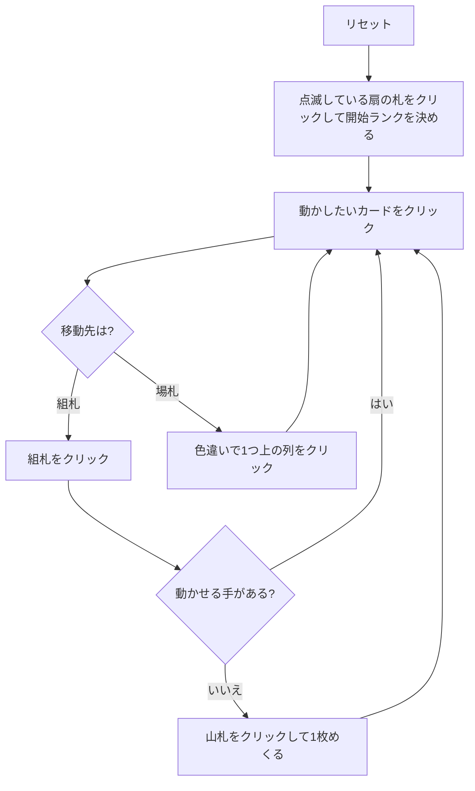

# ダッチェス（Web版）遊び方

## ゲーム概要

52 枚 1 組で遊ぶカンフィールド系ソリティア。別名グレンウッド (Glenwood)。**4 つのリザーブ扇に 3 枚ずつ（計 12 枚）**、タブロー 4 列に 1 枚ずつ配り、残り 36 枚が山札になる。

最大の特徴は**基礎札の開始ランクを自分で選ぶ**こと。ゲーム開始時に 4 つの扇の一番上から 1 枚を選び、そのランクが 4 つの基礎札すべての開始ランクになる。

## 起動方法

```sh
go run ./cmd/trumpcards web  # CLI経由でWebサーバーを起動
go run ./cmd/server          # 直接Webサーバーを起動
```

ブラウザで `http://localhost:8080` にアクセスし、ナビゲーションバーから「ダッチェス」を選択します。
ナビバーのJA/ENボタンで日本語・英語を切り替えられます。

## ルール

- 52 枚 1 組。リザーブは 3 枚ずつの扇が 4 つ、タブローは 4 列、残り 36 枚が山札
- 使えるのは各リザーブ扇の**一番上の 1 枚だけ**
- 最初に扇の一番上を 1 枚クリックして開始ランクを決める。**それまで他の操作はすべてできない**
- 基礎札はスートごとに 4 つ。開始ランクから同スートで昇順、**K の次は A に折り返す**
- タブローは**色違いの降順**。A の下に K を置ける。連番はまとめて動かせる
- **リザーブが 1 枚でも残っているうちは、空いた列にはリザーブからしか置けない**（画面上も「R のみ」と表示される）
- 山札は 1 枚ずつめくって捨て札へ。**めくり直しは無い**
- 4 つの基礎札すべてが一周すればクリア

## ゲームの流れ



## 画面の操作方法

| 操作 | 説明 |
|------|------|
| 扇の一番上をクリック（開始ランク未決定のとき） | そのカードのランクを 4 つの組札すべての開始ランクにする |
| 扇の一番上をクリック（開始ランク決定後） | そのカードを移動元として選択する |
| 場札のカードをクリック | そのカードを移動元として選択する。**連番の途中を選べば、そこから末尾までがまとめて動く** |
| 捨て札をクリック | 一番上の札を移動元として選択する |
| 組札をクリック | 選択中のカードをその組札に置く |
| 別の列をクリック | 選択中のカード（または連番）をその列に置く |
| 山札 / めくるボタン | 山札を 1 枚めくって捨て札へ送る |
| ドラッグ＆ドロップ | クリック 2 回と同じ移動をドラッグでも行える |
| ヒントボタン | 組札 → 場札の順に手を 1 つ提示する |
| 自動完成ボタン | 組札へ送れる札がなくなるまで自動で送る |
| 元に戻す / 手詰まり脱出ボタン | 1 手戻す / 脱出に必要な手数だけまとめて戻す |
| ギブアップ / リセットボタン | 確認ダイアログのうえで投了 / やり直す |
| CLI トグル | 同じゲームをコマンド入力で操作するモードに切り替える |

キーボードショートカット: `d` めくる / `h` ヒント / `a` 自動完成 / `z` 元に戻す / `g` ギブアップ（確認あり）。

## 画面構成

- **上部**: フェーズ表示、開始ランク（未決定のうちは「未決定」）、手数
- **中央上段**: 4 つのリザーブ扇（番号と残り枚数つき）、4 つの組札、山札と捨て札。開始ランク未決定のときは扇が緑に点滅する
- **中央下段**: 4 列の場札。列番号 `#0`〜`#3` はヒント表示の列番号と一致する。リザーブが残っているうちの空き列は「R のみ」と表示
- **下部**: ヒント表示、アクションログ、設定、キーボードショートカット一覧

## 遊び方のコツ

- **開始ランクは扇の一番上 4 枚から選ぶ「唯一の自由」。** 扇や場で続きが見えているスートを基準にすると回りやすい
- **空き列は掘る道具ではなく、リザーブの出口。** リザーブが残っているうちは他から置けないので、列を空けたら必ずリザーブから埋める
- 逆に言えば、**リザーブ 12 枚を先に消化してしまえば空き列が自由になる**。序盤はリザーブ優先で組み立てる
- 山札は 1 巡しか回らない。めくる前に置き場所を作っておく
- 詰まったら元に戻すで分岐をやり直す
