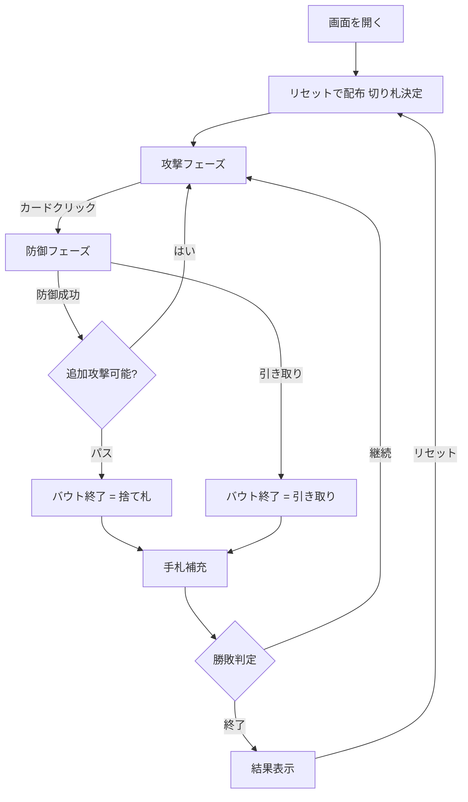

# ドゥラーク（Web版）遊び方

## ゲーム概要

Durak（ドゥラーク）は東欧で人気のカードゲーム。36枚のデッキ（各スートの6〜A）を使用し、2〜6人でプレイする。最後まで手札を持っていたプレイヤーが「ドゥラーク（愚か者）」として負けとなる。

## 起動方法

```sh
go run ./cmd/trumpcards web        # CLI経由でWebサーバーを起動
go run ./cmd/server                # 直接Webサーバーを起動
```

ブラウザで `http://localhost:8080` にアクセスし、ナビゲーションバーから「ドゥラーク」を選択します。
ナビバーのJA/ENボタンで日本語・英語を切り替えられます。

## ルール

### デッキと配り

- 36枚デッキ（6, 7, 8, 9, 10, J, Q, K, A × 4スート）
- 各プレイヤーに6枚ずつ配る
- 山札の底のカードが切り札スートを決定

### 基本ルール

- 攻撃者がカードを1枚出し、防御者はより強い同スートのカードまたは切り札で防ぐ
- 防御成功ならカードは捨て札、失敗なら防御者が場のカードを全て引き取る
- 各バウト終了後、山札から手札が6枚になるよう補充
- 切り札スートのカードは非切り札の全てに勝つ
- 異スート（切り札でない）同士では防御不可

### カードの強さ

- 同スート内: 数値が大きいほど強い（6 < 7 < ... < K < A）

### 勝利条件

手札を先になくしたプレイヤーから順に上がり。最後まで手札を持っていたプレイヤーが「ドゥラーク」（負け）。

## ゲームの流れ



## 画面の操作方法

### 攻撃フェーズ

1. 手札の中からカードをクリックして選択
2. 「攻撃」ボタンで場に出す
3. 「パス」ボタンで追加攻撃をやめる

### 防御フェーズ

1. 場の攻撃カードをクリックして選択
2. 手札から防御に使うカードをクリック
3. 「防御」ボタンで防御を確定
4. 防御できない場合は「引き取り」ボタンで全カードを引き取る

### 設定

- CPU難易度: Easy / Normal / Hard
- 手札ソート: スート順 / 値順

## 画面構成

```
┌────────────────────────────────────────────┐
│  CPU1 (手札枚数)  CPU2 (手札枚数)  CPU3     │
│                                            │
│  山札残り / 切り札表示                        │
│                                            │
│  場: [攻撃 / 防御] [攻撃 / 防御]              │
│                                            │
│  あなた: [♠6] [♣7] [♥10] [♦Q] [♠A] [♥K]    │
│                                            │
│  [攻撃] [防御] [パス] [引き取り] [リセット]    │
└────────────────────────────────────────────┘
```

- **CPUエリア**: 各CPUの残り手札枚数を上部に表示
- **山札 / 切り札**: 山札残り枚数と切り札スート
- **場**: 攻撃カードと防御カードのペアを表示
- **自分の手札**: 下部に表示、クリックで選択
- **操作ボタン**: 攻撃・防御・パス・引き取り・リセット

## 遊び方のコツ

- 切り札は最後まで温存する
- 弱いカードから順に攻撃に使い、手札を減らす
- 防御できない攻撃に切り札を使いすぎると後半に苦しくなる
