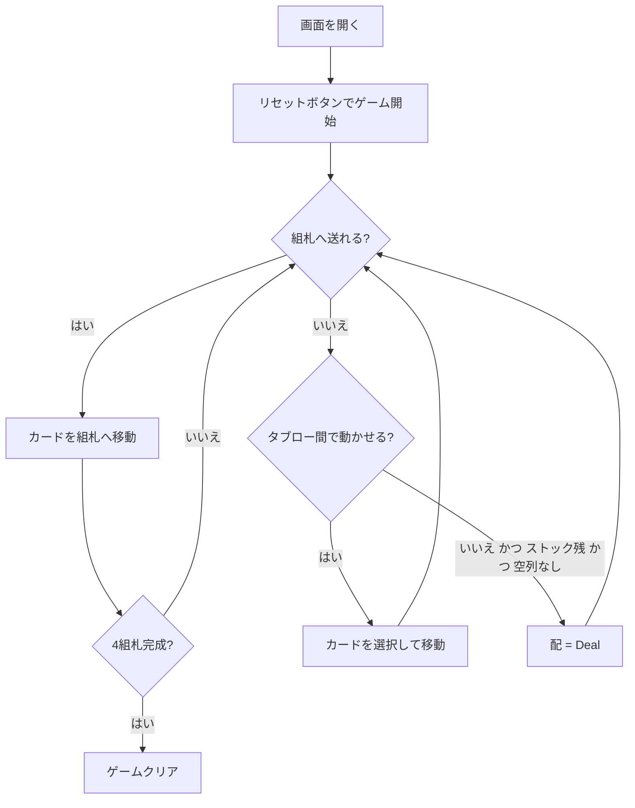

# イーストヘイブン（Web版）遊び方

## ゲーム概要

イーストヘイブン（Easthaven）は1人用のソリティアカードゲームで、クロンダイク（Klondike）とスパイダー（Spider）のメカニクスを融合させた作品です。タブローの移動ルール（赤黒交互・降順）と組札（A→K昇順）はクロンダイクと同じですが、ストックからの配り方（全タブロー列に1枚ずつ配る）はスパイダーと同じです。7列の場札とストックを駆使し、4つの組札をすべてA→Kの順に積み上げればクリアです。「クロンダイクより戦略的で、スパイダーほど時間がかからない」と評される良作です。

## 起動方法

```sh
go run ./cmd/trumpcards web   # CLI経由でWebサーバーを起動
go run ./cmd/server           # 直接Webサーバーを起動
```

ブラウザで `http://localhost:8080` にアクセスし、ナビゲーションバーから「イーストヘイブン」を選択します。
ナビバーのJA/ENボタンで日本語・英語を切り替えられます。

## ルール

### 配り方

- 7列のタブローに3枚ずつ配ります（先頭2枚が裏向き、末尾1枚が表向き）
- 残り31枚はストックとして保持

### 移動ルール

- **タブロー → タブロー**: 赤黒交互・降順に並んだ表向きのカード群を移動できます。移動先の最上段カードと **色が交互で1つ下のランク** の関係が必要です。**空の列にはKのみ** 置けます（クロンダイクと同じ）
- **タブロー → 組札**: A→Kの昇順で、同じスートのみ積み上げられます
- **ストックからの配布（Deal）**: ストックにカードが残っていて、かつ空の列が1つもない場合のみ、各列の末尾に1枚ずつ表向きで配ります（スパイダー方式）

### クリア

- 4つの組札すべてがA→Kまで揃うとゲームクリアです
- **ギブアップ**: いつでもギブアップ可能
- **手詰まり**: 有効な手も配布もできない場合、手詰まりと判定されます

## ゲームの流れ



## 画面の操作方法

### カードの移動

1. 移動したい表向きのカード（赤黒交互・降順の並びの先頭）をクリック（選択状態になる）
2. 移動先の列、または組札をクリック
3. ドラッグ&ドロップでも移動可能

### ストックからの配布

- 空列がない状態で「配」ボタンを押すと、ストックから各列の末尾に1枚ずつ配られます

### キーボードショートカット

| キー | アクション | 有効条件 |
|------|-----------|---------|
| H | ヒント | プレイ中 |
| A | オートコンプリート | 全カード表向き かつ ストック0 |
| G | ギブアップ | プレイ中 |
| Z | 元に戻す | アンドゥ可能時 |
| D | 配（Deal） | プレイ中 |

## 画面構成

```
┌────────────────────────────────────────────┐
│  手数: N      Stock: 31                     │
├────────────────────────────────────────────┤
│  組札:  [♠]  [♣]  [♥]  [♦]                │
├────────────────────────────────────────────┤
│  列0  列1  列2  列3  列4  列5  列6        │
│  [??] [??] [??] [??] [??] [??] [??]       │
│  [??] [??] [??] [??] [??] [??] [??]       │
│  [K♠] [8♥] [5♣] [10♦][3♠] [7♥] [2♣]       │
├────────────────────────────────────────────┤
│  [リセット] [配] [ヒント] [自動完成]       │
│  [元に戻す] [ギブアップ]                   │
└────────────────────────────────────────────┘
```

## 遊び方のコツ

- まず裏向きカードを早く解放することを優先しましょう
- 空列はKでしか埋められないため、Kの確保を意識しましょう
- 低いランクのカードは早めに組札へ送ると盤面が整理しやすくなります
- ストックの配布は全列が埋まっている必要があります。空列をなくしてから配りましょう
- 配布は盤面の手が尽きてからにすると、不要にカードを増やさずに済みます
- 手詰まりになったら「元に戻す」で戻ってやり直しましょう
