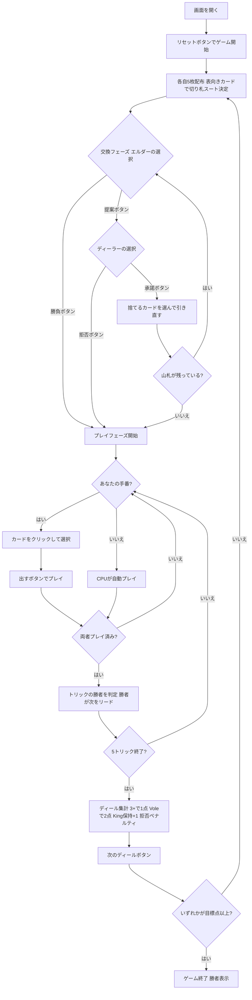

# エカルテ（Web版）遊び方

## ゲーム概要

Écarté（エカルテ）は2人用のフランス系トリックテイキングゲームです。**32枚のデッキ**（A,7,8,9,10,J,Q,K × 4スート）を使い、各自5枚を持って戦います。プレイの前に**交換（エクスチェンジ）フェーズ**があり、エルダー（非ディーラー）が交換を提案（Propose）するか勝負（Stand）するかを決め、提案された場合はディーラーが承諾（Accept）か拒否（Refuse）を選びます。承諾されると各自が任意の枚数を捨てて山札から引き直し、これを山札が尽きるまで繰り返せます。その後5トリックのマストフォロー戦に入ります。ランクは K>Q>J>A>10>9>8>7。3トリック以上で1点、全5トリック（Vole）で2点。スコアはディールをまたいで累積し、先に**目標点（既定5点）**へ達したプレイヤーの勝利です。あなたは人間プレイヤーとして CPU と対戦します。

## 起動方法

```sh
go run ./cmd/trumpcards web         # CLI経由でWebサーバーを起動
go run ./cmd/trumpcards web --open  # サーバー起動 + ブラウザを開く
go run ./cmd/server                 # 直接Webサーバーを起動
```

ブラウザで `http://localhost:8080` にアクセスし、ナビゲーションバーから「エカルテ」を選択します。
ナビバーのJA/ENボタンで日本語・英語を切り替えられます。

## ルール

### デッキと配布

- **デッキ**: 32枚（A,7,8,9,10,J,Q,K × 4スート）
- **プレイヤー**: 2人（あなた vs CPU）
- **配布**: 各プレイヤー5枚。残りは山札となり、次の1枚を表向きにして**切り札スート**を決めます。
- **めくれたキング**: 表向きにされたカードが King だった場合、ディーラーに **+1点** が入ります。

### カードの強さ

- トリック内の強さ（強い順）は K > Q > J > A > 10 > 9 > 8 > 7。
- 切り札はすべての非切り札を上回ります。

### 交換（エクスチェンジ）フェーズ

- **エルダー（非ディーラー）** が選びます。
  - **「提案」(Propose)**: カード交換を申し込みます。
  - **「勝負」(Stand)**: 交換せず、配られた手札のままプレイへ進みます。
- 提案された場合、**ディーラー** が応じます。
  - **「承諾」(Accept)**: 交換に応じます。両者が捨てたいカードを選んで山札から引き直します。引き直し後、エルダーが再び提案／勝負を選びます（山札が尽きるまで繰り返せます）。
  - **「拒否」(Refuse)**: 交換を断り、そのままプレイへ進みます。
- **拒否ペナルティ**: ディーラーが拒否したのに、そのディールで **3トリック未満** しか取れなかった場合、エルダーに **+1点** が加算されます。

### プレイフェーズ

- **マストフォロー**: リードスートを持っていれば必ず出し、さらに**勝てるなら勝たなければなりません**。リードスートを持たない場合は切り札を出します（切り札もなければ任意札）。
- 5トリックを切り札ありで戦い、各トリックの勝者が次のトリックをリードします。

### 切り札の King

- 切り札の **King を手札に持っている** プレイヤーは **+1点**（自動で宣言されます）。

### 得点計算と勝利条件

| 条件 | 得点 |
|------|------|
| 3トリックまたは4トリック獲得 | 1点 |
| 全5トリック獲得（Vole） | 2点 |
| 切り札の King を手札に保持 | +1点 |
| めくれたカードが King（ディーラー） | +1点 |
| ディーラーが拒否して3トリック未満 | エルダーに +1点 |

- スコアはディールをまたいで累積し、先に**目標点（既定5点）**へ達したプレイヤーの勝ちです。

## ゲームの流れ



## 画面の操作方法

### EXCHANGEフェーズ（交換フェーズ）

- あなたがエルダーのとき、**「提案」**または**「勝負」**ボタンが表示されます。
  - 「提案」を押すと交換を申し込みます。CPU（ディーラー）が承諾／拒否を判断します。
  - 「勝負」を押すと交換せずプレイフェーズへ進みます。
- あなたがディーラーで、CPU が提案してきたときは、**「承諾」**または**「拒否」**ボタンが表示されます。
- 交換が承諾されたら、手札のカードをクリックして捨てるカードを選び、**「捨てる」ボタン**で引き直します。

### PLAYフェーズ（トリックフェーズ）

- あなたの手番のとき、手札のカードをクリックして選択します。
- **「出す」ボタン**: 選択したカードをプレイします。マストフォロー義務に従う必要があります（義務に反するカードは選択できません）。

### ディール終了時

- **「次のディール」ボタン**: スコアを集計して次のディールへ進みます。目標点に達していればゲーム終了です。

## 画面構成

```
┌─────────────────────────────────────────────────────────┐
│  Écarté (エカルテ) [JA/EN] [CLI]                         │
├─────────────────────────────────────────────────────────┤
│  ディール: 1  フェーズ: EXCHANGE                         │
│  切り札: ♥  山札: 21枚                                   │
│  あなた=0  CPU=0                                         │
├──────────┬──────────────────────────────────────────────┤
│  CPU     │                                               │
│  手札:5枚 │     現在のトリック表示エリア                  │
│          │     （両プレイヤーの出したカード）             │
│          │                                               │
├──────────┼──────────────────────────────────────────────┤
│  メッセージ・結果表示                                     │
├──────────┴──────────────────────────────────────────────┤
│  あなたの手札（クリックで選択）                           │
│  [K♥][Q♠][J♦][9♣][7♠]                                  │
│  [提案][勝負]                    ← EXCHANGE（エルダー）  │
│  [承諾][拒否]                    ← EXCHANGE（ディーラー）│
│  [捨てる]                        ← 承諾後の捨て札選択     │
│  [出す]                          ← PLAYフェーズ          │
│  [次のディール]                  ← ディール終了時        │
└─────────────────────────────────────────────────────────┘
```

- **ヘッダー**: ゲーム名・フェーズ表示・言語切り替えトグル・CLI切り替えトグル。
- **ディール／フェーズ表示**: 現在のディール番号とフェーズ（EXCHANGE / PLAY）。
- **切り札・山札行**: 表向きカードで決まった切り札スートと、山札の残り枚数。
- **スコア**: あなたと CPU の累積スコアをリアルタイムで表示（目標点に先着で勝利）。
- **プレイヤー表示エリア（左）**: CPU の手札枚数を表示。
- **トリック表示エリア（中央）**: 場に出ているカード。
- **メッセージボックス**: フェーズ・交換のやり取り・ディール結果・勝敗の案内。
- **フッター（手札エリア）**: あなたの手札と操作ボタン（EXCHANGEは提案／勝負・承諾／拒否・捨てる、PLAYは出す、ディール終了時は次のディール）。

## 遊び方のコツ

- **交換の見極め**: 弱い手札のときは「提案」で引き直し、強い手札のときは「勝負」で即プレイ。切り札の King や K/Q が揃っているなら無理に交換する必要はありません。
- **拒否のリスク**: ディーラーで「拒否」した場合、そのディールで3トリック取れないとエルダーに +1点を献上します。拒否は3トリック以上を確実に見込めるときだけにしましょう。
- **切り札の King を温存**: 切り札の King を手札に保持しているだけで +1点。安易に切らず、終盤まで持っておくと得点源になります。
- **Vole（5トリック総取り）を狙う**: 3トリックで1点に対し、5トリック総取りは2点。強い手札のときは全勝を狙って大きくリードしましょう。
- **マストフォローで勝ちにいく**: プレイフェーズではフォローして勝てる札があれば出す義務があります。手なりで取れるトリックを逃さず、3トリックの確保を最優先に組み立てます。
