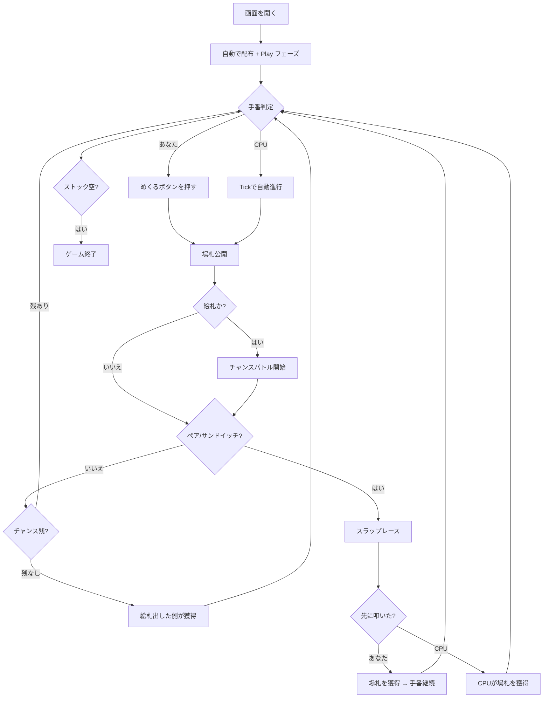

# エジプシャン・ラットスクリュー（Web版）遊び方

## ゲーム概要

プレイヤー1人対CPU 1人で遊ぶ、反射神経と頭脳プレーが融合したパーティゲーム。スラップジャックの拡張版で、**ペア**（場のトップ2枚が同じ数字）や**サンドイッチ**（場のトップ3枚がX-Y-X）が出た瞬間に最も早くスラップ（叩く）した方が場の山札を全て獲得します。さらに、絵札（J/Q/K/A）が場に出た時は**チャンスバトル**が発生し、相手プレイヤーは規定の枚数以内に絵札を出せなければ負けます。誤スラップは1枚のペナルティ。

## 起動方法

```sh
go run ./cmd/trumpcards web     # CLI経由でWebサーバーを起動
go run ./cmd/server             # 直接Webサーバーを起動
```

ブラウザで `http://localhost:8080` にアクセスし、ナビゲーションバーから「エジプシャン・ラットスクリュー」を選択します。

## ルール

### 基本ルール

- 52枚のトランプ（ジョーカーなし）を使用
- シャッフル後、26枚ずつプレイヤーとCPUに配布
- 「めくる」(s) で現在の手番プレイヤーが自分のストックのトップを場に積む
- 場のトップ 2 枚が同じ数字（ペア）または上 3 枚が X-Y-X（サンドイッチ）の時、誰でも素早く「スラップ」できる
- 正解スラップ → 場の全カードを取得し、自分のストックの底に裏向きで戻す。手番もそのプレイヤーに移る
- 誤スラップ → ストックの先頭1枚を相手のストックの底に渡すペナルティ
- 通常めくり後は手番が相手に移る

### チャンスバトル（絵札ルール）

絵札が場のトップに出ると、相手プレイヤーは規定枚数以内に**絵札**を出さなければなりません。

| 出た絵札 | 相手の挑戦回数 |
|---------|--------------|
| J | 1 回 |
| Q | 2 回 |
| K | 3 回 |
| A | 4 回 |

- 規定枚数以内に絵札を出せれば、攻守交代（出した側が次のチャンスバトルを仕掛ける）
- 規定枚数以内に絵札を出せなかった場合、絵札を出した側が場の全カードを獲得
- チャンスバトル中でもペア/サンドイッチが成立すればスラップで場札を奪える

### CPUの反応時間

| 難易度 | 平均反応時間 | 標準偏差 |
|--------|------------|--------|
| Easy   | 1100ms     | 300ms |
| Normal | 600ms      | 200ms |
| Hard   | 300ms      | 120ms |

### ゲーム終了

- ストックが0枚になり、かつスラップ・チャンス勝利で取り戻せない状態になると敗北
- 相手が脱落した場合、自分の勝利

## ゲームの流れ



## 画面の操作方法

- **めくる**: 自分のターンで自分のストックのトップを場に出す
- **スラップ**: 場札のトップを叩く。ペア/サンドイッチなら獲得、それ以外ならペナルティ
- **リセット**: 新しいゲームを開始

## 画面構成

- 上段: CPUのストック残枚数と裏向きカード
- 中央: 場のトップカードと総枚数（スラップ可能時は黄色強調、チャンス残数表示あり）
- 下段: あなたのストック残枚数と裏向きカード
- フッター: めくる / スラップ / リセット / 棋譜ボタン

## 遊び方のコツ

- 場のトップを観察し、ペアやサンドイッチの瞬間に素早くスラップ。Hardは平均300msなので、目視→クリックを高速化
- 絵札（特にA）が出たら相手のチャンスバトルが長引くので、自分の手番を待つだけでなくスラップ機会を探す
- 誤スラップは確実に1枚損するので、緑色の「めくる」と非スラップ時の赤色「スラップ」を見間違えないよう冷静に
- 自分のストックが減ったらスラップ獲得・チャンス勝利を狙ってリスクを取る
