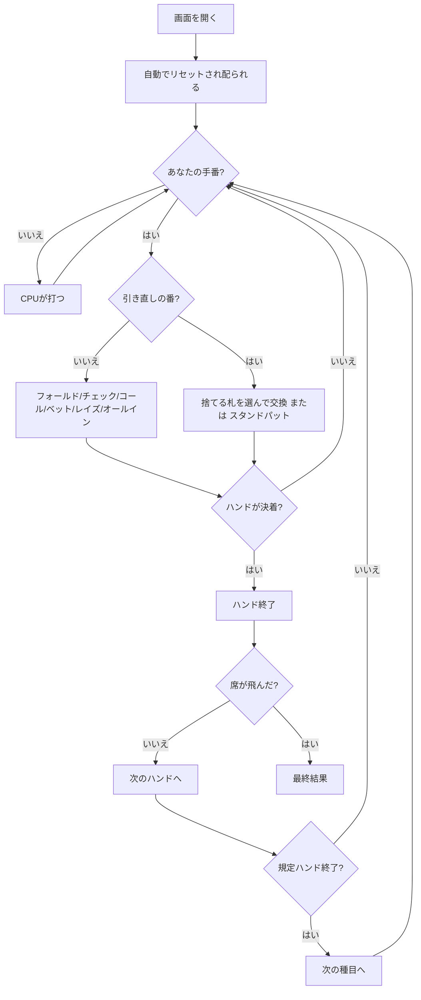

# エイトゲーム・ミックス（Web版）遊び方

## ゲーム概要

エイトゲーム・ミックスは**8種目のポーカーを1つの卓で順に回すミックスゲーム**です（4人：あなた + CPU3人）。[H.O.R.S.E.](horse.md) の5種目に、ノーリミット・ホールデム / ポットリミット・オマハ / 2-7 トリプルドローを加えた形式です。チップは種目をまたいで持ち越され、規則だけが入れ替わります。

H.O.R.S.E. との一番の違いは、**引き直し（ドロー）のある種目が1つ混ざる**ことです。2-7 トリプルドローの番だけは、賭けるのではなく**捨てる札を選ぶ**操作になります。

## 起動方法

```sh
go run ./cmd/trumpcards web  # CLI経由でWebサーバーを起動
go run ./cmd/server          # 直接Webサーバーを起動
```

ブラウザで `http://localhost:8080` にアクセスし、ナビゲーションバーから「エイトゲーム・ミックス」を選択します。
ナビバーのJA/ENボタンで日本語・英語を切り替えられます。

## ルール

### 種目の並び

| 記号 | 種目 | 形 | 共有札 | リミット |
|------|------|----|--------|----------|
| H | テキサスホールデム | 伏せ2枚 + 共有5枚 | あり | フィックスドリミット |
| O | オマハ ハイロー | 伏せ4枚 + 共有5枚（手札からちょうど2枚） | あり | フィックスドリミット |
| R | ラズ | スタッド7枚（最も低い手が勝ち） | なし | フィックスドリミット |
| S | セブンカードスタッド | スタッド7枚 | なし | フィックスドリミット |
| E | スタッド ハイロー | スタッド7枚（ハイとローで分ける） | なし | フィックスドリミット |
| NLH | ノーリミット・ホールデム | 伏せ2枚 + 共有5枚 | あり | ノーリミット |
| PLO | ポットリミット・オマハ | 伏せ4枚 + 共有5枚（手札からちょうど2枚） | あり | ポットリミット |
| 2-7 | 2-7 トリプルドロー | 伏せ5枚 + 3回の引き直し | なし | フィックスドリミット |

- 同じホールデムでも**リミットが違えば別の種目**です。H はレイズ幅が固定、NLH は残り全部まで賭けられます。
- 1種目あたりのハンド数は 1〜10（既定2）。規定ハンドで次の種目へ進み、2-7 の次は H に戻ります。
- 役の判定とベッティングの規則は、その種目を単体で遊ぶときとまったく同じです。

### 席数は4人だけ

**エイトゲーム・ミックスは4人卓のみ**です。2-7 トリプルドローが最大4席までしか作れないため、それより大きい卓を選べるようにすると8種目目でマッチが止まります。設定の席数も4しか出ません。

### チップと決着

- チップは種目をまたいで持ち越されます。**1席でも飛んだ時点でマッチ終了**で、最も多く持っている席の勝ちです。

## ゲームの流れ



## 画面の操作方法

### ベッティング

1. あなたの手番になると、フッターにベッティングの操作が出ます。操作はどの種目でも同じです。
2. **賭けられていなければ「チェック」と「ベット」**、賭けられていれば「コール」と「レイズ」が出ます。額は入力欄か 1/2ポット・ポット・マックスのボタンで決めます。
3. 「フォールド」「オールイン」はいつでも押せます。

### 引き直し（2-7 トリプルドローのみ）

1. 引き直しの番になると、ベッティングの操作の代わりに**手札5枚がボタンとして並びます**。
2. 捨てたい札を押すと縁が光ります（もう一度押すと解除）。**1枚も選んでいないうちは「交換する」を押せません。**
3. 「交換する」で選んだ札だけを引き直します。**引かずに進むときは「引かない（スタンドパット）」**を押します。
4. これを最大3回繰り返し、間にベッティングが挟まります。

### ハンドの区切り

- ハンドが決着すると「次のハンドへ」が出ます。押すと次が配られ、**規定ハンドを打ち切っていれば種目が変わります**。
- 種目が変わったことは画面上部の記号（H/O/R/S/E/NLH/PLO/2-7）と種目名で分かります。

### 設定

| 設定 | 範囲 | 説明 |
|------|------|------|
| 席数 | 4 | 2-7 トリプルドローが作れる卓の上限 |
| 種目ごとのハンド数 | 1 / 2 / 3 / 5 / 10 | 何ハンドで次の種目へ進むか |

### キーボードショートカット

| キー | アクション | 有効条件 |
|------|-----------|---------|
| Tab | 次の操作へフォーカス移動 | 常時 |
| Enter / Space | フォーカス中の操作を実行 | 自分の手番 |

## 画面構成

```
┌────────────────────────────────────────────┐
│ エイトゲーム・ミックス                     │
│ 2-7 トリプルドロー ハンド1/2 引き直し P60  │
├────────────────────────────────────────────┤
│  あなた      CPU1      CPU2      CPU3      │
│  940チップ   1030      1000      1030      │
│  [札]x5      -         -         -         │
├────────────────────────────────────────────┤
│ 引き直し2回目 — 交換する札を選んでください │
│ [札][札][札][札][札]                       │
│ [2枚交換する] [引かない（スタンドパット）] │
└────────────────────────────────────────────┘
```

- 席の下に並ぶのは**見えている札だけ**です。スタッド系では CPU のドアカードが見え、ホールデム系と 2-7 では何も見えません。
- 見出しには**いまのベッティングラウンド名**も出ます。**種目で呼び方が変わります** ── ホールデム系は「プリフロップ / フロップ / ターン / リバー」、スタッド系は「サード〜セブンスストリート」、2-7 は「配り終わり / ベッティング / 引き直し」。

## 遊び方のコツ

- **H と NLH、O と PLO は見た目が同じでリミットだけが違う。** 賭けられる額を確かめてから押してください。ノーリミットの1手はマッチ全体を決めます。
- **2-7 トリプルドローは「最も低い5枚」を作る種目。** ストレートもフラッシュも役として数えられる（＝弱くなる）ので、7-5-4-3-2 のバラバラが最強です。A は常に高い札です。
- **引かないのも手。** 何枚引いたかは相手に見えているので、スタンドパットは強さの主張にもなります。
- **飛ばないことが第一。** 1席でも飛べばマッチが終わるので、苦手な種目では素直に降り、得意な種目で押します。
