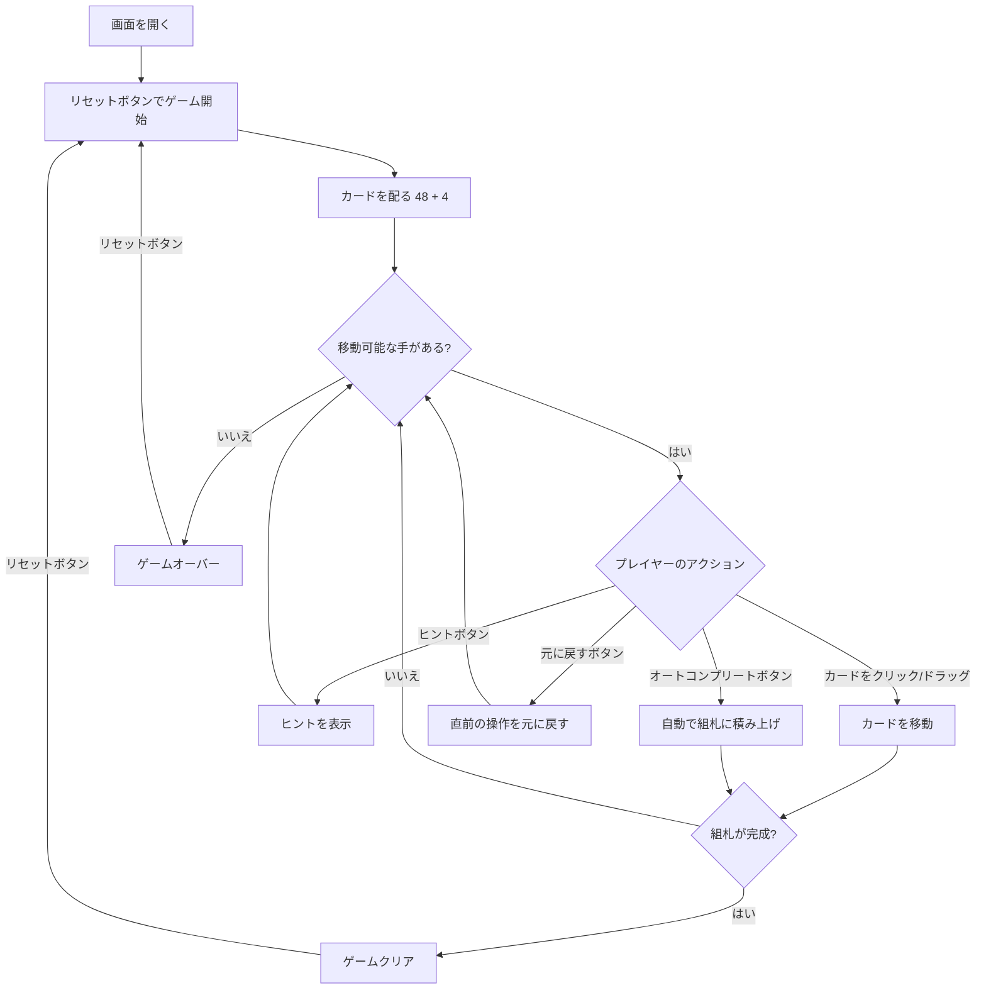

# エイトオフ（Web版）遊び方

## ゲーム概要

1人用のソリティアカードゲームで、FreeCellの厳格バリアントです。52枚のカードを使い、8列のタブロー、8つのフリーセル、4つの組札で構成されます。初期状態でタブローに各列6枚ずつ48枚、残り4枚はフリーセル0〜3に配られます。組札にA→Kまでスート別に積み上げればクリアです。

## 起動方法

```sh
go run ./cmd/trumpcards web     # CLI経由でWebサーバーを起動
go run ./cmd/server             # 直接Webサーバーを起動
```

ブラウザで `http://localhost:8080` にアクセスし、ナビゲーションバーから「エイトオフ」を選択します。
ナビバーのJA/ENボタンで日本語・英語を切り替えられます。

## ルール

### 基本ルール

- 52枚のトランプ（ジョーカーなし）を使用
- 8列のタブローに各列6枚ずつ配る（計48枚）、すべて表向き
- 残り4枚は最初の4つのフリーセル（セル0〜3）に配置される
- フリーセルは8つあり、それぞれカード1枚を一時的に保持できる
- 4つの組札（ファンデーション）はスート別にA→Kの順に積み上げる
- **タブローでは「同じスート」の降順でのみ重ねる**（例: ♠10の上に♠9）
- **空いた列にはK（キング）のみ置くことができる**

### スーパームーブ

一度に移動できるカード数は以下の計算式で決まります:

```
最大移動枚数 = (1 + 空きフリーセル数) × 2^(空きタブロー列数)
```

### ゲームクリア

- 4つの組札すべてにA→Kまで13枚ずつ積み上げるとゲームクリア

### ゲームオーバー

- これ以上移動可能な手がない場合はゲームオーバー（ギブアップ時）

### 手詰まり検出

- 各操作の後、ソルバー（A* + メモ化）がボード全体を解析し、解法が存在しないと判定された場合「手詰まりです」とメッセージが表示されます
- 手詰まり状態では「元に戻す」またはギブアップを選択できます
- ソルバーの探索上限（100,000状態）を超えた場合は手詰まりとは判定しません

## ゲームの流れ



## 画面の操作方法

### カードを移動する

1. 移動元のカードをクリックして選択します
2. 移動先のカード（またはエリア）をクリックして移動を確定します
3. タブロー内では同スート降順の連続したカード列をまとめて移動できます（スーパームーブ）
4. ドラッグ＆ドロップでも移動可能です

### フリーセルを使う

1. タブローのカードを選択し、空いているフリーセルをクリックして退避します
2. フリーセルのカードを選択し、タブローや組札をクリックして戻します

### アンドゥ（元に戻す）

**「元に戻す」** ボタンまたは `z` キーで直前の操作を取り消せます。何度でも元に戻せます。

### ヒント・オートコンプリート

1. **「ヒント」** ボタンをクリックすると、次に可能な手を提案します
2. **「オートコンプリート」** ボタンをクリックすると、組札に安全に移動できるカードを自動で移動します

### キーボードショートカット

ゲーム中、以下のキーボードショートカットが使用できます。

| キー | アクション | 有効条件 |
|------|-----------|---------|
| `z` | 元に戻す（アンドゥ） | プレイ中 |
| `h` | ヒント | プレイ中 |
| `a` | オートコンプリート | プレイ中 |
| `g` | ギブアップ | プレイ中 |

※ テキスト入力欄にフォーカスがある場合、ショートカットは無効になります。

## 画面構成

```
┌────────────────────────────────────────────┐
│              ゲーム情報                     │
│  手数: 0                                   │
├────────────────────────────────────────────┤
│  フリーセル（8セル）       組札エリア      │
│  [♠K][♥7][♦3][♣8][  ][  ][  ][  ]  [♠][♥][♦][♣] │
├────────────────────────────────────────────┤
│              タブロー                      │
│  [0]  [1]  [2]  [3]  [4]  [5]  [6]  [7]   │
│  ♥Q  ♠J   ♦Q   ♣Q   ♥6   ♠5   ♦6   ♣5   │
│  ♥J  ♠10  ♦J   ♣J   ♥5   ♠4   ♦5   ♣4   │
│  ♥10 ♠9   ♦10  ♣10  ♥4   ♠3   ♦4   ♣3   │
│  ♥9  ♠8   ♦9   ♣9   ♥3   ♠2   ♦2   ♣2   │
│  ♥8  ♠7   ♦8   ♣8   ♥2   ♠A   ♦A   ♣A   │
│  ♥7  ♠6   ♦7   ♣7   ♥A   ♦K   ♣6   ♦A   │
├────────────────────────────────────────────┤
│  [元に戻す] [ヒント] [オートコンプリート]  │
│  [ギブアップ] [リセット]                   │
└────────────────────────────────────────────┘
```

- **フリーセル**: 8つの一時退避スペース（カード1枚ずつ）。初期に4つ埋まっています
- **組札エリア**: 4つのスート別の組札（A→Kの順に積み上げ）
- **タブロー**: 8列のカード列（すべて表向き、各列6枚）
- **ボタン**:
  - 「元に戻す」: 直前の操作を取り消す
  - 「ヒント」: 次の一手を提案
  - 「オートコンプリート」: 自動で組札へ移動
  - 「ギブアップ」: 現在のゲームを終了
  - 「リセット」: 新しいゲームを開始

## 遊び方のコツ

- フリーセルは8つありますが、初期状態で既に4つ埋まっています
- タブロー移動は「同じスート」の降順のみなので、FreeCellより制約が厳しいです
- 空いた列にはK以外を置けないため、Kを優先的に確保しましょう
- 序盤は組札に上がりやすいA・2を取り出すために、上に重なっている邪魔なカードをフリーセルへ退避させる動きが基本です
- ヒントボタンで詰まった時のアドバイスを得られます
- オートコンプリートは組札に安全に移動できるカードがある場合に便利です
