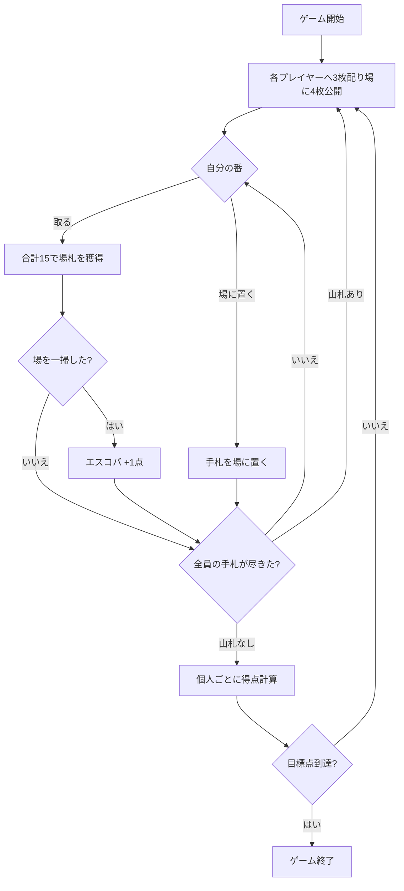

# エスコバ（Web版）遊び方

## ゲーム概要

エスコバ (Escoba / Escoba de 15) はスペイン発祥の数合わせ漁系ゲームです。40枚のスペイン式デッキを使い、4人がそれぞれ個人で（チームなし）得点を競います。各プレイヤーに3枚配り、場に4枚を公開した状態から始めます。手札のカード1枚と場札の組み合わせの**合計をちょうど15**にして場札を取ります。獲得したカードの枚数・エスパダ（剣＝♠）の枚数・7の枚数・オロ（金貨＝♦）の枚数・エスコバ（場の一掃）・エスパダの A と 7 で得点を競い、先に目標点（デフォルト10点）に到達したプレイヤーの勝ちです。

スコパ（およびスコポーネ）との主な違いは、**4人個人戦（チームなし）**であることと、「手札の値と一致する場札」ではなく**手札+場札の合計がちょうど15**になる組を取ること、そして手札が尽きるたびに**山札から3枚ずつ再配布**することです。

## 起動方法

```sh
go run ./cmd/trumpcards web  # CLI経由でWebサーバーを起動
go run ./cmd/server          # 直接Webサーバーを起動
```

ブラウザで `http://localhost:8080` にアクセスし、ナビゲーションバーから「エスコバ」を選択します。
ナビバーのJA/ENボタンで日本語・英語を切り替えられます。

## ルール

1. 各プレイヤーに3枚配り、場に4枚を公開します。
2. 自分の番に手札を1枚選び、アクションを選択します。合計15を作れる場札があれば必ず取ります。
   - **取る**: 手札の値と取る場札の値の合計がちょうど15になる組を選びます。複数の取り方があれば選べます。
   - **場に置く**: 合計15を作れない場合は手札を場に置きます。
3. カードの値: A=1、2〜7はそのまま、J=8、Q=9、K=10。
4. 場札をすべて取り切ると「エスコバ」となり1点加算されます（最後の1手を除く）。
5. 全員の手札が尽きると、山札から3枚ずつ再配布されます。山札も尽きてすべてのカードをプレイし終えるとラウンド終了、個人ごとに得点を計算します。先に目標点に到達したプレイヤーが勝ちです。

## ゲームの流れ



## 得点（個人単位）

| 項目 | 点数 |
|------|------|
| 最多カード | 1点 |
| 最多エスパダ (剣＝♠) | 1点 |
| 最多の7 | 1点 |
| 最多オロ (金貨＝♦) | 1点 |
| エスコバ | 各1点 |
| エスパダの A を取得 | 1点 |
| エスパダの 7 を取得 | 1点 |

## 画面の操作方法

1. 手札をクリックして選択します。
2. 合計15になる場札をクリックして選択します（1枚でも複数枚でも可）。
3. 「取る」ボタンを押すとカードを獲得します。
4. 合計15を作れない場合は場札を選ばずに「場に置く」を押します。**取れる札を選んでいる間は「場に置く」は押せません**（エスコバは強制捕獲）。
5. ラウンド終了後は内訳を確認し「次のラウンド」へ進みます。

## 画面構成

| 要素 | 説明 |
|------|------|
| 場札 | テーブル中央のカード。合計15になる組み合わせがハイライトされます。 |
| プレイヤー | 各プレイヤーの手札枚数・獲得枚数・エスコバ数・得点。 |
| 手札 | 画面下のあなた（P0）の3枚の手札。 |
| 山札残り | 山札の残り枚数。全員の手札が尽きると3枚ずつ再配布されます。 |
| アクションボタン | 取る・場に置く から選びます。 |
| 設定パネル | CPU難易度・目標点を切り替えます。 |

## 困ったときは

- **取れるカードがわからない**: 手札を選ぶと、合計15を作れる場札が強調表示されます。
- **絵札の数え方**: J=8 / Q=9 / K=10 として合計15になるかを判定します。
- **CPUが強すぎる**: 設定でCPU難易度を下げてください。
- **ゲームをやり直したい**: リセットボタンを押してください。
