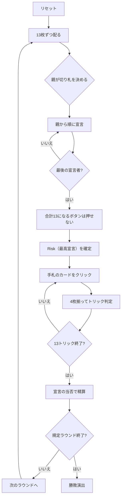

# エスティメーション（Web版）遊び方

## ゲーム概要

中東・湾岸諸国で家庭的に遊ばれる予想制トリックテイキング。52枚を4人に13枚ずつ配る**個人戦**です。**獲得トリック数をぴたりと当てたときだけ得点が入り**、1つ足りなくても5つ多くても減点は同じ。0を宣言する **Dash Call** と、その場の最高宣言である **Risk** は得点の桁が変わります。

## 起動方法

```sh
go run ./cmd/trumpcards web  # CLI経由でWebサーバーを起動
go run ./cmd/server          # 直接Webサーバーを起動
```

ブラウザで `http://localhost:8080` にアクセスし、ナビゲーションバーから「エスティメーション」を選択します。
ナビバーのJA/ENボタンで日本語・英語を切り替えられます。

## ルール

- **52枚**、**4人個人戦**、13枚ずつ（ちょうど配り切る）
- **親が切り札スートを決め**、そのあと親から順に獲得予定トリック数を宣言する
- **最後の宣言者は、合計がちょうど13になる数を選べません**（そのボタンは押せなくなります）
- 得点: 的中 **+(10+宣言)** / 外し **-(10+宣言)**。**Dash Call（0宣言）は ±23**、**Risk（最高宣言）は2倍**
- **過不足の量では変わりません。** 1つ足りなくても5つ多くても同じ減点
- フォロー義務あり。切り札 > リードのスート > その他
- 規定ラウンド（既定5）を終えた時点の累計得点が最も高い人の勝ち

> 合計13禁止は Oh Hell（`ohhell`）の親にも掛かる同じ制約で、このゲーム固有ではありません。得点表は出典が割れるため、写さずに一貫した形を選んでいます。

## ゲームの流れ



## 画面の操作方法

| 操作 | 説明 |
|------|------|
| 切り札ボタン（♠♣♥♦の4つ） | 切り札スートを決める（**親のときだけ表示**） |
| 宣言ボタン（0〜13） | 獲得予定トリック数を宣言する（**0 は Dash Call**） |
| 手札のカードをクリック | そのカードを出す（出せる札だけ押せます） |
| 次のラウンドへボタン | ラウンド終了後、次のラウンドを配る |
| ヒントボタン | 宣言すべき数、または打つべき札を提示する |
| ギブアップボタン | 投了する |
| リセットボタン | 確認ダイアログのうえで最初からやり直す |
| CLI トグル | 同じゲームをコマンド入力で操作するモードに切り替える |

**合計が13になる宣言ボタンは押せません。** サーバが必ず拒否する値なので、押させてから断るのではなく最初から無効にしています。

## 画面構成

- **上部**: ラウンド数、トリック数、切り札
- **得点帯**: 的中だけが得点になること。盤面からは読み取れません
- **中央上**: 各プレイヤーの宣言（`Dash(0)` / `Risk(n)` / `宣言n`）、獲得数、累計得点。**ラウンド終了時には「今回 +23」のように今回の増減**も並びます（減った席は赤）
- **中央**: 現在のトリック
- **下部**: 自分の手札。**フォロー義務を満たす札だけ**に印が付きます

## 遊び方のコツ

- **宣言は小さめが安全。** 外したときの減点も宣言に比例します
- **宣言ぶん取り終えたら、あとは全部逃げる。** 強い札をわざと捨てるのが定石
- **Dash Call は13枚で1つも取らない宣言。** A や K が無い手のときだけ
- **高く宣言すると自動的に Risk になり、当否が2倍**になります
- **相手の宣言を見る。** 宣言ぶん取り終えた相手は逃げに回ります
