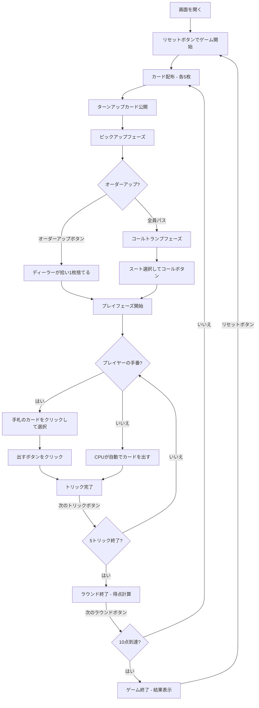

# ユーカー（Web版）遊び方

## ゲーム概要

4人（プレイヤー1人 + CPU 3人）で遊ぶ2チーム制（0+2 vs 1+3）のトリックテイキング型カードゲームです。24枚のカード（各スート9〜A）を使用し、ライトバウアー（切り札のJ）とレフトバウアー（同色スートのJ）が最強の切り札です。先に10点に到達したチームが勝者です。

## 起動方法

```sh
go run ./cmd/trumpcards web     # CLI経由でWebサーバーを起動
go run ./cmd/server             # 直接Webサーバーを起動
```

ブラウザで `http://localhost:8080` にアクセスし、ナビゲーションバーから「ユーカー」を選択します。
ナビバーのJA/ENボタンで日本語・英語を切り替えられます。

## ルール

### 基本ルール

- 24枚のカード（各スート9, 10, J, Q, K, A）を4人に配布（1人5枚）
- 4人を2チームに分ける（プレイヤー0+2 vs プレイヤー1+3）
- ディーラーが1枚めくり（ターンアップカード）、そのスートが切り札候補
- **ライトバウアー**（切り札のJ）が最強カード
- **レフトバウアー**（切り札と同色スートのJ）が2番目に強い切り札
- リードスートに従う（フォロースート）
- トリックの勝者: 切り札が出ていれば最高の切り札、なければリードスートの最高値

### ビッド（切り札決定）

- **ピックアップフェーズ**: ターンアップカードのスートを切り札にするか各プレイヤーが判断
- **コールトランプフェーズ**: 全員パスした場合、ターンアップ以外のスートを切り札に宣言
- **ゴーイングアローン**: オーダーアップ/コール時にアローンを選択可（パートナーが休み）

### 得点

- **メイカー（切り札を決めたチーム）3〜4トリック**: +1点
- **マーチ（5トリック全取り）**: +2点
- **ユーカード（ディフェンダーが勝利）**: ディフェンダー +2点
- **ゴーイングアローン マーチ**: +4点
- **ゴーイングアローン 3〜4トリック**: +1点

### ゲーム終了

- **勝利条件**: 先に10点に到達

### CPU難易度

- **Easy**: ランダムにカードを出す
- **Normal**: 基本的なトリック戦略（デフォルト）
- **Hard**: 戦略的なプレイ（切り札管理等）

## ゲームの流れ



## 画面の操作方法

### ピックアップフェーズ

1. ターンアップカードが中央に表示されます
2. **「オーダーアップ」** ボタンでそのスートを切り札にします
3. **「アローン」** チェックボックスを選択してからオーダーアップするとゴーイングアローンになります
4. **「パス」** ボタンで次のプレイヤーに回します

### コールトランプフェーズ

1. スートセレクターから切り札にしたいスートを選択します（ターンアップのスート以外）
2. **「コール」** ボタンで切り札を宣言します
3. **「アローン」** チェックボックスを選択してからコールするとゴーイングアローンになります
4. **「パス」** ボタンでパスします（ディーラーはパス不可）

### ディスカードフェーズ（ディーラーのみ）

1. 手札のカードをクリックして捨てるカードを選択します
2. **「捨てる」** ボタンをクリックして確定します

### カードのプレイ（プレイフェーズ）

1. 手札のカードをクリックして選択します
2. フォロー必須のルールに従い、出せないカードは選択できません
3. **「カードを出す」** ボタンをクリックしてカードを場に出します

### ヒント

- プレイフェーズで **「ヒント」** ボタンをクリックすると、CPUのHard戦略に基づく推奨カードが表示されます

### トリック・ラウンドの進行

1. トリックが完了すると結果が表示されます
2. **「次のトリック」** ボタンで次のトリックに進みます
3. ラウンドが完了すると得点が表示されます
4. **「次のラウンド」** ボタンで次のラウンドに進みます

### キーボードショートカット

| キー | アクション | 有効条件 |
|------|-----------|---------|
| `1`〜`5` | カード選択/解除（1=1枚目, ..., 5=5枚目） | プレイヤーの手番 |
| `Enter` | カードを出す | プレイヤーの手番 |
| `Escape` | 選択クリア | プレイヤーの手番 |

※ テキスト入力欄にフォーカスがある場合、ショートカットは無効になります。

## 画面構成

```
┌────────────────────────────────────────────┐
│  ▶ 設定 (クリックで展開)                   │
│    CPU難易度:    [Normal▼]                 │
│    目標スコア:   [10▼]                     │
├────────────────────────────────────────────┤
│           CPU プレイヤーエリア              │
│ ┌──────────┐ ┌──────────┐ ┌──────────┐    │
│ │ CPU 1    │ │ CPU 2    │ │ CPU 3    │    │
│ │ 5枚      │ │ 5枚(D)   │ │ 5枚      │    │
│ └──────────┘ └──────────┘ └──────────┘    │
├────────────────────────────────────────────┤
│              ゲーム情報                     │
│  ラウンド 3 / トリック 2                    │
│  切り札: ♥  ターンアップ: ♥K              │
│  チーム1: 6点  チーム2: 4点                │
├────────────────────────────────────────────┤
│           現在のトリック                    │
│  CPU 1: ♦10                               │
├────────────────────────────────────────────┤
│     フッター: あなた                        │
│  [♥A][♥J][♠Q][♦K][♣9]                    │
│  [リセット] [ヒント] [カードを出す] [次のトリック] │
└────────────────────────────────────────────┘
```

- **設定パネル（▶ 設定）**:
  - 「CPU難易度」セレクト: Easy / Normal / Hard から選択
  - 「目標スコア」: 5 / 10 / 15 / 20 から選択
  - 次のリセット時に設定が適用される
- **CPU プレイヤーエリア**: 各 CPU の手札枚数を表示
  - 手番の CPU は金色枠
  - ディーラーは (D) マーク
- **ゲーム情報**: 現在のラウンド、トリック番号、切り札スート、チームスコア
- **現在のトリック**: トリックに出されたカード
- **フッター（あなたの手札）**:
  - クリックで選択（緑枠 + 上に浮き上がる）
  - フォロー必須のカードのみ選択可能

## 遊び方のコツ

- ライトバウアー（切り札のJ）やレフトバウアー（同色のJ）を持っている場合はオーダーアップ/コールを積極的に検討しましょう
- ゴーイングアローンは手札が非常に強い場合にのみ狙いましょう（マーチで+4点）
- パートナーとの連携を意識し、パートナーがリードしたスートをフォローしましょう
- 切り札が少ない場合は、特定のスートをボイド（手札からなくす）にして切り札で切る戦略が有効です
- ディフェンダーの場合、メイカーをユーカードにすると+2点の大チャンスです
- 迷った時はヒントボタンでCPUのHard戦略に基づく推奨を確認できます
