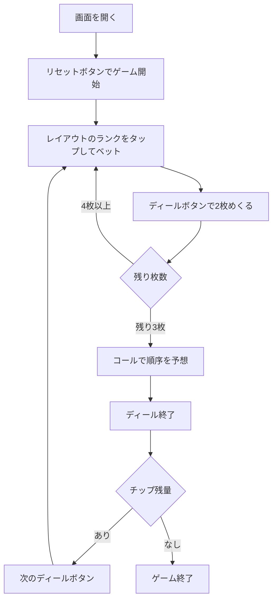

# ファロ（Web版）遊び方

## ゲーム概要

ファロ（Faro）は19世紀アメリカの酒場で大流行した、プレイヤー1人対バンク（胴元）の賭けゲームです。52枚デッキとA〜Kの13ランクのレイアウトを使い、チップが尽きるまで遊びます。

## 起動方法

```sh
go run ./cmd/trumpcards web  # CLI経由でWebサーバーを起動
go run ./cmd/server          # 直接Webサーバーを起動
```

ブラウザで `http://localhost:8080` にアクセスし、ナビゲーションバーから「ファロ」を選択します。
ナビバーのJA/ENボタンで日本語・英語を切り替えられます。

## ルール

### 基本の流れ

1. **ベット**: A〜Kのレイアウトでランクをタップし、選んだ額のチップを置きます。「カッパー」をオンにすると、そのランクが「負ける」方に賭けられます。
2. **ディール**: バンクは最初の1枚（ソーダ）を捨て、以後2枚ずつめくります。
   - 1枚目（負け札）のランクの賭けはバンクが回収します。
   - 2枚目（勝ち札）のランクの賭けには1:1で配当されます。
   - 2枚が同ランクの「スプリット」では、賭け金の半分をバンクが取ります。
3. **コール**: 最後の3枚は、並ぶ順序を予想する「コール」ができます。的中すれば4:1の配当です。

### ゲーム終了

チップが尽きるとゲーム終了です。

## ゲームの流れ



## 画面の操作方法

### ベットフェーズ

- フッターでベット額とカッパーのオン／オフを選びます。
- 13ランクのレイアウトでランクをタップするとチップが置かれます。
- 「このベットを外す」「すべて外す」でベットを取り消せます。

### ターンフェーズ

- 「ディール」ボタンで2枚のカードがめくられ、負け札・勝ち札・スプリットの結果が表示されます。

### コールフェーズ

- 残り3ランクのボタンをタップして並ぶ順序を選び、「コールする」で確定します。予想しない場合は「コールせずに終える」を選びます。

### 画面構成

```
┌────────────────────────────────────────────┐
│  チップ / 今回の収支 / ターン / 残り枚数        │
│  ソーダ（バーン）                              │
│  ┌──────────────────────────────────────┐    │
│  │  A 2 3 4 5 6 7  （13ランクのレイアウト）  │    │
│  │  8 9 10 J Q K                          │    │
│  └──────────────────────────────────────┘    │
│  現在のベット一覧                              │
│  直前のターン（負け札 / 勝ち札 / スプリット）    │
│  ┌── フッター ──────────────────────────┐    │
│  │  ベット額・カッパー / ディール / リセット │    │
│  └──────────────────────────────────────┘    │
└────────────────────────────────────────────┘
```

## 画面構成

上から順に、ページのコンポーネント構成そのままの並びです。

```
┌──────────────────────────────────────────────────┐
│  ファロ                                          │
│  チップ: 1000  残り山札: 50                      │
├──────────────────────────────────────────────────┤
│  ベット盤（A〜K の 13 ランク）                   │
│  [A][2][3][4][5][6][7][8][9][10][J][Q][K]        │
│  チップを置いたランクに額が表示される            │
├──────────────────────────────────────────────────┤
│  今回めくられた2枚                               │
│  ルーザー [♠7]    ウィナー [♥K]                  │
├──────────────────────────────────────────────────┤
│  メッセージ / ヒント / 棋譜                      │
├──────────────────────────────────────────────────┤
│  [ベットをクリア] [めくる] [リセット]            │
└──────────────────────────────────────────────────┘
```

- **チップ / 残り山札**: 持ちチップと **52枚**（`FaroDeckSize`）デッキの残り枚数
- **ベット盤**: A〜K の 13 ランクにチップを置きます。1回のターンで複数ランクに置けます
- **めくられた2枚**: 先にめくれた方が**ルーザー**（胴元の勝ち）、次が**ウィナー**（プレイヤーの勝ち）
- **ベットをクリア**: めくる前なら置いたチップを引き上げられます
- **メッセージ / ヒント**: 直前の操作の結果と、ヒントボタンを押したときの推奨手
- **設定 / 棋譜**: 難易度などの設定と、これまでの手の履歴（折りたたみ式）
- **リセット**: 新しいゲームを開始します
- **CLIモード切替**: 画面右上のトグルで、CUI 版と同じテキスト表示に切り替えられます

## 遊び方のコツ

- スプリットはバンク有利なので、過度なベットは避けましょう。
- コールは配当4:1と大きいですが的中は難しいため、ここぞというときに使いましょう。
