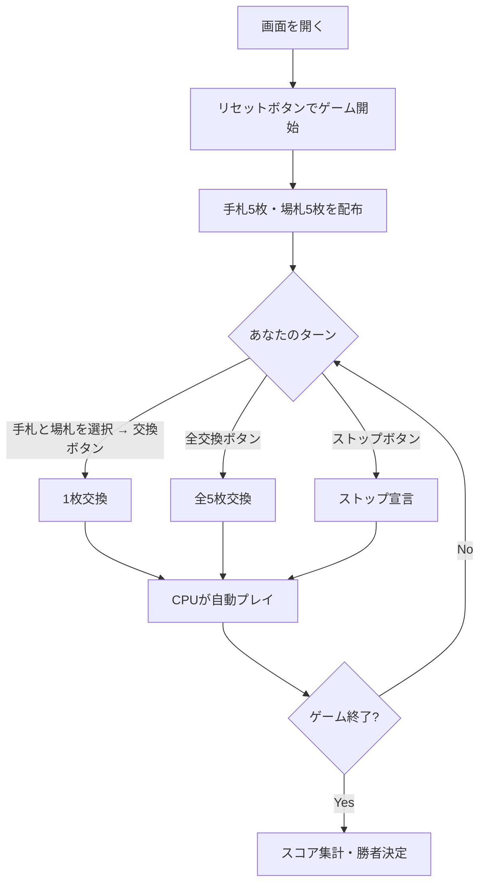

# フィフティワン（Web版）遊び方

## ゲーム概要

フィフティワン（51）は、4人で遊ぶカード交換ゲームです。手札と場札を交換しながら、同じスートのカードの合計点を最大化することを目指します。最高得点は51点（同スートのA+K+Q+J+10）です。

## 起動方法

```sh
go run ./cmd/trumpcards web        # CLI経由でWebサーバーを起動
go run ./cmd/server                # 直接Webサーバーを起動
```

ブラウザで `http://localhost:8080` にアクセスし、ナビゲーションバーから「フィフティワン」を選択します。
ナビバーのJA/ENボタンで日本語・英語を切り替えられます。

## ルール

### 基本ルール
- プレイヤー4人（あなた + CPU 3人）
- 標準52枚デッキ使用
- 各プレイヤーに5枚、場に5枚配る
- カード点数: A=11点、J/Q/K=10点、2-10=額面通り

### 自分のターンにできること
1. **1枚交換**: 手札1枚と場札1枚を選んで交換
2. **全交換**: 手札5枚と場札5枚を全て交換
3. **ストップ**: ストップを宣言する

### スコア計算
- 手札の中で、同じスートのカードの点数を合計
- 4つのスートの中で最も高い合計がスコア

### ゲーム終了
- 誰かがストップを宣言すると、残りのプレイヤーが各1回ずつプレイしてゲーム終了
- 最高スコアのプレイヤーが勝利
- 同点の場合、プレイヤー番号の小さい方が勝利

### CPU難易度
- **Easy (0)**: ランダムに交換。45点以上でストップ
- **Normal (1)**: ベストスートを狙って交換。40点以上でストップ
- **Hard (2)**: 全交換パターンを評価して最善手を選択。45点以上でストップ

## ゲームの流れ



## 画面の操作方法

### プレイフェーズ

1. **1枚交換**: 手札のカードを1枚クリック（青枠でハイライト）→ 場札のカードを1枚クリック（黄枠でハイライト）→「交換」ボタン
2. **全交換**: 「全交換」ボタンをクリック
3. **ストップ**: 「ストップ」ボタンをクリック（誰かがストップ済みの場合は無効化）

### 結果フェーズ

- 全プレイヤーの手札とスコアが公開されます
- 勝者に勝利アニメーションが表示されます
- 「リセット」ボタンで新しいゲームを開始できます

## 画面構成

```
┌────────────────────────────────────────────┐
│  フィフティワン              [CLI] [マニュアル] │
│  フェーズ: プレイ中                          │
├────────────────────────────────────────────┤
│                                            │
│   CPU1: 5枚     CPU2: 5枚     CPU3: 5枚    │
│   スコア: ?     スコア: ?     スコア: ?      │
│                                            │
│  ┌──────── 場札 ────────┐                   │
│  │ [♠K] [♥9] [♦Q] [♣6] [♠8] │               │
│  └──────────────────────┘                   │
│                                            │
│   あなた — スコア: 21                        │
│   [♠A] [♠10] [♥5] [♦3] [♣2]               │
│                                            │
├────────────────────────────────────────────┤
│  [交換] [全交換] [ストップ] [リセット] [ログ]  │
└────────────────────────────────────────────┘
```

- **CPU領域**: 各CPUの手札枚数とスコア（ゲーム中は「?」）
- **場札領域**: 場に出ている5枚のカード（クリックで選択）
- **手札領域**: あなたの手札5枚とスコア（クリックで選択）
- **フッター**: アクションボタンとログボタン

## 遊び方のコツ
- 1つのスートに集中してカードを集めましょう
- Aは11点と高いので、同スートのAがあるスートを狙いましょう
- 高スコアになったら早めにストップを宣言しましょう
- 場札に自分のベストスートのカードが出たら、不要なカードと交換しましょう
