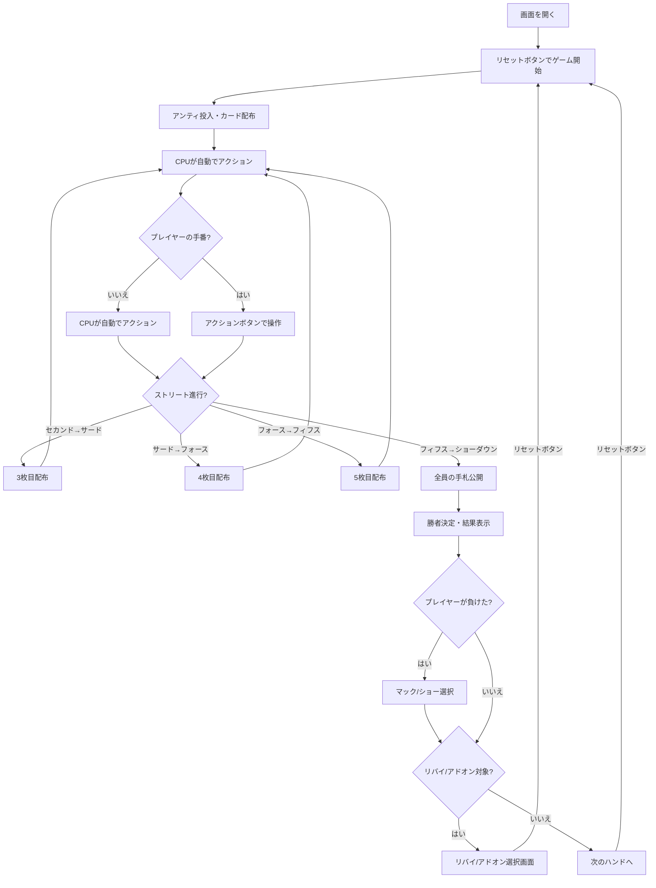

# ファイブカードスタッド（Web版）遊び方

## ゲーム概要

ファイブカード・スタッドポーカーです。ポーカー最古のスタッド形式で、コミュニティカードを使わず、各プレイヤーに5枚のカードが配られ、その5枚で役を作ります。テーブルサイズは2人～6人（デフォルト4人 = 1人+CPU 3人）から選択できます。各CPUは異なるプレイスタイル（TAG/LAP/TAP/LAG/GTO）を持ち、ブラフを含む戦略的なプレイをします。サイドポットにも対応しています。

HUD統計（VPIP%/PFR%/3Bet%/AF）が全プレイヤーに表示されます。トーナメントモードでは、指定ハンド数ごとにアンティが自動的に上昇します。リバイ（チップ再購入）とアドオン（一回限りのチップ追加購入）にも対応しています。

## 起動方法

```sh
go run ./cmd/trumpcards web  # CLI経由でWebサーバーを起動
go run ./cmd/server          # 直接Webサーバーを起動
```

ブラウザで `http://localhost:8080` にアクセスし、ナビゲーションバーから「ファイブカード・スタッド」を選択します。
ナビバーのJA/ENボタンで日本語・英語を切り替えられます。

## ルール

### 基本ルール

- 52枚のトランプを使用
- コミュニティカードなし — 各プレイヤーに個別にカードが配られる
- 合計5枚（裏向き1枚 + 表向き4枚）で役を作る
- ブラインドの代わりにアンティ（全員が支払う参加費）とブリングイン（最も低いドアカードのプレイヤーが支払う強制ベット）を使用
- 各ストリートでベッティング順は表向きカードの最強ハンドから開始

### ゲームの進行

1. **アンティ**: 全プレイヤーがアンティを支払う
2. **セカンドストリート**: 裏向き1枚（ホールカード）+ 表向き1枚（ドアカード）配布。最も低いドアカードのプレイヤーがブリングインを投入。ベッティングラウンド（スモールベット）
3. **サードストリート**: 表向き1枚追加（計3枚）。最強の表向きハンドから開始。ベッティングラウンド（スモールベット）
4. **フォースストリート**: 表向き1枚追加（計4枚）。最強の表向きハンドから開始。ベッティングラウンド（ビッグベット）
5. **フィフスストリート**: 表向き1枚追加（計5枚）。最強の表向きハンドから開始。最後のベッティングラウンド（ビッグベット）
6. **ショーダウン**: 残っているプレイヤーの手札を公開し、勝者を決定
7. **マック/ショー**: ショーダウンで負けた場合、手札をマック（伏せる）またはショー（公開）を選択
8. **リバイ/アドオン**: リバイ・アドオンが有効な場合、該当条件を満たすとチップの再購入・追加購入が可能

### ベッティングアクション

| アクション | 説明 |
|-----------|------|
| フォールド | 手札を捨ててラウンドから降りる |
| チェック | ベットせずにパスする（未ベット時のみ） |
| コール | 現在のベット額に合わせる |
| ベット | 新たにベットする（未ベット時のみ） |
| レイズ | 現在のベット額を上げる |
| オールイン | 全チップを賭ける |

### 役一覧（強い順）

| 役 | 説明 |
|----|------|
| Royal Flush | 同じスートの10・J・Q・K・A |
| Straight Flush | 同じスートの5枚連番 |
| Four of a Kind | 同じ数字4枚 |
| Full House | 同じ数字3枚 + 同じ数字2枚 |
| Flush | 同じスート5枚 |
| Straight | 5枚連番 |
| Three of a Kind | 同じ数字3枚 |
| Two Pair | ペア2組 |
| One Pair | ペア1組 |
| High Card | 上記に該当しない最も高いカード |

### CPUプレイスタイル

| スタイル | 略称 | 特徴 |
|---------|------|------|
| Tight-Aggressive | TAG | 強い手のみ参加し、積極的にレイズ。ブラフ率15% |
| Loose-Passive | LAP | 多くの手に参加するが、主にコール。ブラフ率5% |
| Tight-Passive | TAP | 厳選した手のみ参加し、主にコール。ブラフ率5% |
| Loose-Aggressive | LAG | 多くの手に参加し、頻繁にレイズ。ブラフ率30% |
| Game Theory Optimal | GTO | ハンド強度とボードテクスチャに基づく確率的混合戦略 |

## ゲームの流れ



## 画面の操作方法

### アクションの実行

自分の手番が来ると、画面下部にアクションボタンが表示されます。

**ベットが出ていない場合:**
- **「ベット」**: ベット額を入力してベットする
- **「チェック」**: パスする

**ベットが出ている場合:**
- **「コール」**: 現在のベット額に合わせる
- **「レイズ」**: ベット額を入力してレイズする

**常に選択可能:**
- **「フォールド」**: 降りる
- **「オールイン」**: 全チップを賭ける

### ベット額の入力

アクションボタンの上にある「ベット額」入力欄で金額を指定します。ベットまたはレイズ時にこの金額が使用されます。

### キーボードショートカット

ゲーム中、以下のキーボードショートカットが使用できます。

| キー | アクション | 有効条件 |
|------|-----------|---------|
| `c` | コール | アクションフェーズ（ベットがある場合） |
| `r` | レイズ / ベット | アクションフェーズ |
| `k` | チェック | アクションフェーズ（ベットがない場合） |
| `f` | フォールド | アクションフェーズ |
| `a` | オールイン | アクションフェーズ |

※ テキスト入力欄にフォーカスがある場合、ショートカットは無効になります。

## 画面構成

```
┌────────────────────────────────────────────┐
│ フェーズ: サードストリート  ポット: 35        │
│ アンティ: 5  ブリングイン: 10  SB/BB: 20/40  │
│ ディーラー: Player 0                        │
├────────────────────────────────────────────┤
│           CPU プレイヤーエリア              │
│ CPU 1 (TAG) チップ:980 ベット:10           │
│ ドア: [♦7] [♠4]  ホール: [🂠]            │
│ CPU 2 (LAP) チップ:990 [フォールド]         │
│ ドア: [♠3] [♥9]  ホール: [🂠]            │
│ CPU 3 (GTO) チップ:980 ベット:10           │
│ ドア: [♥J] [♦Q]  ホール: [🂠]            │
├────────────────────────────────────────────┤
│             CPU行動ログ                    │
│  Player 1: コール                         │
│  Player 2: フォールド                      │
│  Player 3: コール                          │
├────────────────────────────────────────────┤
│         フッター: あなたの手札               │
│  チップ:980 ベット:10                       │
│  ドア: [♣5] [♦J]  ホール: [♠A]           │
│                                            │
│  メッセージエリア                           │
│                                            │
│  ベット額: [20 ▲▼]                         │
│  [コール] [レイズ] [フォールド] [オールイン]  │
│  [リセット]                                │
└────────────────────────────────────────────┘
```

- **情報バー（上部）**: 現在のフェーズ、ポット額、アンティ/ブリングイン/SB/BB額、ディーラー位置（トーナメントモード時はハンド数とレベルアップ情報も表示）
- **CPUプレイヤーエリア**: 各CPUのプレイスタイル、チップ、ベット額、状態
  - ホールカード（1枚）は裏向き、ドアカード（最大4枚）は表向きで表示
  - ショーダウン時にはCPUのホールカードと役名が表示される
- **CPU行動ログ**: CPUが行ったアクションの記録
- **結果エリア**: ショーダウン後、各プレイヤーの役と獲得チップを表示
- **フッター（あなたの手札）**:
  - ホールカード（裏向き、自分だけ見える、1枚）とドアカード（表向き、最大4枚）が表示される
  - フォールド/オールイン状態のバッジ
  - ショーダウン時には役名が表示される
- **メッセージエリア**: ゲームの状態メッセージ
- **アクションボタン**: 手番時のみ表示

## HUD統計

各プレイヤーにはHUD（ヘッズアップディスプレイ）統計が表示されます：

- **VPIP** (Voluntarily Put $ In Pot): セカンドストリートで自発的にチップを入れた割合
- **PFR** (Pre-Flop Raise): セカンドストリートでレイズした割合
- **3Bet**: 3ベット率
- **AF** (Aggression Factor): アグレッションファクター

統計はハンド数が1以上のプレイヤーに対してのみ表示されます。

## トーナメントモード

トーナメントモードを有効にすると、指定ハンド数ごとにアンティが自動的に上昇します。情報バーにハンド数とレベルアップ情報が追加表示されます。

API経由で以下のパラメータを指定できます：

- **tournamentMode**: `true` でトーナメントモードを有効化
- **anteLevelHands**: アンティレベルアップまでのハンド数（デフォルト10）
- **anteMultiplier**: アンティ倍率（百分率、デフォルト200 = 2倍）
- **bettingLimit**: ベッティングリミット（0=Fixed, 1=PotLimit, 2=NoLimit、デフォルト0）
- **tableSize**: テーブルサイズ（2～6、デフォルト4）
- **rebuyEnabled**: `true` でリバイを有効化（デフォルト`false`）
- **rebuyMaxCount**: リバイの最大回数（デフォルト3）
- **rebuyChips**: リバイで得られるチップ数（デフォルト1000）
- **rebuyPeriodHands**: リバイ可能なハンド数（デフォルト10）
- **addonEnabled**: `true` でアドオンを有効化（デフォルト`false`）
- **addonChips**: アドオンで得られるチップ数（デフォルト1500）
- **addonAfterHand**: アドオン可能になるハンド番号（デフォルト10）
- **cpuMetaAI**: `true` でメタAIを有効化（デフォルト`false`）
- **humanPlayMs**: 人間のアクションにかかった時間（ミリ秒）

## マック/ショー

ショーダウンでプレイヤーが負けた場合、手札の公開/非公開を選択できます。

- **「マック」ボタン**: 手札を伏せて非公開にする
- **「ショー」ボタン**: 手札を公開する

マックした場合、結果表示で手札が非表示になります。

## リバイ/アドオン

### リバイ

リバイ期間内にチップが0になった場合、リバイ画面が表示されます。

- **「リバイ」ボタン**: チップを再購入して続行
- **「スキップ」ボタン**: リバイせずに続行

### アドオン

指定ハンド数経過後にアドオン画面が表示されます（1回のみ）。

- **「アドオン」ボタン**: チップを追加購入
- **「スキップ」ボタン**: アドオンせずに続行

CPUプレイヤーはリバイ・アドオンを自動的に実行します。

## 遊び方のコツ

- セカンドストリートで強いドアカード（A/K/Q）を見せると、弱い手を持つ対戦相手をフォールドさせやすくなります
- 他プレイヤーの表向きカードをよく観察し、自分のアウツ（必要なカード）が場に出ていないか確認しましょう
- フォースストリート以降はビッグベットになるため、弱い手で深追いしないようにしましょう
- ペアが見えているプレイヤーがレイズしてきたら、スリーカード（トリップス）の可能性を考慮しましょう
- HUD統計を活用して、CPUのプレイスタイルの傾向を把握しましょう
- トーナメントモードではアンティが上がるため、早めにチップを稼ぐ戦略が重要です
- 表向きカードの情報は非常に重要です。相手のフラッシュやストレートの可能性を常に確認しましょう
