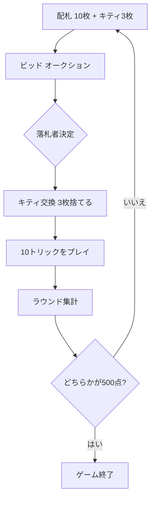

# 500 (ファイブハンドレッド)（Web版）遊び方

## ゲーム概要

500（ファイブハンドレッド）は、オーストラリアの国民的トリックテイキングゲームです。4人が2対2のチームに分かれ、オークション（ビッド）で切り札と獲得トリック数を競い、10回のトリックを戦います。ユーカーと同じく「ジョーカー」「ライトバウアー（切り札のJ）」「レフトバウアー（同色のJ）」が最強カードとなる特殊なランク変動を持ちます。先に500点に到達したチームの勝ちです。

## 起動方法

ブラウザでアプリを開き、ナビゲーションから「500 (ファイブハンドレッド)」を選択します。あなたはプレイヤー0（チーム0）で、対面のCPUがパートナー、両隣のCPUが対戦相手です。

## ルール

- **デッキ**: 43枚。ジョーカー1枚＋赤スート(♥♦)の 4〜A、黒スート(♠♣)の 5〜A。
- **配札**: 各プレイヤーに10枚、残り3枚を「キティ（場札）」とします。
- **ビッド**: 6〜10トリック × スート(♠＜♣＜♦＜♥＜NT) に加えて、ミゼール(250点)・オープンミゼール(520点)を宣言できます。各ビッドは現在の最高ビッドより高くする必要があります。
- **キティ交換**: 最高ビッダー（落札者）がキティ3枚を手札に加え、不要な3枚を捨てます。
- **カードの強さ**: 切り札契約では ジョーカー＞ライトバウアー＞レフトバウアー＞A＞K＞Q＞10＞… の順。ノートランプではジョーカーが最強で、リード時にスートを指名します。
- **得点**: 契約を達成すれば点数を獲得、失敗すれば同点を失います。守備側は獲得トリック1つにつき10点。ミゼールは落札者が単独で0トリックを目指します。
- **勝敗**: 先に+500点に到達したチームが勝利、-500点に到達したチームは敗北します。

## ゲームの流れ

## 画面の操作方法

- **ビッド**: トリック数を選び、スートボタン(♠♣♦♥)またはNTを押します。ミゼール/オープンミゼール/パスのボタンもあります。
- **キティ交換**: 手札からカードを3枚選び、「交換」を押します。
- **プレイ**: 出すカードを1枚選び、「出す」を押します。ノートランプでジョーカーをリードする場合は、指名するスートを選びます。
- **次のトリック / 次のラウンド**: トリックやラウンドが終わると表示されるボタンで進めます。
- **設定**: CPU難易度と目標スコアを変更できます。ヒントのオン/オフも切り替えられます。

## 画面構成

- 上部に現在のラウンド・契約・チームスコアを表示します。
- 中央に対戦相手の手札枚数と、現在のトリックに出されたカードが並びます。
- 下部にあなたの手札と、フェーズに応じた操作ボタンが表示されます。
- メッセージボックスに現在の状況や結果が表示されます。
- ラウンドが終わると、契約の成否・獲得トリック数・チームごとの増減点をまとめた行が表示されます。

## 遊び方のコツ

- 切り札にできる強いスートが手札に多いときは、積極的にビッドしましょう。ジョーカーと2枚のバウアーは切り札契約で特に強力です。
- パートナーが落札したら、相手の切り札を引き出すプレイで援護できます。
- 手札が極端に弱いときは、ミゼールで0トリックを狙うのも有効な戦略です。
- 守備側のときは、確実に取れるトリックを積み上げて10点ずつ稼ぎ、相手の契約を崩しましょう。
