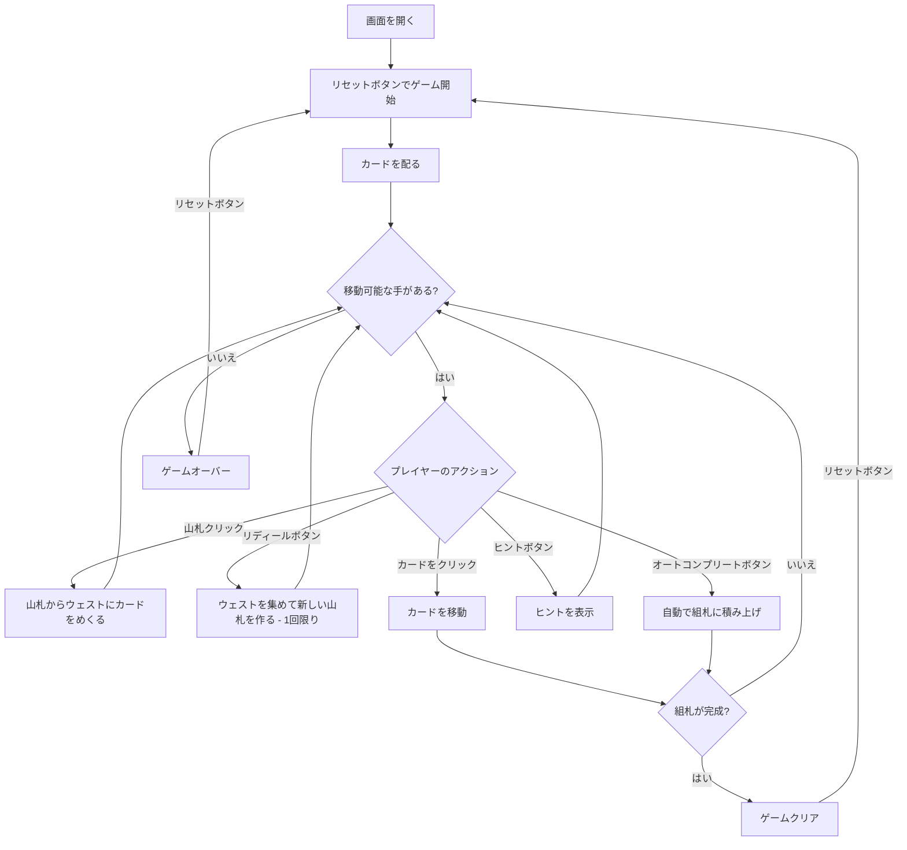

# フォーティ・アンド・エイト（Web版）遊び方

## ゲーム概要

1人用のソリティアカードゲームです。フォーティシーブスの変種で、2デッキ（104枚）を使い、8列×5枚のタブロー、山札、ウェスト、8つの組札で構成されます。組札にA→Kまでスート別に積み上げればクリアです。山札を使い切った後、ウェストを1回だけ集めて新しい山札を作れる（リディール）のが特徴です。

## 起動方法

```sh
go run ./cmd/trumpcards web  # CLI経由でWebサーバーを起動
go run ./cmd/server          # 直接Webサーバーを起動
```

ブラウザで `http://localhost:8080` にアクセスし、ナビゲーションバーから「フォーティ・アンド・エイト」を選択します。
ナビバーのJA/ENボタンで日本語・英語を切り替えられます。

## ルール

### 基本ルール

- 2デッキ（104枚、ジョーカーなし）を使用
- 8列のタブローに各5枚ずつ表向きで配る（計40枚）
- 残りの64枚は山札（ストック）に裏向きで置く
- 8つの組札（ファンデーション）はスート別にA→Kの順に積み上げる
- タブローでは同スート降順で重ねる（例: ♠Kの上に♠Qのみ）
- 移動できるのは1枚ずつのみ（複数枚の同時移動は不可）
- 空いた列にはどのカードでも置ける

### リディール（再構築）

- 山札を使い切った後、**「リディール」** ボタンでウェストを集めて新しい山札を作れます
- リディールはゲーム全体で **1回限り**

### ゲームクリア

- 8つの組札すべてにA→Kまで13枚ずつ積み上げるとゲームクリア

### ゲームオーバー

- これ以上移動可能な手がない場合はゲームオーバー

## ゲームの流れ



## 画面の操作方法

### カードを移動する

1. 移動元のカードをクリックして選択します
2. 移動先のカード（またはエリア）をクリックして移動を確定します
3. 同スート降順の場合のみ移動できます（1枚ずつ）

### 山札をめくる・リディール

1. 山札エリアをクリックしてカードをウェストにめくります（1枚ずつ）
2. 山札が空になったら、**「リディール」** ボタンでウェストを集めて新しい山札を作れます（1回限り）

### アンドゥ（元に戻す）

**「元に戻す」** ボタンまたは `z` キーで直前の操作を取り消せます。何度でも元に戻せます。

### ヒント・オートコンプリート

1. **「ヒント」** ボタンをクリックすると、次に可能な手を提案します
2. **「オートコンプリート」** ボタンをクリックすると、組札に安全に移動できるカードを自動で移動します

### キーボードショートカット

ゲーム中、以下のキーボードショートカットが使用できます。

| キー | アクション | 有効条件 |
|------|-----------|---------|
| `d` | カードをめくる（ドロー） | プレイ中 |
| `z` | 元に戻す（アンドゥ） | プレイ中 |
| `h` | ヒント | プレイ中 |
| `a` | オートコンプリート | プレイ中 |
| `g` | ギブアップ | プレイ中 |

※ テキスト入力欄にフォーカスがある場合、ショートカットは無効になります。

## 画面構成

```
┌────────────────────────────────────────────┐
│              ゲーム情報                     │
│  手数: 15                                   │
├────────────────────────────────────────────┤
│  山札・ウェストエリア    組札エリア         │
│  [山札] [♠5]          [♠][♠][♣][♣]       │
│                        [♥][♥][♦][♦]       │
├────────────────────────────────────────────┤
│              タブロー (8列×5枚)            │
│ [0]  [1]  [2]  [3]  [4]  [5]  [6]  [7]      │
├────────────────────────────────────────────┤
│  [引く] [リディール] [元に戻す] [ヒント]    │
│  [オートコンプリート] [ギブアップ] [リセット]│
└────────────────────────────────────────────┘
```

- **山札エリア**: クリックでカードをめくる（残りカード数表示）
- **ウェストエリア**: めくられたカードが表示される
- **組札エリア**: 8つのスート別の組札（A→Kの順に積み上げ、2デッキ分）
- **タブロー**: 8列のカード列（すべて表向き）
  - 表向きカード: クリックで選択・移動
- **ボタン**:
  - 「引く」: 山札からカードをめくる
  - 「リディール」: 山札が空のとき、ウェストを集めて新しい山札を作る（1回限り）
  - 「元に戻す」: 直前の操作を取り消す
  - 「ヒント」: 次の一手を提案
  - 「オートコンプリート」: 自動で組札へ移動
  - 「ギブアップ」: 現在のゲームを終了
  - 「リセット」: 新しいゲームを開始

## 遊び方のコツ

- すべてのカードが表向きなので、先を見越した計画が重要です
- Aが出たらすぐに組札へ移動しましょう
- 空いた列を作ることが攻略の鍵です — 一時的な置き場として活用できます
- 同スート降順でしか重ねられないため、移動先の選択は慎重に
- リディールは1回限り。本当に必要なときまで温存しましょう
- ヒントボタンで詰まった時のアドバイスを得られます
