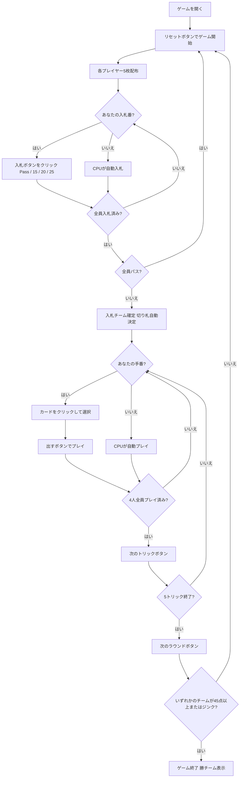

# オークション・フォーティファイブズ（Web版）遊び方

## ゲーム概要

Auction Forty-Fives（フォーティファイブズ）はアイルランドとカナダ・ノバスコシア州で広く親しまれているトリックテイキングゲームです。52枚の標準デッキを4人2チーム（席0&2 vs 席1&3）でプレイします。各ラウンドの最初に**入札フェーズ**があり、最高入札チームが**入札チーム（デクレアラー側）**として5トリックを争います。切り札5、切り札J、♥Aの3枚は常に最強の**固定トップトランプ**です。先に**45点**を獲得したチームの勝利です。あなたは席0（チームA）としてプレイします。

## 起動方法

```sh
go run ./cmd/trumpcards web         # CLI経由でWebサーバーを起動
go run ./cmd/trumpcards web --open  # サーバー起動 + ブラウザを開く
go run ./cmd/server                 # 直接Webサーバーを起動
```

ブラウザで `http://localhost:8080` にアクセスし、ナビゲーションバーから「オークション・フォーティファイブズ」を選択します。
ナビバーのJA/ENボタンで日本語・英語を切り替えられます。

## ルール

### デッキと配布

- **デッキ**: 52枚（A,2-10,J,Q,K × 4スート）
- **プレイヤー**: 4人2チーム（あなた = 席0・チームA、席0&2 vs 席1&3）
- **配布**: 各プレイヤー5枚、計5トリック
- **カードの強さ（切り札スートの場合、強い順）**: 切り札5 > 切り札J > ♥A（常に上位） > 切り札A > 切り札K > 切り札Q > 切り札その他 > リードスートのカード

### 入札フェーズ

ディーラーの左隣から時計回りに、各プレイヤーが1回だけ入札します。

| 入札 | 内容 |
|------|------|
| **Pass（パス）** | 入札をパスする |
| **15** | チームとして15点以上取ることを宣言 |
| **20** | チームとして20点以上取ることを宣言 |
| **25** | チームとして25点以上取ることを宣言（最高入札） |

- パス以外の入札は、現在の最高入札を上回らなければなりません（15 < 20 < 25）。
- 全員がパスした場合はそのラウンドは無効となり、再配布されます。
- 最高入札者のチームが**入札チーム**となり、入札者の最長スートが自動的に**切り札スート**に決まります（カード交換ステップは省略）。

### 固定トップトランプとリネギング

切り札スートに関係なく、以下3枚は常に最強の切り札です（強い順）。

1. **切り札5**（Five Fingers）
2. **切り札J**（Knave of Trump）
3. **♥A**（Ace of Hearts — 常にトップトランプ、ハートが切り札でなくても適用）

**リネギング（Reneging）**: 上記3枚のトップトランプはフォロー義務の免除があります。切り札リードで通常なら切り札を出さなければならない場面でも、トップトランプを温存して別のカードを出せます。

### 勝利条件

- 各トリックは**5点**（勝ったチームに加算）。5トリックで最大25点。
- **入札チーム**が入札値以上の点を取った場合 → その点数をチームスコアに加算。
- **入札チーム**が入札値を下回った場合 → 入札値をチームスコアから減算（失点）。
- **非入札チーム**は獲得したトリック得点をそのまま加算。
- **ジンク（Jink）**: 入札値25で5トリックすべて取った場合 → 即座に勝利。
- 先に**45点**に達したチームが勝利。

## ゲームの流れ



## 画面の操作方法

### BIDフェーズ（入札フェーズ）

あなたの入札番になると、手札の下に入札ボタンが表示されます。

- **「Pass」ボタン**: 入札をパスします。
- **「15」ボタン**: 15点入札を宣言します。先行入札が15以上の場合はグレーアウトして選択できません。
- **「20」ボタン**: 20点入札を宣言します。先行入札が20以上の場合は選択できません。
- **「25」ボタン**: 25点入札（最高入札）を宣言します。先行入札が25の場合は選択できません。

### PLAYフェーズ（トリックフェーズ）

- あなたの手番のとき、手札のカードをクリックして選択します。
- **「出す」ボタン**: 選択したカードをプレイします。スートフォロー義務に従う必要があります（リネギング対象の3枚を除き、義務に反するカードは選択できません）。
- **「次のトリック」ボタン**: トリックが解決したら次へ進みます。
- **「次のラウンド」ボタン**: 5トリック終了後にスコアを集計して次のラウンドへ進みます。

## 画面構成

```
┌─────────────────────────────────────────────────────┐
│  Auction Forty-Fives (フォーティファイブズ) [JA/EN] [CLI] │
├─────────────────────────────────────────────────────┤
│  ラウンド: 1  トリック: 0  フェーズ: BID             │
│  切り札: -  入札チーム: -  入札値: -                 │
│  チームA(あなた)=0  チームB=0                        │
├──────────┬──────────────────────────────────────────┤
│  CPU1    │                                           │
│  (チームB)│     現在のトリック表示エリア               │
│  CPU2    │     （各プレイヤーの出したカード）          │
│  (チームA)│                                           │
│  CPU3    │                                           │
│  (チームB)│                                           │
├──────────┼──────────────────────────────────────────┤
│  入札状況│  メッセージ / 結果表示                    │
│  CPU1=?  │  ラウンド結果・スコア情報                  │
│  CPU2=?  │                                           │
│  CPU3=?  │                                           │
├──────────┴──────────────────────────────────────────┤
│  あなたの手札（クリックで選択）                       │
│  [5♠][J♠][A♥][K♦][Q♣]                             │
│  [Pass] [15] [20] [25]        ← BIDフェーズ         │
│  [出す] [次のトリック] [次のラウンド] ← PLAYフェーズ │
└─────────────────────────────────────────────────────┘
```

- **ヘッダー**: ゲーム名・フェーズ表示・言語切り替えトグル・CLI切り替えトグル。
- **ラウンド／トリック表示**: 現在のラウンド番号・トリック番号・フェーズ・切り札スート・入札チームと入札値。
- **チームスコア**: 両チームの累積得点をリアルタイムで表示。
- **プレイヤー表示エリア（左）**: CPU各プレイヤーの手札枚数・チーム（入札チームか非入札チームか）を表示。
- **入札状況（左）**: 各プレイヤーの入札内容（入札フェーズ中）。
- **トリック表示エリア（中央）**: 場に出ているカードと出したプレイヤー名。
- **メッセージボックス**: フェーズ・ラウンド結果（トリック数・チーム得点）・勝敗の案内。
- **フッター（手札エリア）**: あなたの手札と操作ボタン（BIDフェーズは入札ボタン4種、PLAYフェーズは出す／次のトリック／次のラウンド）。
- **トップトランプのリング**: 手札のうち切り札の5・切り札のJ・♥Aにリングが付きます（♥Aは切り札スートに関係なく常に対象）。ホバーするとリネギング免除の説明が出ます。

## 遊び方のコツ

- **入札の判断**: 固定トップトランプ（切り札5・切り札J・♥A）を複数持っている場合は積極的に入札を検討しましょう。特に切り札5があれば最低1トリックは確実です。
- **チームメイトとの連携**: チームメイト（席2のCPU）の入札や動きを確認し、チームとして入札値の達成を目指しましょう。非入札チームはエース・キングで相手の入札チームを阻止します。
- **リネギングを活用**: 切り札5・切り札J・♥Aの3枚は温存が可能です。序盤の切り札合戦で温存しておき、終盤の決定的な場面で出すと有効です。
- **グレーアウトボタンを確認**: 入札フェーズで既に高い入札が出ている場合、それ以下のボタンはグレーアウトされます。残りの選択肢を確認してから入札しましょう。
- **入札25のリスク**: 入札25は5トリックすべてを取ればジンクで即勝利ですが、取れなかった場合は25点の失点です。強力な手札がなければ避けましょう。
- **点数管理**: 各トリック5点で計25点。45点が勝利条件です。チームスコアを常に確認し、残り何点で勝てるか意識しながら入札値を選びましょう。
