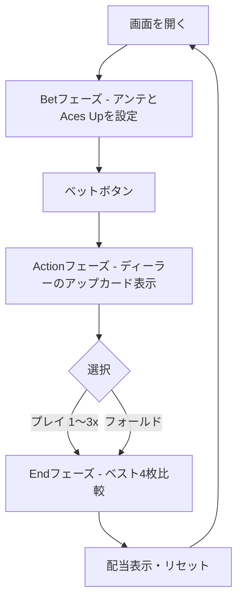

# フォーカードポーカー（Web版）遊び方

## ゲーム概要

Four Card Poker は、プレイヤーに5枚・ディーラーに6枚（うち1枚は表）を配り、それぞれが「ベスト4枚」で作った役を比較するカジノポーカーゲームです。ディーラーのクオリファイ条件が無く、テンポ良く勝負できるのが魅力です。

## 起動方法

```sh
go run ./cmd/trumpcards web  # CLI経由でWebサーバーを起動
go run ./cmd/server          # 直接Webサーバーを起動
```

ブラウザで `http://localhost:8080` にアクセスし、ナビゲーションバーから「フォーカードポーカー」を選択します。
ナビバーのJA/ENボタンで日本語・英語を切り替えられます。

## ルール

### 役の強さ（昇順）

ハイカード < ペア < ツーペア < ストレート < フラッシュ < スリーカード < ストレートフラッシュ < フォーカード

> 注意: 4枚ポーカーでは「フラッシュ」と「ストレート」の順位が通常の5枚ポーカーと逆になります。

### 配当

- アンテ／プレイ: 勝ち 1:1、引き分け プッシュ、負け 没収。
- アンテボーナス（自動配当）: スリーカード 2:1、ストレートフラッシュ 20:1、フォーカード 25:1。
- エースズアップ（サイドベット）: Aペア以上で配当発生。Aペア 1:1、ツーペア 2:1、ストレート 4:1、フラッシュ 5:1、スリーカード 7:1、ストレートフラッシュ 40:1、フォーカード 50:1。

## ゲームの流れ



## 画面の操作方法

### ベットフェーズ

1. Ante 入力欄に金額を入力（10チップ単位）。
2. 任意で Aces Up（サイドベット）金額を入力。
3. 「ベット」を押すとカードが配られます。

### アクションフェーズ

1. ディーラーのアップカードと自分の5枚を確認。
2. 「プレイ倍率」セレクタで 1x / 2x / 3x を選択。
3. 「プレイ」で勝負、または「フォールド」で降ります。

### 結果フェーズ

ベスト4枚どうしを比較した勝敗、各種配当、合計払戻しが表示されます。**実際に役を作った4枚は緑の枠で持ち上がり、外れた札は薄く表示されます**（プレイヤー・ディーラーとも）。「リセット」で次のラウンドへ。

### キーボードショートカット

| キー | アクション | 有効条件 |
|------|-----------|---------|
| `b` | ベット | Bet フェーズ |
| `p` | プレイ（選択中の倍率で） | Action フェーズ |
| `f` | フォールド | Action フェーズ |
| `r` | リセット | End フェーズ |

## 画面構成

```
┌──────────────────────────────────────────────┐
│  Four Card Poker            チップ: 900       │
│  PLAYER                                       │
│   ♠A ♣10 ♥5 ♦7 ♣2                            │
│  DEALER (アップカードのみ)                     │
│   ♠K                                          │
│                                               │
│  [ アンテ 100 ][ Aces Up 0 ]                  │
│  [ プレイ倍率: 2x ]  [プレイ] [フォールド]    │
└──────────────────────────────────────────────┘
```

## 遊び方のコツ

- アップカードがマイハンドのアウトを潰している場合（フラッシュ・ストレートを邪魔する等）は倍率を抑えるかフォールドが安全です。
- スリーカード以上が確定している場合はアンテボーナスを最大化するため 3x プレイを検討しましょう。
- エースズアップはハウスエッジが大きい賭けです。雰囲気重視で少額に留めるのが堅実です。
