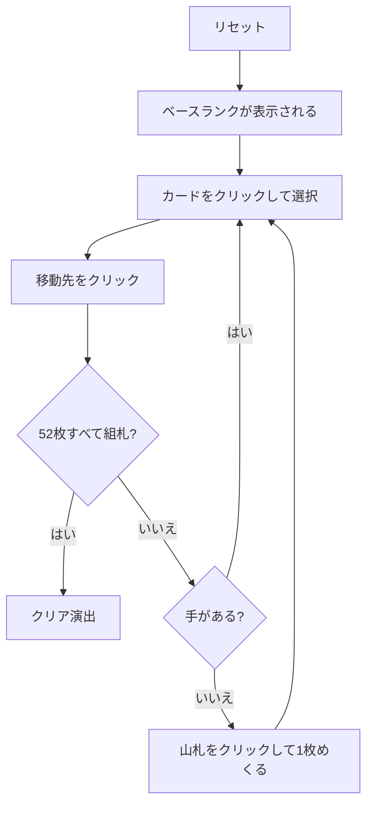

# フォーシーズンズ（Web版）遊び方

## ゲーム概要

イギリスの古典的な一人用ソリティア。コーナーズ（Corners）とも呼ばれる。十字に並べた5つの列と、四隅の4つの組札で遊ぶ。

**組札が A から始まるとは限らない**のが核心。配りはじめの1枚のランクが「ベースランク」になり、4つの組札はすべてそこから始まる。組札も列も**ラップアラウンド**する — K の次は A、A の下は K。

## 起動方法

```sh
go run ./cmd/trumpcards web  # CLI経由でWebサーバーを起動
go run ./cmd/server          # 直接Webサーバーを起動
```

ブラウザで `http://localhost:8080` にアクセスし、ナビゲーションバーから「フォーシーズンズ」を選択します。
ナビバーのJA/ENボタンで日本語・英語を切り替えられます。

## ルール

- 52 枚 1 組。十字に5枚、さらに1枚を四隅の1つに置く。**この1枚のランクがベースランク**
- 残り46枚は山札。1枚ずつめくって捨て札にする（めくり直しは無い）
- **四隅（組札）**: ベースランクから**同じスート**で昇順。K の次は A
- **十字（列）**: **スートを問わず**降順。A の下は K
- 動かせるのは各列の**最上段1枚だけ**
- 空いた十字のマスには**どのカードでも**置ける
- 52 枚すべてが四隅に乗れば勝ち

## ゲームの流れ



## 画面の操作方法

| 操作 | 説明 |
|------|------|
| 山札をクリック | 1枚めくって捨て札に置く |
| 捨て札・十字の列をクリック | 移動元として選択する（もう一度押すと解除） |
| 四隅をクリック | 選択中のカードをその組札に置く |
| 十字の列をクリック（選択中に） | 選択中のカードをその列に置く |
| ヒントボタン | 組札へ送れる手を1つ提示する |
| 元に戻すボタン | 直前の1手を取り消す |
| オートコンプリートボタン | 送れるカードを自動で組札へ送る |
| リセットボタン | 確認ダイアログのうえで最初からやり直す |
| CLI トグル | 同じゲームをコマンド入力で操作するモードに切り替える |

## 画面構成

- **上部**: フェーズ表示（プレイ中 / クリア）、手数、**ベースランク**
- **中央**: 四隅の組札（`n/13` と次に必要なランク）と、十字に並んだ5つの列
- **下部左**: 山札の残り枚数と捨て札の一番上
- **下部**: アクションログ、設定、操作ボタン

## 遊び方のコツ

- **ラップアラウンドを忘れない。** ベースランクが 7 なら組札は 7→8→…→K→A→2→…→6。K で止まりません
- 十字の列も A の下に K を置けます。手が無いと思ったらまずここを確認
- **空きマスは強力**だがすぐ埋めない。どのカードでも置けるので、詰まったときの逃げ場として温存する
- 山札はめくり直しが無いので、送れるカードは送っておく
- 四隅は先着順にスートが決まります。同じランクが複数あるとき、どの隅に置くかは自由です
