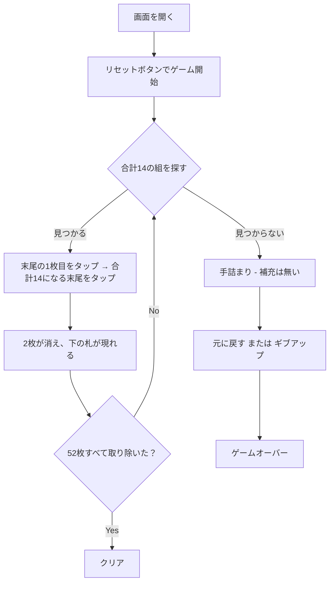

# フォーティーンアウト（Web版）遊び方

## ゲーム概要

1人用のペア除去ソリティアです。52枚すべてを **12列** に配り、各列の**末尾（一番手前）の札だけ**を使って、**ランクの合計が14になる2枚**をタップして取り除いていきます。52枚すべてを取り除ければクリアです。

**山札はありません。**52枚を最初に配り切るので、補充も配り直しもできません。合計14の組が作れなくなった時点で敗北です。

配りは 52 = 12×4 + 4 なので、**左から4列が5枚、残り8列が4枚**になります。

## 起動方法

```sh
go run ./cmd/trumpcards web     # CLI経由でWebサーバーを起動
go run ./cmd/server              # 直接Webサーバーを起動
```

ブラウザで `http://localhost:8080` にアクセスし、ナビゲーションバーから「フォーティーンアウト」を選択します。
ナビバーのJA/ENボタンで日本語・英語を切り替えられます。

## ルール

### 基本ルール

- 52枚のトランプ（ジョーカーなし）を使用
- リセット時、**12列**に配り切る（列0〜3が5枚、列4〜11が4枚）
- **選べるのは各列の末尾の札だけ**。その下の札は、上が取り除かれて初めて選べるようになる
- ペアになる条件は**ランクの合計が14**、ただそれだけ：
  - Aは1、J・Q・Kはそれぞれ11・12・13として数える
  - 成立する組は **K+A / Q+2 / J+3 / 10+4 / 9+5 / 8+6 / 7+7** の7通り
  - **スートは一切見ない**
  - **列が隣り合っている必要も無い**。列0と列11でも組める
- **K は A としか組めない**が、これは特別ルールではなく 13+1=14 という一般規則の結果です
- **同ランクで組めるのは 7 と 7 だけ**です

### ゲーム終了

- **クリア**: 全52枚を取り除いた状態
- **ゲームオーバー**: 露出している札のどの2枚も合計14にならない状態（手詰まり）。**補充する手段が無いので、そのまま敗北**です

## ゲームの流れ



## 画面の操作方法

| 要素 | 説明 |
|------|------|
| 12列の盤面 | 各列の**末尾の札**をタップして選択。1枚目を選んだ後、合計14になる別の列の末尾をタップすると両方が消えます |
| 元に戻す | 直前の取り除きを1手だけ取り消します |
| ヒント | サーバーが取り除ける組を1つ返します |
| ギブアップ | プレイ中なら明示的にゲームオーバーにします |
| リセット | 新しいデッキでゲームを最初から始めます |

## 推奨環境・操作

- スマートフォン（タップ）/ デスクトップ（クリック）両対応
- すべてのタップ対象は 44x44 px 以上（WCAG 2.5.5 AAA 準拠）
- ja / en 切り替えに対応

## 画面構成

上から順に、ページのコンポーネント構成そのままの並びです。

```
┌──────────────────────────────────────────────────┐
│  フォーティーンアウト                            │
│  取り除いた枚数: 0/52   除去可能: 5 組           │
├──────────────────────────────────────────────────┤
│  12列の盤面（末尾だけが選べる）                  │
│  列0  列1  列2  列3  列4  ...  列11              │
│  ♥10  ♣A   ♦4   ♣J   ♠5        ♠7               │
│  ♥4   ♦K   ♦2   ♥3   ♥9        ♣8               │
│  ♣3   ♠2   ♣4   ♠K   ♣2        ♦9               │
│  ♦3   ♥A   ♥K   ♣K   ♠Q        ♠3  ← 末尾       │
│  ♥5   ♣6   ♥2   ♥6                              │
├──────────────────────────────────────────────────┤
│  メッセージ / ヒント                             │
├──────────────────────────────────────────────────┤
│  設定パネル / 棋譜（アクションログ）             │
├──────────────────────────────────────────────────┤
│  [元に戻す] [ヒント] [ギブアップ]                │
│  [リセット]                                      │
└──────────────────────────────────────────────────┘
```

- **12列の盤面**: 選べるのは**各列の一番手前の札だけ**です。取り除けるのは**合計が14になる2枚**で、スートも列の位置も問いません
- **取り除いた枚数**: 52枚すべてを取り除けばクリア
- **除去可能**: いま作れる合計14の組の数。**0 になったら敗北が確定**しています（補充の手段が無いため）
- **メッセージ / ヒント**: 直前の操作の結果と、ヒントボタンを押したときの推奨手
- **設定 / 棋譜**: 設定と、これまでの手の履歴（折りたたみ式）
- **リセット**: 新しいゲームを開始します

## 遊び方のコツ

- **同じ札が2通りの組に使える時が分かれ道です。**9 が1枚と 5 が2枚あるとき、どちらの 5 と組むかで、その下から出てくる札が変わります。配り直せないので、この選択がそのまま勝敗になります。
- **深い列を優先して掘る**と選択肢が増えます。浅い列は最後に残しても手数が読めます。
- 7 は 7 としか組めません。場に 7 が奇数枚見えている状況は、どこかで詰む合図です。
- ヒントは取り除ける組を1つ返すだけで、最善手ではありません。「除去可能」の数を見ながら、どれを崩すか自分で決めてください。
