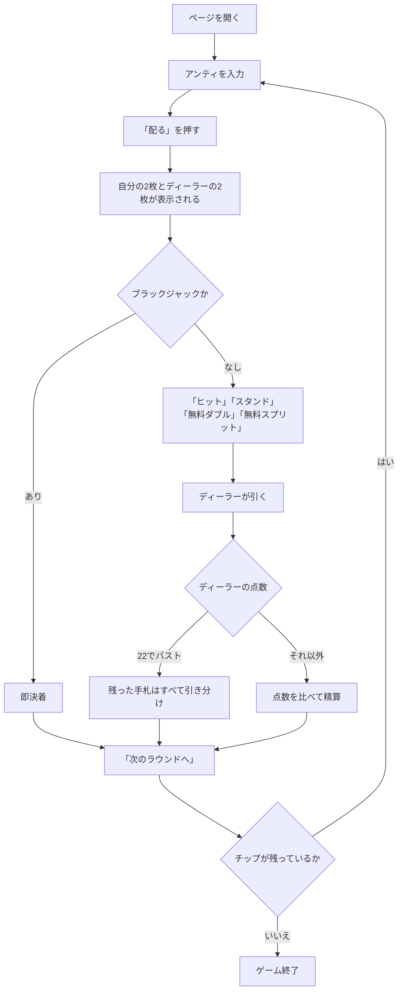

# フリーベット・ブラックジャック（Web版）遊び方

## ゲーム概要

フリーベット・ブラックジャックは、**ダブルとスプリットの上乗せぶんをハウスが払ってくれる**ブラックジャック派生です。自分のチップは最初のアンティしか出しません。

ただしこれは取引です。その対価として、**ディーラーが 22 でバストしたときは引き分け**になります。勝てるはずだった手札が引き分けに変わる、という形でハウスが元を取ります。

**この 2 つは必ずセットで動きます。** 片方だけを思い浮かべると期待値の感覚が大きく狂うので、常に「ハウスが払う代わりに 22 は引き分け」と 1 つの規則として覚えてください。

## 起動方法

```sh
go run ./cmd/trumpcards web  # CLI経由でWebサーバーを起動
go run ./cmd/server          # 直接Webサーバーを起動
```

サーバ起動後、ブラウザで `http://localhost:8080/freebet` を開きます。

## ルール

- 標準 52 枚 × 6 組（312 枚）のシューを使います。
- アンティを置くと、プレイヤーに 2 枚、ディーラーに 2 枚配られます。
- **無料ダブル**は、最初の 2 枚が**ハード 9・10・11** のときだけ使えます。上乗せぶんはハウスが出し、1 枚だけ引いて打ち止めです。
  - 勝てば**自分の賭け金ぶんとハウスの出資ぶんの両方**に配当が付きます。
  - 負けても**失うのは最初の賭け金だけ**です。
  - ソフト（エースを 11 と数える形）は対象外です。
- **無料スプリット**は同じ数字 2 枚のときに使えます。ただし **10 点札の対（10・J・Q・K）は対象外**です。分けた手札の賭け金もハウス持ちです。
  - エースを割ったときは 1 枚ずつで打ち止めです。
- **ディーラーはソフト 17 でヒット**します。
- **ディーラーが 22 でバストしたら、残っている手札はすべて引き分け**です。23 以上のバストは普通どおりプレイヤーの勝ちになります。
  - 自分がバストしていたら、その手札はディーラーの 22 に関係なく負けです。
  - 22 の引き分けで戻るのは**自分が出した賭け金だけ**です。
- **プレイヤーのブラックジャックは 3:2** のままです。

## ゲームの流れ



## 画面の操作方法

| 操作 | 説明 |
|------|------|
| アンティ入力 | 10〜500 で指定します |
| 「配る」 | アンティを確定して配ります |
| 「ヒット」 | 1枚引きます |
| 「スタンド」 | 打ち止めにします |
| 「無料ダブル」 | ハード9〜11のときだけ押せます。チップは要りません |
| 「無料スプリット」 | 10点札以外の対のときだけ押せます。チップは要りません |
| 「次のラウンドへ」 | 決着後、次のラウンドを始めます |
| ヒントボタン | いまの場面の定石を表示します |
| 棋譜ボタン | これまでの行動ログを表示します |
| リセットボタン | ゲームを最初からやり直します |

**無料ダブルと無料スプリットの可否はサーバが決めています。** 画面はその値に従うだけなので、使えない場面ではボタンが出ません。

## 画面構成

- **フェーズ表示**: `BET`（賭け）/ `PLAY`（プレイ）/ `RESULT`（決着）
- **ディーラー**: 2 枚とも最初から表示されます。追加ベット系のゲームと違い、伏せ札はありません
- **自分の手札**: スプリットすると複数行になり、操作中の手札が強調されます
- **賭けの表示**: 各手札に**自分の賭け金**と**ハウスの出資**が別々に出ます。前者が負けたときに失う額、後者は勝ったときだけ配当が付く額です
- **決着**: 手札ごとの勝敗と、そのラウンドの収支。ディーラーが 22 でバストしたラウンドはその旨が明示されます
- **チップ**: 現在の持ちチップ

## 遊び方のコツ

- **無料ダブルと無料スプリットは、使えるなら基本的に使います。** 上乗せぶんを失うことがないので、勝ち目が五分を割っていても損になりません。ヒントもこの方針で助言します。
- **9・10・11 でしかダブルできない**点に注意してください。普通のブラックジャックでダブルするソフトハンドは対象外です。
- **10 点札の対は割れません。** 20 という完成した手を無料で 2 つに増やせてしまうと有利すぎるためです。
- **ディーラーの 22 が引き分けになる**ぶん、自分からバストしにいく手はいつもより損です。
