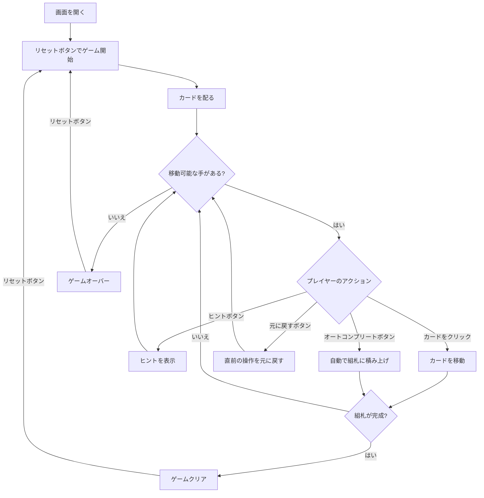

# フリーセル（Web版）遊び方

## ゲーム概要

1人用のソリティアカードゲームです。52枚のカードを使い、8列のタブロー、4つのフリーセル、4つの組札で構成されます。すべてのカードが表向きに配られ、組札にA→Kまでスート別に積み上げればクリアです。

## 起動方法

```sh
go run ./cmd/trumpcards web     # CLI経由でWebサーバーを起動
go run ./cmd/server             # 直接Webサーバーを起動
```

ブラウザで `http://localhost:8080` にアクセスし、ナビゲーションバーから「フリーセル」を選択します。
ナビバーのJA/ENボタンで日本語・英語を切り替えられます。

## ルール

### 基本ルール

- 52枚のトランプ（ジョーカーなし）を使用
- 8列のタブローに配る（最初の4列に7枚ずつ、残りの4列に6枚ずつ）、すべて表向き
- 4つのフリーセル: 一時的にカード1枚を置ける場所
- 4つの組札（ファンデーション）はスート別にA→Kの順に積み上げる
- タブローでは降順かつ交互の色で重ねる（例: 黒のKの上に赤のQ）
- 空いた列にはKのみ置くことができる

### スーパームーブ

一度に移動できるカード数は以下の計算式で決まります:

```
最大移動枚数 = (1 + 空きフリーセル数) × 2^(空きタブロー列数)
```

**空き列へ移す場合はもう一段低くなります。**移動先の空き列そのものを経由地に
使えないためで、画面には「一括移動上限」と並べて表示されます。選択中の束が
この上限を超えている空き列は薄く表示され、ツールチップに理由が出ます。

### ゲームクリア

- 4つの組札すべてにA→Kまで13枚ずつ積み上げるとゲームクリア

### ゲームオーバー

- これ以上移動可能な手がない場合はゲームオーバー

### 手詰まり検出

- 各操作の後、ソルバー（DFS + メモ化）がボード全体を解析し、解法が存在しないと判定された場合「手詰まりです」とメッセージが表示されます
- 手詰まり状態では「元に戻す」またはギブアップを選択できます
- ソルバーの探索上限（100,000状態）を超えた場合は手詰まりとは判定しません

## ゲームの流れ



## 画面の操作方法

### カードを移動する

1. 移動元のカードをクリックして選択します
2. 移動先のカード（またはエリア）をクリックして移動を確定します
3. タブロー内では降順・交互色の連続したカード列をまとめて移動できます（スーパームーブ）

### フリーセルを使う

1. タブローのカードを選択し、空いているフリーセルをクリックして退避します
2. フリーセルのカードを選択し、タブローや組札をクリックして戻します

### アンドゥ（元に戻す）

**「元に戻す」** ボタンまたは `z` キーで直前の操作を取り消せます。何度でも元に戻せます。

### ヒント・オートコンプリート

1. **「ヒント」** ボタンをクリックすると、次に可能な手を提案します
2. **「オートコンプリート」** ボタンをクリックすると、組札に安全に移動できるカードを自動で移動します

### キーボードショートカット

ゲーム中、以下のキーボードショートカットが使用できます。

| キー | アクション | 有効条件 |
|------|-----------|---------|
| `z` | 元に戻す（アンドゥ） | プレイ中 |
| `h` | ヒント | プレイ中 |
| `a` | オートコンプリート | プレイ中 |
| `g` | ギブアップ | プレイ中 |

※ テキスト入力欄にフォーカスがある場合、ショートカットは無効になります。

## 画面構成

```
┌────────────────────────────────────────────┐
│              ゲーム情報                     │
│  手数: 15                                  │
├────────────────────────────────────────────┤
│  フリーセルエリア        組札エリア         │
│  [♠K][  ][  ][  ]     [♠A][♥A2][  ][  ]  │
├────────────────────────────────────────────┤
│              タブロー                      │
│  [0]  [1]  [2]  [3]  [4]  [5]  [6]  [7]  │
│  ♥Q  ♠J   ♦Q   ♣Q   ♥9   ♠6   ♦3   ♠5   │
│  ♣J  ♥10  ♣K   ♦J   ♣6   ♥5   ♣5   ♦7   │
│  ♦10 ♣9   ♥J   ♠Q   ♦5   ♦4   ♠3   ♣A   │
│  ♠9  ♦8   ♠10  ♥K   ♠4   ♣3   ♥2   ♠A   │
│  ♥8  ♠7   ♦9   ♦K   ♥3   ♠2   ♦2   ♦A   │
│  ♣7  ♥6   ♣8   ♣10  ♣2   ♥4   ♣4   ♥A   │
│  ♦6       ♥7   ♠8                         │
├────────────────────────────────────────────┤
│  [元に戻す] [ヒント] [オートコンプリート]  │
│  [ギブアップ] [リセット]                   │
└────────────────────────────────────────────┘
```

- **フリーセルエリア**: 4つの一時退避スペース（カード1枚ずつ）
- **組札エリア**: 4つのスート別の組札（A→Kの順に積み上げ）
- **タブロー**: 8列のカード列（すべて表向き）
- **ボタン**:
  - 「元に戻す」: 直前の操作を取り消す
  - 「ヒント」: 次の一手を提案
  - 「オートコンプリート」: 自動で組札へ移動
  - 「ギブアップ」: 現在のゲームを終了
  - 「リセット」: 新しいゲームを開始

## 遊び方のコツ

- フリーセルは一時的な退避場所です。むやみに埋めないようにしましょう
- 空いたタブロー列はスーパームーブの計算に影響するため、戦略的に活用しましょう
- Aが出たらすぐに組札へ移動しましょう
- 空いた列にはKのみ置くことができます
- ヒントボタンで詰まった時のアドバイスを得られます
- オートコンプリートは組札に安全に移動できるカードがある場合に便利です
