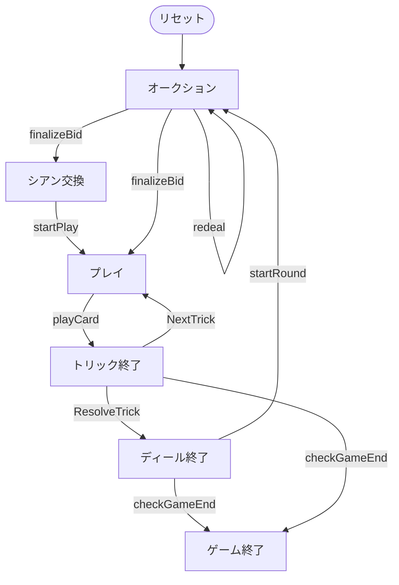

# フレンチタロット（Web版）遊び方

## ゲーム概要

French Tarot（フレンチタロット）はフランスの4人用**トリックテイキングゲーム**です。78枚のタロットデッキ（4スート × 14枚、切り札21枚、エクスキューズ）を使い、あなたは**席0**としてプレイします。オークションで最高入札者が**デクレアラー（declarer）**となり、残り3人のCPUからなる**防御側（defenders）**と対戦します。契約（コントラクト）の成否とウードラーの枚数で得点が決まります。

## 起動方法

```sh
go run ./cmd/trumpcards web         # CLI経由でWebサーバーを起動
go run ./cmd/trumpcards web --open  # サーバー起動 + ブラウザを開く
go run ./cmd/server                 # 直接Webサーバーを起動
```

ブラウザで `http://localhost:8080` にアクセスし、ナビゲーションバーから「フレンチタロット」を選択します。
ナビバーのJA/ENボタンで日本語・英語を切り替えられます。

## ルール

### デッキと配布

- **デッキ**: 78枚。
  - **スート札**: ♠♥♦♣ の4スート × 各14枚（1〜10、V=ヴァレ／C=カヴァリエ／D=ダーム／R=ロワ）。
  - **切り札（アトゥ）**: 番号1〜21の21枚（紫の ✦ 表示）。数字が大きいほど強い。
  - **エクスキューズ**: ★ 表示の特殊札1枚（金色）。
- **プレイヤー**: 4人（あなた = 席0、CPU1〜3）。各18枚。
- **シアン（chien）**: 場に伏せた6枚の札。

### ウードラー（bouts）

**切り札の1（プティ）**・**切り札の21**・**エクスキューズ**の3枚を**ウードラー**と呼びます。デクレアラーが手札＋獲得トリックで持つウードラーの枚数によって、契約成功に必要な得点が変わります。

- 3枚: 36点、2枚: 41点、1枚: 51点、0枚: 56点。

### オークション（入札）

各プレイヤーは順番に、パスするか、より高いコントラクトを宣言します。宣言できるコントラクトは以下の順に強くなります。

- **プティット（Petite）**: シアンを公開して手札に加え、6枚を捨てる。倍率 ×1。
- **ガルド（Garde）**: プティットと同じ手順。倍率 ×2。
- **ガルド・サン（Garde Sans）**: シアンは公開せずデクレアラー側の得点に加える（交換なし）。倍率 ×4。
- **ガルド・コントル（Garde Contre）**: シアンは防御側の得点に加える。倍率 ×6。

全員がパスした場合は再配札となります。最高入札者がデクレアラーです。

### シアン交換（エカルト）

プティット／ガルドでデクレアラーになった場合、シアン6枚が公開されて手札に加わり（24枚）、そこから**6枚を伏せて捨てます（エカルト）**。

- **キング（R）とエクスキューズは捨てられません。**
- 捨てた札の得点はデクレアラーの獲得点に含まれます。

Web版では、捨てられない札は選択できないよう淡色表示になります。6枚を選ぶと「捨てる」ボタンが有効になります。

### プレイ

リードされたスートに**マストフォロー**。フォローできない場合は**切り札を出さなければなりません**（原則として直前までの最高切り札を上回る「シュルクープ」が必要）。切り札も持っていない場合は任意の札を出せます。

- トリックは、切り札が出ていれば最も高い切り札、なければリードスートの最も高い札を出したプレイヤーが取ります。
- **エクスキューズ**はほぼどのトリックでも出せますが、トリックを取ることはできず、自分の側に残ります。

### 得点

デクレアラーが獲得点で必要点に達すれば**契約成功**、届かなければ**失敗**です。

- 基礎点 = 25 +（必要点との差）+ ボーナス。
- コントラクト倍率（×1〜×6）を掛けた点数を、デクレアラーと防御側3人でやり取りします（デクレアラーは ±3倍、各防御側は ∓1倍）。

規定ディール数を戦い、累計得点が最も高いプレイヤーが勝者です。

## ゲームの流れ

ゲームの進行は `internal/domain/FrenchTarot.go` のフェーズ機械そのものです。各ノードは同ファイルの `FrenchTarotPhase` 定数、矢印ラベルはその遷移を行うメソッド名です。



## 画面の操作方法

- **入札**: 「パス」または「プティット／ガルド／ガルド・サン／ガルド・コントル」ボタン。現在の最高入札以下のコントラクトは選べません。
- **シアン交換**: 手札から6枚を選び「捨てる」ボタン。
- **プレイ**: 出せるカードをクリックして「出す」ボタン。
- **次のトリック／次のディール**: フェーズ終了後にボタンで進みます。
- **ヒント**: 設定でヒントを有効にすると、推奨アクションが表示されます。
- **CLIモード**: 画面右上のトグルでコマンド入力モードに切り替えられます。

## 画面構成

上から順に、ページのコンポーネント構成そのままの並びです。

```
┌──────────────────────────────────────────────────┐
│  フレンチタロット                                         │
│  ディール: 1  トリック: 0  コントラクト: -
├──────────────────────────────────────────────────┤
│  設定パネル（CPU難易度・目標点など）             │
├──────────────────────────────────────────────────┤
│  場（現在のトリック）                            │
│    CPU1 [♠A]   CPU2 [♠9]   CPU3 [♠8]             │
│  直前のトリック（勝者つき）                      │
├──────────────────────────────────────────────────┤
│  メッセージ / ヒント                             │
├──────────────────────────────────────────────────┤
│  棋譜（アクションログ）                          │
├──────────────────────────────────────────────────┤
│  あなたの手札                                    │
│  [♠K][♠Q][♣Q][♣10][♥J][♥10][♥9][♥7][♦J]        │
│  [入札] [パス] [カードを出す] [次へ]
│  [リセット]                                      │
└──────────────────────────────────────────────────┘
```

- **ヘッダー**: ディール数・トリック数・確定したコントラクト
- **設定パネル**: CPU 難易度
- **場**: 現在のトリックと直前のトリック
- **手札**: `T1`〜`T21` が切り札、`Excuse` は特殊札で原則としてトリックを取らない- **メッセージ / ヒント**: 直前の操作の結果と、ヒントボタンを押したときの推奨手
- **棋譜（アクションログ）**: これまでの手の履歴。折りたたみ式
- **あなたの手札**: 出せるカードだけが押せます。出せない札は淡く表示されます
- **リセット**: 新しいゲームを開始します
- **CLIモード切替**: 画面右上のトグルで、CUI 版と同じテキスト表示に切り替えられます（`CliToggle` / `CliTerminal`）
