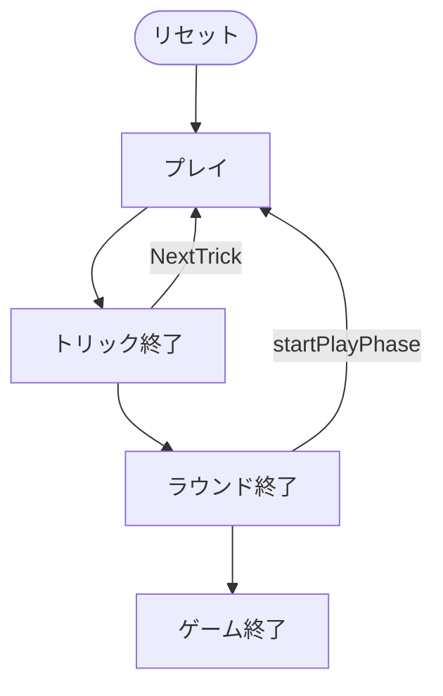

# ガイゲル（Web版）遊び方

## ゲーム概要

Gaigel（ガイゲル）はドイツ・シュヴァーベン地方の伝統的なトリックテイキングゲームで、シュナプセン（66）の系統に属します。48枚デッキ（A,10,K,Q,J,7 を各2枚ずつ）を使う4人2チーム制で、山札（タロン）から補充しながらプレイし、K+Q のマリッジ宣言でボーナス点を獲得します。先に101点に達したチームが勝利します。Web版では3つのCPUと自動的に組み合わせられ、ボタン操作でプレイできます。

## 起動方法

```sh
go run ./cmd/trumpcards web  # CLI経由でWebサーバーを起動
go run ./cmd/server          # 直接Webサーバーを起動
```

ブラウザで `http://localhost:8080` にアクセスし、ナビゲーションバーから「ガイゲル」を選択します。
ナビバーのJA/ENボタンで日本語・英語を切り替えられます。

## ルール

### 基本ルール

- プレイヤーは4人（人間1 + CPU3）。プレイヤー0と2、プレイヤー1と3が同チーム（人間はプレイヤー0）。
- 48枚デッキ（A,10,K,Q,J,7 × 4スート × 2枚）を使用。各プレイヤーに5枚配り、残りは山札（タロン）に。

### 2つのフェーズ

1. **フェーズ1（山札あり）**: フォローは任意。各トリック後に山札から手札が5枚になるよう補充します。
2. **フェーズ2（山札なし）**: 厳格なフォロー義務（マストフォロー）が発生します。

### マリッジ

リード時に同一スートの K+Q を持っていれば「マリッジ」を宣言し、自チームに20点（切り札なら40点）を加算できます。

### カード点とトリックの強さ

- カード点: A=11, 10=10, K=4, Q=3, J=2, 7=0
- トリックの強さ: A > 10 > K > Q > J > 7

### 勝敗

各ラウンドのカード点＋マリッジ点を累計し、先に101点（変更可）に達したチームが勝利します。

## ゲームの流れ

ゲームの進行は `internal/domain/Gaigel.go` のフェーズ機械そのものです。各ノードは同ファイルの `GaigelPhase` 定数、矢印ラベルはその遷移を行うメソッド名です。



## 画面の操作方法

- 自分の手番では、出すカードを選択して「出す」でプレイします。
- 同一スートの K+Q を持ってリードする場面では、対象カードを選ぶと「マリッジ」ボタンが表示され、宣言できます。
- トリック終了後は「次のトリック」、ラウンド終了後は「次のラウンド」ボタンで進めます。
- 「ヒント」ボタンで推奨手を確認できます。

## 画面構成

上から順に、ページのコンポーネント構成そのままの並びです。

```
┌──────────────────────────────────────────────────┐
│  ガイゲル                                         │
│  ラウンド: 1  トリック: 1  切り札: ♣  山札: 残り12枚
├──────────────────────────────────────────────────┤
│  設定パネル（CPU難易度・目標点など）             │
├──────────────────────────────────────────────────┤
│  場（現在のトリック）                            │
│    CPU1 [♠A]   CPU2 [♠9]   CPU3 [♠8]             │
│  直前のトリック（勝者つき）                      │
│  ラウンド得点アナウンス（ラウンド終了時）        │
├──────────────────────────────────────────────────┤
│  メッセージ / ヒント                             │
├──────────────────────────────────────────────────┤
│  棋譜（アクションログ）                          │
├──────────────────────────────────────────────────┤
│  あなたの手札                                    │
│  [♠K][♠Q][♣Q][♣10][♥J][♥10][♥9][♥7][♦J]        │
│  [カードを出す] [マリアージュ宣言] [次のトリック] [ヒント]
│  [リセット]                                      │
└──────────────────────────────────────────────────┘
```

- **ヘッダー**: ラウンド数・トリック数・切り札スート・山札の残り枚数
- **山札**: 尽きるとフォロー義務が発生するため、残り枚数は戦術上の重要な情報です
- **マリアージュ宣言**: 同スートの K と Q を持っているときに宣言して加点します
- **ラウンド得点アナウンス**: ラウンド終了時の内訳- **メッセージ / ヒント**: 直前の操作の結果と、ヒントボタンを押したときの推奨手
- **棋譜（アクションログ）**: これまでの手の履歴。折りたたみ式
- **あなたの手札**: 出せるカードだけが押せます。出せない札は淡く表示されます
- **リセット**: 新しいゲームを開始します
