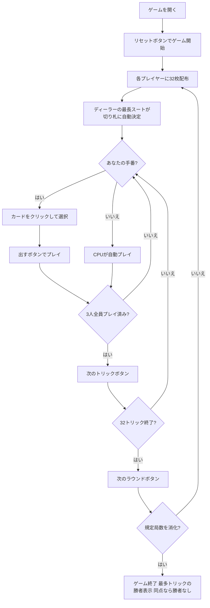

# ガンジファ（Web版）遊び方

## ゲーム概要

Ganjifa（ガンジファ）はムガル帝国期のインドで遊ばれていたトリックテイキングゲームです。8スート × 1〜12 の円形96枚デッキを3人でプレイします。このゲームを他と分けているのは **スート群でランクの向きが逆転する** ことに尽きます。

- **強いスート群**（design 1〜4 / Taj・Shamsher・Ashrafi・Ghulam）: 数字が**大きい**ほど強い（12 が最強、1 が最弱）
- **弱いスート群**（design 5〜8 / Chang・Surkh・Barat・Qimash）: 数字が**小さい**ほど強い（1 が最強、12 が最弱）

同じ「3」が、強い群では下から3番目、弱い群では上から3番目になります。切り札はディーラーの手札で最も多いスートが局ごとに選ばれ、**切り札が強い群か弱い群かで手札の読み方が反転する**ため、画面には毎回どちらの群かが表示されます。入札はありません。3人が対等に32トリックを競い、規定局数（デフォルト**3局**）終了時に累計トリック数が最大のプレイヤーが勝者です。同点なら勝者なしとなります。あなたは席0としてプレイします。

## 起動方法

```sh
go run ./cmd/trumpcards web        # サーバーを起動
go run ./cmd/trumpcards web --open # サーバー起動 + ブラウザを開く
```

ブラウザで `http://localhost:8080/ganjifa` を開きます。

## ルール

### デッキと配布

- **デッキ**: 96枚（8スート × 1〜12）
- **プレイヤー**: 3人（あなた = 席0、CPU1・CPU2）
- **配布**: 各プレイヤー32枚、1ラウンド32トリック（山札に残る札はありません）

### カードの強さ

| スート群 | design | 画面の色 | 最強 → 最弱 |
|----------|--------|----------|-------------|
| 強い群 | 1〜4 | 黒 | 12 → 11 → 10 → … → 2 → 1 |
| 弱い群 | 5〜8 | 青 | 1 → 2 → 3 → … → 11 → 12 |

カードは専用の絵札を持たないため、スート記号と数字で手続き的に描画されます。**記号の色がそのスートの群を表す**ので、色を見ればその札の強弱がどちら向きに読めるか分かります。

### 切り札

- 各ラウンドの開始時に、**ディーラーの手札で最も枚数の多いスート**が自動的に切り札になります。入札も宣言もデクレアラーもありません。
- 情報行の下に、切り札が強い群か弱い群かを示す1行が常に表示されます（強い群は青文字、弱い群は黄文字）。

### トリック・テイキング

- **スートフォロー義務**: リードされたスートのカードを持っている場合は必ず出さなければなりません。出せないカードは選択できないよう抑止されます。
- 持っていない場合は任意のカードを出せます（切り札でも他スートでも可）。
- **トリックの勝者**:
  - 切り札スートのカードが場にあれば、最も強い切り札カードが勝ちます。
  - 切り札がなければ、リードスートの最も強いカードが勝ちます。
  - いずれの「最も強い」も、上表の**群を踏まえた順序**で判定されます。
- トリックの勝者が次のトリックをリードします。

### 勝利条件

- **1トリック = 1点**。取ったトリック数がそのまま得点になります。
- 規定局数（設定で **3 / 6 / 9** から選択、デフォルト3局）を終えた時点で、累計得点が最大のプレイヤーが勝者です。
- **同点の場合は勝者なし**となります。

## ゲームの流れ



## 画面の操作方法

### 設定パネル

- **CPU難易度**: Easy / Normal / Hard。変更するとゲームがリセットされます。
- **ラウンド数**: 3 / 6 / 9。変更するとゲームがリセットされます。
- **ヒント表示**: フロントエンドのヒントツールチップの有効・無効。

### PLAYフェーズ（トリックフェーズ）

- あなたの手番のとき、手札のカードをクリックして選択します。
- **「出す」ボタン**: 選択したカードをプレイします。カードをちょうど1枚選ぶまで押せません。
- **「次のトリック」ボタン**: トリックが解決したら次へ進みます。
- トリックが解決すると、勝ったカードに金色の枠と「勝ち」バッジが付きます（他のトリックテイキングゲームと同じ表示です）。
- **「次のラウンド」ボタン**: 32トリック終了後にスコアを集計して次のラウンドへ進みます。

入札フェーズは存在しないため、入札ボタンは表示されません。

## 画面構成

```
┌─────────────────────────────────────────────────────┐
│  Ganjifa (ガンジファ) [JA/EN] [CLI]                  │
├─────────────────────────────────────────────────────┤
│  ラウンド: 1  トリック: 1  切り札: ♛ Taj  全3ラウンド │
│  切り札は強い群 — 数字が大きいほど強い（12が最強）    │
├──────────┬──────────────────────────────────────────┤
│          │  得点: あなた=0  CPU1=0  CPU2=0           │
│  現在の  │                                           │
│  トリック│  プレイヤー: 手札枚数 / 獲得トリック       │
│  表示    │                                           │
│  エリア  │  ラウンド結果（ラウンド終了時のみ）        │
├──────────┴──────────────────────────────────────────┤
│  メッセージ / 結果表示                                │
├─────────────────────────────────────────────────────┤
│  あなたの手札（クリックで選択）                       │
│  [♛12][♪1][†7][◉3][♟11][✦2][▤9][▧5] ...            │
│  [出す] [次のトリック] [次のラウンド] [リセット]       │
└─────────────────────────────────────────────────────┘
```

- **ヘッダー**: ゲーム名・フェーズ表示・言語切り替えトグル・CLI切り替えトグル。
- **情報行**: 現在のラウンド番号・トリック番号・切り札スート（記号と名前）・規定ラウンド数。
- **群の行**: いま手札をどちらの向きで読むべきかを示します。**この1行がないと手札の並びを読み違えます。**
- **トリック表示エリア（中央左）**: 場に出ているカードと出したプレイヤー名。
- **得点／プレイヤー情報（右）**: 各プレイヤーの累計得点、手札枚数、このラウンドで取ったトリック数。モバイルではプレイヤー情報が折りたたみ表示になります。
- **ラウンド結果**: ラウンド終了時とゲーム終了時に、各プレイヤーのトリック数を表示します。
- **フッター（手札エリア）**: あなたの手札と操作ボタン。出せないカードは選択できません。

## 遊び方のコツ

- **まず色を見る**: 記号が黒いスートは数字が大きいほど強く、青いスートは小さいほど強くなります。色を確認せずに数字だけで判断すると、最強札を最弱札と取り違えます。
- **青いスートの1と2は隠れたエース**: 数字が小さいので見落としがちですが、弱いスートの1は同スートの最強札です。
- **切り札の枚数を数える**: 切り札はディーラーの最長スートなので、ディーラーが切り札を多く持っています。自分がディーラーでない局では、切り札の勝負を急がず、切り札を持たないスートでの取り合いを優先する方が安全です。
- **マストフォローから相手の手札を読む**: 誰かがリードスートを出せなかったら、そのプレイヤーはそのスートを切らしています。32トリックは長いので、序盤に判明したボイド情報が終盤で効いてきます。
- **1トリック1点なので大きな博打は不要**: 契約もペナルティもありません。取れるトリックを堅実に積む方が有利です。取れないトリックには最弱札（黒なら1、青なら12）を捨てましょう。
- **ヒントは群を考慮済み**: ヒントが示す札は、群の反転を踏まえた強弱で選ばれています。判断に迷ったら、まずヒントで自分の読みと突き合わせてみてください。
