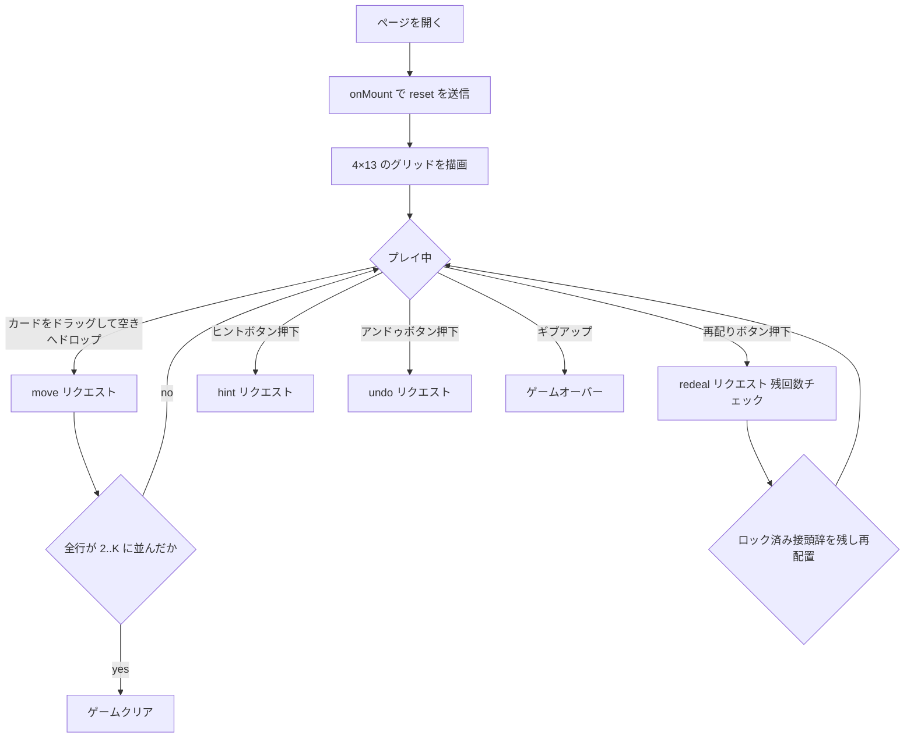

# ギャップス（Web版）遊び方

## ゲーム概要

Gaps（別名 Montana / Addiction）は、4 行 × 13 列のグリッド上でカードをドラッグ & ドロップして、各行を 2〜K の昇順かつ同スートに並び替えるパズル系ソリティアです。エースは盤上に存在せず、その代わりに 4 つの空きセルがあります。

## 起動方法

```sh
go run ./cmd/trumpcards web  # CLI経由でWebサーバーを起動
go run ./cmd/server          # 直接Webサーバーを起動
```

ブラウザで `http://localhost:8080` にアクセスし、ナビゲーションバーの「ソリティア」カテゴリから「ギャップス」を選択します。ナビバーの JA/EN ボタンで日本語・英語を切り替えられます。

## ルール

### 基本ルール

- 52 枚を 4×13 のグリッドに表向きで配ります。
- A は盤面から除かれ、4 つの空きセル（gap）になります。
- 各行を `2,3,4,…,K` の昇順 (1 行 1 スート) に並び替えると勝利です。

### 移動ルール

- カードをドラッグし、空きセルへドロップします。
- 空きセルの**左隣**にあるカードと「同じスートで +1 のランク」のカードだけが置けます。
- 各行の左端 (列 0) の空きセルには、任意の「2」を置けます。
- 空きセルの左隣が K の場合、そのセルへは何も置けません (チェーンが終端しているため)。

### 再配り (Redeal)

- 手詰まりになったら「再配り」ボタンを押せます。最大 **3 回** まで使えます。
- 各行で左端から続いている「正しく並んだ接頭辞」(`2,3,…`) はそのまま保存され、それ以降のセルがシャッフルされて再配置されます。
- 再配り直後は、各行のロック済み接頭辞の直後 1 セルが空きになります。

### 終了条件

- **ゲームクリア**: 4 行すべてが `2..K` の同スート昇順に並んだとき。
- **ゲームオーバー**: 再配りを使い切り、かつ動かせる手が 1 つもないとき。`ギブアップ` ボタンでも終了できます。

## ゲームの流れ



## 画面の操作方法

### プレイフェーズ

| 操作 | アクション |
|------|-----------|
| カードをドラッグ → 空きセルにドロップ | 合法なら移動が確定し手数 +1 |
| 「再配り」ボタン | 残り回数があれば残ったカードを再配置 (最大 3 回) |
| 「ヒント」ボタン | 次に打てる一手を提案 |
| 「アンドゥ」ボタン | 直前の操作を取り消す |
| 「ギブアップ」ボタン | ゲームをすぐに終了 |
| 「リセット」ボタン | 確認ダイアログ後に新しい盤面で再スタート |

ヒント表示中はソース/ターゲットのセルが黄色の枠でハイライトされます。

### 終了フェーズ

ゲームクリア / オーバー時はアクションボタンが隠れ、アクションログとリセットボタンのみが表示されます。

## 画面構成

```
┌──────────────────────────────────────────────────────────┐
│ ナビバー: ギャップス | 手数: N | 再配り残り: M           │
├──────────────────────────────────────────────────────────┤
│ [2♠][3♠][..][..][..][..][..][..][..][..][..][..][..]     │
│ [2♣][..][..][..][..][..][..][..][..][..][..][..][..]     │  ← 4 行 × 13 列のグリッド
│ [..][..][..][..][..][..][..][..][..][..][..][..][..]     │     `[..]` の空き枠は
│ [..][..][..][..][..][..][..][..][..][..][..][..][..]     │     ドロップターゲット
│                                                          │
│ メッセージボックス                                       │
│ アクションログ (ゲーム終了後)                            │
├──────────────────────────────────────────────────────────┤
│ 操作ボタン: アンドゥ / 再配り(0/3) / ヒント / ギブアップ │
└──────────────────────────────────────────────────────────┘
```

## 遊び方のコツ

- 左端列に確実に「2」を置いておくと、再配り時にロックされる行を増やせます。
- ヒント機能は同スート +1 のカードを盤面から探し出してくれるため、終盤の見落とし防止に有効です。
- 空きセルの左隣が K になりやすい配置を避けると、生きた手数を維持できます。
