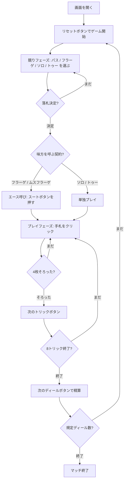

# ジャーマン・ソロ（Web版）遊び方

## ゲーム概要

German Solo（ジャーマン・ソロ）は、オンブル → カドリールと伝わった「ソリスト対多数」系トリックテイキングのドイツ版です。32枚のスカート・パック（A・K・Q・J・10・9・8・7）を4人に8枚ずつ配り切り、競りで契約を取った側が8トリック中の規定数を取れば成功。既定5ディールの後、累積点が最も高い席が勝者です。

## 起動方法

```sh
go run ./cmd/trumpcards web  # CLI経由でWebサーバーを起動
go run ./cmd/server          # 直接Webサーバーを起動
```

ブラウザで `http://localhost:8080` にアクセスし、ナビゲーションバーから「ジャーマン・ソロ」を選択します。
ナビバーのJA/ENボタンで日本語・英語を切り替えられます。

## ルール

### デッキと配り

- 32枚（各スート A・K・Q・J・10・9・8・7）を4人に8枚ずつ配り切ります。山札は残りません。
- 8枚 = 8トリック。ディーラーの左隣（forehand）が最初に宣言し、最初のトリックもリードします。

### 三大マタドール

| 順位 | 名前 | カード |
|------|------|--------|
| 1 | スパディーユ (Spadille) | ♣Q |
| 2 | マニーユ (Manille) | 切り札スートの 7 |
| 3 | バスタ (Basta) | ♠Q |

黒の2枚のクイーンは常に切り札なので、♠・♣が平札のときそのスートにQはありません。切り札スートの残りは A > K >（Q）> J > 10 > 9 > 8（Qが残るのは切り札が赤のときだけ）。平札は A > K > Q > J > 10 > 9 > 8 > 7。

### 契約

| 契約 | 単独／味方 | 必要トリック | 契約値 |
|------|------------|--------------|--------|
| ムスフラーゲ | 味方あり | 5 | 1 |
| フラーゲ | 味方あり | 5 | 2 |
| ソロ | 単独 | 5 | 4 |
| トゥー | 単独 | **8** | 8 |

ムスフラーゲは宣言できません（全員パス時にスパディーユ保持者へ強制）。フラーゲ／ムスフラーゲでは、落札者が「持っていない・切り札でない」エースを指名し、その持ち主が**伏せられた味方**になります。

### 得点

契約値 V が宣言側と守備側の間でゼロ和に動きます。成功なら守備側の各席が V を失い、その合計を宣言側で山分け（単独 +3V、味方あり1人あたり +V）。失敗なら符号が反転します。

### CPU難易度

設定パネルから Easy / Normal / Hard を選べます（変更するとゲームはリセットされます）。

## ゲームの流れ



## 画面の操作方法

### 競りフェーズ

- 宣言ボタンには**今のあなたが宣言できる契約だけ**が並びます（サーバが弾く選択肢は出しません）。切り札スートを選んでから宣言してください。
- 降りるときは「パス」を押します。最高宣言は画面上部に表示されます。

### エース呼びフェーズ

- フラーゲ／ムスフラーゲを落札したときだけ現れます。呼べるスートのボタンだけが有効です（自分が持っているエース・切り札のエースは選べません）。

### プレイフェーズ

- 出せる手札だけがクリックできます。マストフォローの都合で1枚しか出せないこともあります。
- 4枚そろったら「次のトリックへ」で解決します。

### 結果フェーズ

- 8トリック終了後、「次のディールへ」で精算して次のディールに進みます。

### キーボードショートカット

| キー | アクション | 有効条件 |
|------|-----------|---------|
| `h` | ヒント表示 | 常時 |
| `r` | リセット | 常時 |

## 画面構成

```
┌────────────────────────────────────────────┐
│  フェーズ表示 / CLIトグル                  │
├────────────────────────────────────────────┤
│  CPU 1 / CPU 2 / CPU 3                     │
│  （役柄 + 残カード数 + 獲得トリック数）    │
├────────────────────────────────────────────┤
│  契約: ソロ（必要 5 トリック）             │
│  宣言側 2 - 守備側 0                       │
│  呼ばれたエース: ♣ の A（持ち主は伏せ）    │
├────────────────────────────────────────────┤
│              [現在のトリック]              │
│         （4方向にプレイされたカード）      │
├────────────────────────────────────────────┤
│  スコア                                    │
│   あなた: 12  CPU 1: -4  CPU 2: -4 ...     │
├────────────────────────────────────────────┤
│  メッセージ / ヒント / 棋譜                │
├────────────────────────────────────────────┤
│  あなたの手札（横並び8枚、クリックで選択） │
│  [パス][フラーゲ][ソロ][トゥー] or [♠][♣][♥][♦] │
│                 [ヒント] [リセット]        │
└────────────────────────────────────────────┘
```

## 遊び方のコツ

- **マタドールを数える。** ♣Q・切り札の7・♠Qは切り札スートに関係なく最強の3枚です。
- **呼ぶエースは手札に少ないスートから。** 自分で取れないスートほど味方の助けが大きくなります。
- **トゥーは1枚も落とせません。** 5トリック取れる手と8トリック取れる手はまったく別物です。
- **守備側は宣言側を規定数に届かせないことが勝ち筋。** 取れるトリックを取るより、宣言側の5トリック目を止める方が効きます。
