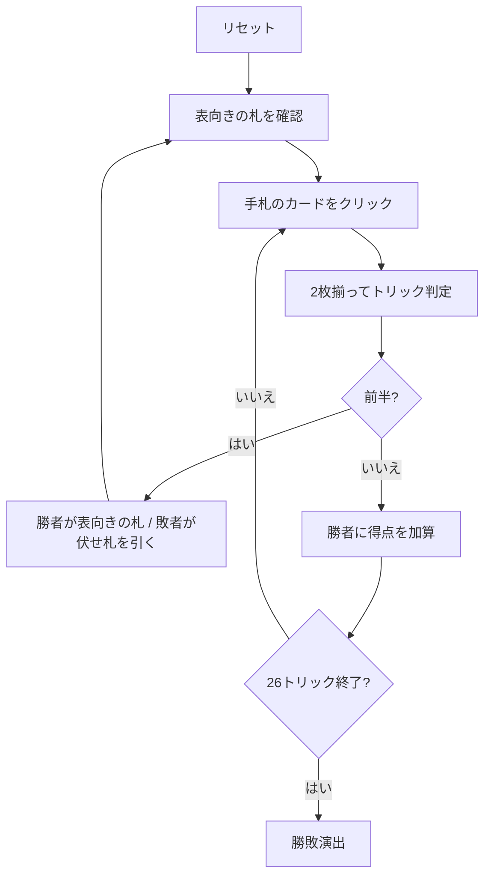

# ジャーマンホイスト（Web版）遊び方

## ゲーム概要

2人用のトリックテイキング。**26トリックを前半13・後半13に分け、得点になるのは後半だけ**。前半は場に表向きで置かれた1枚を奪い合うためのトリックで、勝っても点にならない。イギリスで19世紀から遊ばれている、ホイスト系でもっとも有名な2人用の形。

## 起動方法

```sh
go run ./cmd/trumpcards web  # CLI経由でWebサーバーを起動
go run ./cmd/server          # 直接Webサーバーを起動
```

ブラウザで `http://localhost:8080` にアクセスし、ナビゲーションバーから「ジャーマンホイスト」を選択します。
ナビバーのJA/ENボタンで日本語・英語を切り替えられます。

## ルール

- 52枚。各プレイヤーに **13枚**ずつ配り、次の1枚を**表向き**にする
- **表向きになった札のスートが、そのハンド全体の切り札**。残り25枚が山札
- **リードのスートを持っていれば必ずそれを出す**（フォロー義務）。切り札があれば切り札が勝つ
- **前半13トリック**: 勝者が表向きの1枚を取り、敗者は山札の次を伏せたまま引く。**このトリックは得点にならない**
- **後半13トリック**: 山札が尽きたら開始。**取ったトリックがそのまま得点**。13は奇数なので引き分けにならない
- 後半で7トリック以上取ったほうが勝ち

## ゲームの流れ



## 画面の操作方法

| 操作 | 説明 |
|------|------|
| 手札のカードをクリック | そのカードを出す（出せる札だけ押せます） |
| ヒントボタン | 打つべき札と、その狙い（取りに行く / わざと負ける）を提示する |
| ギブアップボタン | 投了する |
| リセットボタン | 確認ダイアログのうえで最初からやり直す |
| CLI トグル | 同じゲームをコマンド入力で操作するモードに切り替える |

## 画面構成

- **上部**: フェーズ表示（前半 / 後半 / 終了）、トリック数、切り札
- **中央上**: CPUの手札（伏せ札・枚数のみ）
- **中央**: **表向きの札**（前半のあいだ、勝者が獲得する1枚）と山札の残り枚数、現在のトリック
- **下部**: 自分の手札。**フォロー義務を満たす札だけが押せます**
- **スコア**: 前半・後半それぞれの獲得トリック数。**得点になるのは後半の数だけ**

## 遊び方のコツ

- **前半の勝ち負けそのものには意味がない。** 見えている1枚が欲しいときだけ取りに行く
- **要らない札なら、わざと安い札で負ける。** 相手に無価値な札を押し付けつつ、自分は伏せ札を引ける
- **狙うのはA・K・切り札。** 表向きの札がこれらなら、多少高い札を使ってでも取る価値がある
- **切り札は後半まで温存する。** 前半で使い切ると、点になる13トリックで何もできなくなる
- **後半に入る時点の手札がすべて。** 前半は「後半用の手札を作る13トリック」だと考える
