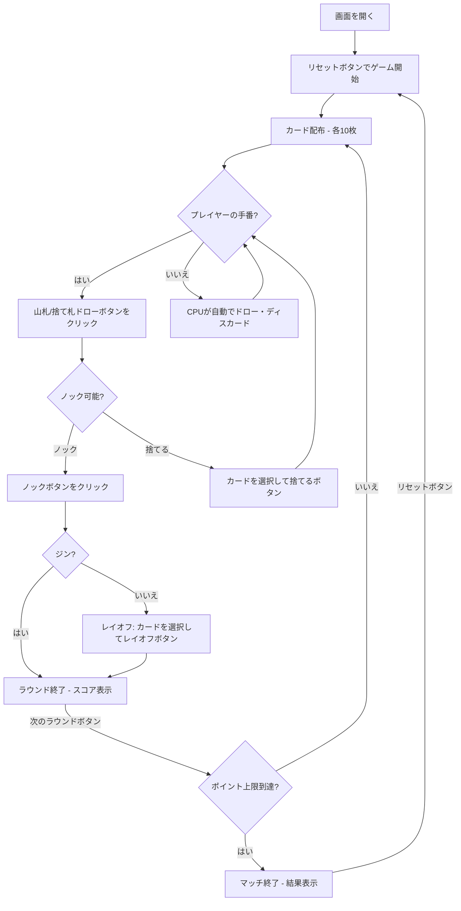

# ジンラミー（Web版）遊び方

## ゲーム概要

2人（プレイヤー1人 + CPU 1人）で遊ぶカードゲームです。手札のカードでメルド（セットやラン）を作り、デッドウッド（メルドに含まれないカード）の合計点を減らします。ポイント上限（デフォルト100点）に先に達したプレイヤーが敗北します。

## 起動方法

```sh
go run ./cmd/trumpcards web  # CLI経由でWebサーバーを起動
go run ./cmd/server          # 直接Webサーバーを起動
```

ブラウザで `http://localhost:8080` にアクセスし、ナビゲーションバーから「ジンラミー」を選択します。
ナビバーのJA/ENボタンで日本語・英語を切り替えられます。

## ルール

### 基本ルール

- 52枚のトランプを使用、2人プレイ
- 各プレイヤーに10枚ずつ配り、1枚を表向きにして捨て札の山を開始、残りは山札（ストック）
- 手番ではまず山札または捨て札の山からカードを1枚ドローする
- その後、手札からカードを1枚捨てるか、ノックする

### メルドとデッドウッド

- **メルド**: セット（同ランク3〜4枚）またはラン（同スート3枚以上の連番）
- **デッドウッド**: メルドに含まれない手札の合計点（J/Q/K=10点、A=1点、その他=額面）

### ノック・ジン・アンダーカット

- **ノック**: デッドウッド合計が10以下の時にノック可能。相手はノッカーのメルドにレイオフ（カードを付け足す）できる
- **ジン**: デッドウッド0でノック。25点ボーナス。相手はレイオフ不可
- **アンダーカット**: 相手のデッドウッドがノッカー以下の場合、相手に25点ボーナス

### ゲーム終了

- ポイント上限（デフォルト100点）に達したプレイヤーが出たらマッチ終了

### CPU難易度

- **Easy**: ランダムにカードを出す
- **Normal**: 基本的なメルド戦略（デフォルト）
- **Hard**: 戦略的なプレイ（相手の捨て札を分析等）

## ゲームの流れ



## 画面の操作方法

### ドローフェーズ

1. **「山札からドロー」** ボタンでストックから1枚引く
2. **「捨て札からドロー」** ボタンで捨て札の山のトップカードを引く

### ディスカード/ノックフェーズ

1. 手札のカードをクリックして選択（1枚）
2. **「捨てる」** ボタンで選択したカードを捨てる
3. **「ノック」** ボタンでノック（デッドウッド≤10の場合のみ有効）

### レイオフフェーズ

1. 相手がノックした場合（ジンでない場合）、ノッカーのメルドにカードを付け足せる
2. 手札のカードをクリックして選択し、**「レイオフ」** ボタンで付け足す
3. **付け足せるカードには枠が付きます**（ディスカードフェーズのメルド表示と同じ見た目）。判定はサーバー側のルールそのままなので、枠の付いた札は必ず通ります

### ラウンド終了

1. **「次のラウンド」** ボタンで次のラウンドに進む

## 画面構成

```
┌────────────────────────────────────────────┐
│  ▶ 設定 (クリックで展開)                   │
│    CPU難易度:    [Normal▼]                 │
│    ポイント上限: [100▼]                    │
├────────────────────────────────────────────┤
│              CPU エリア                     │
│  🂠🂠🂠🂠🂠🂠🂠🂠🂠🂠 (裏向き)                │
│  スコア: 30点                              │
├────────────────────────────────────────────┤
│              ゲーム情報                     │
│  ラウンド 2 | 山札: 22枚                   │
│  捨て札トップ: ♥7                          │
├────────────────────────────────────────────┤
│         フッター: あなた (45点)              │
│  [♠3][♣4][♣5][♣6][♥9][♦J]...             │
│  メルド: {♣4,♣5,♣6} デッドウッド: 19点     │
│  [リセット] [山札ドロー] [捨て札ドロー]      │
│  [捨てる] [ノック]                          │
└────────────────────────────────────────────┘
```

- **設定パネル（▶ 設定）**:
  - 「CPU難易度」セレクト: Easy / Normal / Hard から選択
  - 「ポイント上限」: マッチ終了のポイント上限を設定
  - 次のリセット時に設定が適用される
- **CPUエリア**: CPUの手札（裏向き）とスコア
- **ゲーム情報**: 現在のラウンド、山札残り枚数、捨て札トップ
- **フッター（あなたの手札）**:
  - クリックで選択（緑枠 + 上に浮き上がる）
  - メルドとデッドウッド合計点を表示
- **スコアテーブル**: 各プレイヤーのラウンドスコアと累積スコア

## 遊び方のコツ

- 序盤は捨て札からドローして、メルドを素早く作りましょう
- 相手がどのカードを捨てているか注意し、相手のメルドを推測しましょう
- デッドウッドの高いカード（J/Q/K=10点）は早めに処理するのが有効です
- ジン（デッドウッド0）を狙えるなら、ノックを待ってボーナスを獲得しましょう
- 相手のノックに備えて、レイオフできるカード（相手のメルドに付け足せるカード）を意識しておきましょう
