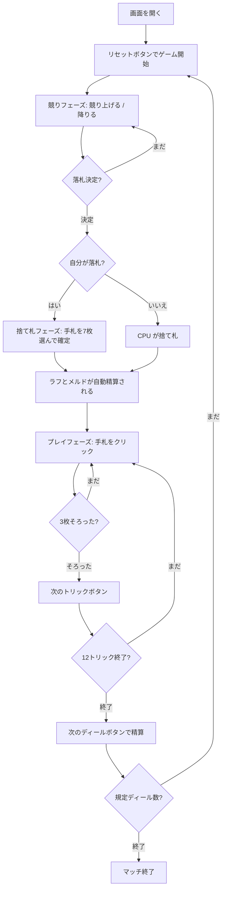

# グリーク（Web版）遊び方

## ゲーム概要

Gleek（グリーク）は16〜17世紀イングランドの3人用ゲームです。44枚（52枚から2と3を抜いたもの）を12枚ずつ配り、**ストックの競り・ラフ・グリーク／マーニヴァル・12トリック**という4段階すべてで点が動きます。既定5ディールの後、累積点が最も高い席が勝者です。

## 起動方法

```sh
go run ./cmd/trumpcards web  # CLI経由でWebサーバーを起動
go run ./cmd/server          # 直接Webサーバーを起動
```

ブラウザで `http://localhost:8080` にアクセスし、ナビゲーションバーから「グリーク」を選択します。
ナビバーのJA/ENボタンで日本語・英語を切り替えられます。

## ルール

### デッキと配り

- 44枚（A・K・Q・J・10・9・8・7・6・5・4 × 4スート）を3人に12枚ずつ配り、残り8枚がストック。
- ストックの一番上を表にして切り札を決めます。めくれたのが4（Tiddy）ならディーラーが各相手から4点。

### 4つの段階

1. **ストックの競り**: エルダーは12から始めて降りられません。以降2刻み。落札者は半額を各相手に払い、表向きの札を除く7枚を取り込んで7枚捨てます。
2. **ラフ**: 同一スートの合計（A=11、K/Q/J=10、数札は額面）が最高の席が各相手から2点。エース4枚のマーニヴァルはどんなラフにも勝ちます。
3. **グリーク／マーニヴァル**: A/K/Q/J の3枚・4枚。各相手から A 4/8、K 3/6、Q 2/4、J 1/2。
4. **12トリック**: マストフォロー、切り札が最強。1トリック3点＋切り札の名札（Tib 15 / Tom 9 / Tumbler 6 / Towser 5 / Tiddy 4 / K・Q 3）。

### 精算

各席は「自分のトリック点 − 基準点」を受け取ります。基準点は**そのディールに実際にあった点**を3で割った値です（表向きの札と捨て札は卓に出ないので、上限81点より小さくなることがあります）。

### CPU難易度

設定パネルから Easy / Normal / Hard を選べます（変更するとゲームはリセットされます）。

## ゲームの流れ



## 画面の操作方法

### 競りフェーズ

- 「競り上げる」ボタンには**次に置ける額だけ**が表示されます（上限に達すると押せなくなります）。降りるときは「降りる」を押します。

### 捨て札フェーズ

- 落札すると手札が19枚になります。捨てる7枚をクリックで選び、「捨てる」で確定します。ちょうど7枚選ぶまで確定できません。

### プレイフェーズ

- 出せる手札だけがクリックできます。3枚そろったら「次のトリックへ」で解決します。

### 結果フェーズ

- 12トリック終了後、「次のディールへ」で精算して次のディールに進みます。

### キーボードショートカット

| キー | アクション | 有効条件 |
|------|-----------|---------|
| `h` | ヒント表示 | 常時 |
| `r` | リセット | 常時 |

## 画面構成

```
┌────────────────────────────────────────────┐
│  フェーズ表示 / CLIトグル                  │
├────────────────────────────────────────────┤
│  CPU 1 / CPU 2（役柄 + 残カード + トリック）│
├────────────────────────────────────────────┤
│  ストック: 表向き ♥4 — あなたが14で落札    │
│  ラフ: CPU 1 が ♠ の 38 で獲得             │
│  グリーク: あなたのK3枚（各相手から3）     │
├────────────────────────────────────────────┤
│              [現在のトリック]              │
├────────────────────────────────────────────┤
│  スコア / 札点 / 基準点                    │
├────────────────────────────────────────────┤
│  メッセージ / ヒント / 棋譜                │
├────────────────────────────────────────────┤
│  あなたの手札（クリックで選択）            │
│  [競り上げる][降りる] or [捨てる] or [出す]│
│                 [ヒント] [リセット]        │
└────────────────────────────────────────────┘
```

## 遊び方のコツ

- **競りは弱い手ほど価値がある。** 7枚入れ替えられるので、伸びしろの大きい手ほどストックを取る意味があります。
- **名札を相手に渡さない。** Tib（切り札のA）だけで15点。取れないトリックに名札を出さないでください。
- **ラフは1スートに固める。** A+K+Q で31点。捨て札は長いスートを伸ばす方向で。
- **マーニヴァルはグリークのちょうど倍。** エース4枚ならラフも同時に取れます。
