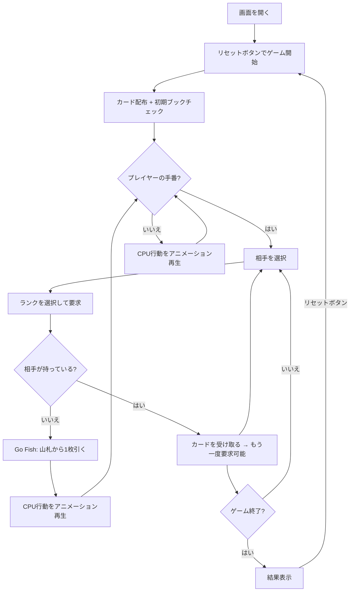

# ゴーフィッシュ（Web版）遊び方

## ゲーム概要

4人（プレイヤー1人 + CPU 3人）で遊ぶカードゲームです。相手にカードのランク（数字）���要求し、同じランク4枚を揃えて「ブック」を作ります。最も多くブックを集めたプレイヤーの勝ちです。

## 起動方法

```sh
go run ./cmd/trumpcards web     # CLI経由でWebサーバーを起動
go run ./cmd/server             # 直接Webサーバーを起動
```

ブラウザで `http://localhost:8080` にアクセスし、ナビゲーションバーから「Go Fish」を選択します。
ナビバーのJA/ENボタンで日本語・英語を切り替えられます。

## ルール

### 基本ルール

- 52枚のトランプ（ジョーカーなし）を使用
- 各プレイヤーに5枚ずつ配布、残りは山札
- 自分のターンに、手札に持っているランクを指定して相手に要求する
- 相手がそのランクのカードを持っていれば、全て受け取り、もう一度要求できる
- 相手が持っていなければ「Go Fish」 → 山札から1枚引く
- 同じランク4枚が揃うと「ブック」として場に出す
- 全13ブックが完成するか、山札がなくなりどのプレイヤーも行動できなくなったらゲーム終了
- 最も多くブックを持つプレイヤーが勝ち

### CPU難易度

| 難易度 | 説明 |
|--------|------|
| Easy | ランダムに要求 |
| Normal（デフォルト） | 手札のランクのみ要求、直近の記憶に基づいて判断 |
| Hard | 全要求履歴から最適な相手とランクを推測 |

## ゲームの流れ



## 画面の操作方法

### 要求フェーズ（2ステップ）

プレイヤーの手番では、以下の2ステップで要求を行います:

1. **相手を選択**: CPUプレイヤーのエリアをクリックして要求先を選択
2. **ランクを選択**: 手札に持っているランクの一覧から要求するランクをクリック

### 要求結果

- **成功**: 相手からカードを受け取り、もう一度要求可能
- **Go Fish**: 山札から1枚引く。引いたカードが要求したランクなら、もう一度要求可能
- **ブック完成**: 同じランク4枚が揃うとブック表示エリアに追加される

### CPUの手番

CPUの行動は自動で進行し、各アクションがアニメーション再生されます。

### 設定

- CPU難易度は設定パネルから変更できます（Easy/Normal/Hard）
- Meta-AI（セッション内学習）のON/OFFを切り替えられます

### キーボードショートカット

| キー | アクション | 有効条件 |
|------|-----------|---------|

※ テキスト入力欄にフォーカスがある場合、ショートカットは無効になります。

## 画面構成

```
┌────────────────────────────────────────────┐
│            CPU プレイヤーエリア             │
│ ┌──────────┐ ┌──────────┐ ┌─────��────┐   │
│ │ CPU 1    │ │ CPU 2    │ │ CPU 3    │   │
│ │ 5枚      │ │ 4枚      │ ��� 5枚      │   │
│ │ ブック: 0 │ │ ブック: 1 │ │ ブック: 0 │   ��
│ │ [選択]   │ │          │ │          │   │
│ └──────────┘ └──────────┘ └──────────┘   │
├────────────────────────────────────────────┤
│         山札: 32枚                         │
├────────────────────────────────────────────┤
│         ブック表示エリア                    │
│  [♠7♥7♦7♣7] [♠K♥K♦K♣K]               │
├─────────────────────────────────��──────────┤
│ [ランク選択ボタン] A 3 5 7 K              │
├────────────────────────────────────────────┤
│ [リセット] [設定]                          │
├───────────────────────���────────────────────┤
│       プレイヤーの手札                      │
│  [♠3] [♥5] [♦7] [♣7] [♥K]             │
│  ブック: 0                                 │
└────────────────────────────────────────────┘
```

- **CPUプレイヤーエリア**: 各CPUの手札枚数とブック数を表示。手番時にクリックして要求先を選択
- **山札**: 残り枚数を表示
- **ブック表示エリア**: 完成したブックを表向きで表示
- **ランク選択ボタン**: 手札に含まれるランクのボタンが表示され、クリックして要求
- **プレイヤーの手札**: 手札カードを表向きで表示

## 遊び方のコツ

- 手札に2枚以上持っているランクを要求すると、ブック完成に近づきやすい
- CPUの要求をアニメーションで観察して、どのランクを持っているか推理しましょう
- アクションログで過去の要求履歴を確認し、誰がどのランクを持っているか推測できます
- Hard難易度のCPUは全要求履歴を分析して最適な要求をするため、手強い対戦相手です
