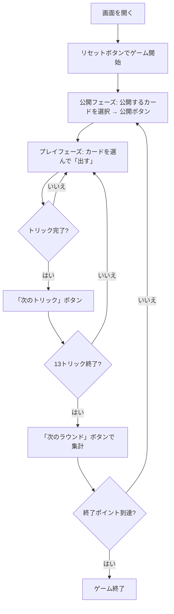

# 拱猪（ゴングジュー）（Web版）遊び方

## ゲーム概要

Gong Zhu（拱猪／中国版ハーツ）は4人で対戦するトリックテイキングゲームです。ハーツ同様にトリックを取り合いますが、♠Q（豚, -100）や♦J（羊, +100）といったプラス・マイナスの大物カード、得点を倍にする♣10（変圧器）、ラウンド開始前の「公開（明牌）」による倍化があり、点数が大きく動きます。いずれかのプレイヤーの累積スコアが終了ポイントの負の値（既定 -1000）に達するとゲーム終了。**最高スコア**のプレイヤーが勝者です。

## 起動方法

```sh
go run ./cmd/trumpcards web  # CLI経由でWebサーバーを起動
go run ./cmd/server          # 直接Webサーバーを起動
```

ブラウザで `http://localhost:8080` にアクセスし、ナビゲーションバーから「拱猪（ゴングジュー）」を選択します。ナビバーのJA/ENボタンで日本語・英語を切り替えられます。

## ルール

### ポイントカード

- **♠Q（豚）**: -100点（公開で -200）
- **♦J（羊）**: +100点（公開で +200）
- **♣10（変圧器）**: 獲得点を×2、単体取得なら +50（公開で ×4 / +100）
- **♥**: A=-50, K=-40, Q=-30, J=-20, 10〜5=各-10, 4〜2=0（合計 -200）。公開（♥A）で全ハート×2。
- **全ハート獲得**: 13枚すべてのハートを取ると +200 になります。

### ゲーム終了

いずれかのプレイヤーの累積スコアが -（終了ポイント）以下になった時点で終了。最高スコアのプレイヤーが勝者です。

## ゲームの流れ



## 画面の操作方法

### 公開フェーズ

公開できるポイントカード（♠Q・♦J・♥A・♣10）のインデックスが表示されます。手札から公開したいカードをクリックして選択し、「公開する」ボタンを押します。何も選択せずに押すと「公開しない」となります。

### プレイフェーズ

自分の手番では手札から1枚を選んで「出す」ボタンを押します。リードスートに従う必要があり、**追従できない札は薄く表示されて選べません**（判定はサーバー側のルールそのままです）。トリックが揃うと「次のトリック」ボタンが表示されます。

### 結果フェーズ

13トリック終了で「次のラウンド」ボタンが表示され、押すとスコアが集計されます。終了ポイントに達するとゲーム終了です。

### キーボードショートカット

| キー | アクション | 有効条件 |
|------|-----------|---------|
| ←/→ | カード選択を移動 | 公開フェーズ／自分の手番 |
| Space/Enter | 選択カードを確定（公開／プレイ） | 公開フェーズ／自分の手番 |
| Esc | 選択をクリア | 公開フェーズ／自分の手番 |

## 画面構成

```
┌────────────────────────────────────────────┐
│  拱猪（ゴングジュー）        [JA/EN] [CLI]   │
│  ラウンド 1  トリック 1  公開済み: ♦J        │
├───────────────────────┬────────────────────┤
│  現在のトリック         │  CPUプレイヤー情報   │
│  （場のカード）         │  スコア表           │
├───────────────────────┴────────────────────┤
│  メッセージ / 棋譜                           │
├────────────────────────────────────────────┤
│  あなたの手札                                │
│  [ヒント] [公開する/出す] [次へ] [リセット]   │
└────────────────────────────────────────────┘
```

## 遊び方のコツ

- ♠Q（豚, -100）は早めに処理し、♦J（羊, +100）は積極的に取りに行きましょう。
- ♣10（変圧器）はプラス点を集めているときに使うと強力。マイナス点が多いときは損失も倍になります。
- 公開は得点を倍にするハイリスク・ハイリターン。♦J を公開して取り切れば +200 です。
- 全ハートを集められそうなら +200 を狙うのも有効です。
