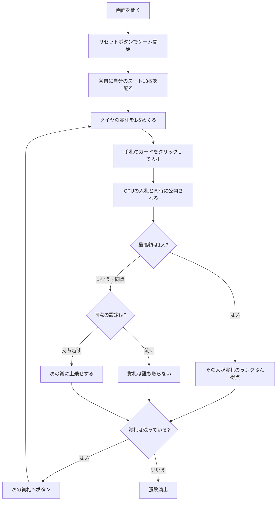

# ゴフスピール（Web版）遊び方

## ゲーム概要

アメリカ発の**数学的ゲーム**（GOPS とも）。ゲーム理論の教材としても有名です。**手番がありません。** ダイヤの賞札を1枚ずつめくり、全員が自分のスートから1枚を伏せて**同時に入札**します。最高額を出した人が賞札のランクぶん得点。2〜3人で遊べます。

## 起動方法

```sh
go run ./cmd/trumpcards web  # CLI経由でWebサーバーを起動
go run ./cmd/server          # 直接Webサーバーを起動
```

ブラウザで `http://localhost:8080` にアクセスし、ナビゲーションバーから「ゴフスピール」を選択します。
ナビバーのJA/ENボタンで日本語・英語を切り替えられます。

## ルール

- **ダイヤを賞札、残りのスートを各自の入札札**にします。各自13枚
- **3人卓は賞札1スート + 入札3スート = 4スート**要ります。ちょうど標準52枚に収まります
- 賞札が1枚めくられたら、全員が自分の入札札から1枚を選んで**伏せます**
- 全員が伏せたら**同時に公開**。**最高額を出した人が賞札のランクぶん得点**します（A=1、K=13）
- **同点なら誰も取りません。** 設定によって流れるか、次の賞に持ち越されます
- **隠されているのは「今いくら出したか」だけ。** 相手の残り札は使ったぶんを引けば分かるので、そのまま表示しています
- 13ラウンドで賞札を使い切り、**合計点のいちばん高い人の勝ち**

## ゲームの流れ



## 画面の操作方法

| 操作 | 説明 |
|------|------|
| 手札のカードをクリック | その札で入札する。**1回のクリックで公開まで進みます** |
| 次の賞札へボタン | 公開された入札を読んだあとに押す |
| 人数（設定） | 2〜3人。リセットすると反映されます |
| 同点のとき（設定） | 「流す」か「持ち越す」。持ち越すと次の賞に上乗せされます |
| ヒントボタン | 入札すべき札を提示する |
| ギブアップボタン | 投了する |
| リセットボタン | 確認ダイアログのうえで最初からやり直す |
| CLI トグル | 同じゲームをコマンド入力で操作するモードに切り替える |

**CPU の番を待つ工程はありません。** 同時入札なので、あなたが選んだ時点で全員の入札が確定し、同時に公開されます。

## 画面構成

```
┌────────────────────────────────────────────┐
│ ラウンド 3            賞札の残り 10枚       │
├────────────────────────────────────────────┤
│ 全員が同時に伏せて入札する。                │
│ 最高額が賞札のランクぶん得点                │
├────────────────────────────────────────────┤
│                 賞札                        │
│                [♦11]                       │
│                11 点                        │
├────────────────────────────────────────────┤
│  あなた: 残り11枚 / 13 点                   │
│  CPU1 [入札済み]: 残り11枚 / 9 点           │
│    [♣A][♣3][♣5]... （小さいカードの絵）    │
├────────────────────────────────────────────┤
│  あなたの入札札（選べるときに緑の枠）       │
└────────────────────────────────────────────┘
```

- **上部**: ラウンド数と賞札の残り枚数
- **規則帯**: このゲームの核心。**同時入札**であることを常に出します
- **賞札**: いま懸かっている札と得点。持ち越しがあるときは枚数も出ます
- **席の行**: 残りの入札札と得点。**残り札は CPU の分も表示**します（使った札は場に出るので隠せていません）。CPU の残り札も**自分の手札と同じカードの絵**で並ぶので、ランクの大小をそのまま見比べられます
- **`[入札済み]`**: 伏せたことだけを示します。**中身は公開まで見せません**
- **`[出した札]`**: 公開後の入札。カードそのものが並びます
- **下部**: 自分の入札札。選べるときに緑の枠が付きます

## 遊び方のコツ

- **13枚の配分がすべて。** 高い賞に高い札を使うか、あえて流して次に備えるか
- **相手の残り札を数える。** 画面に出ているので、相手が高い札を使い切ったあとは安い札で取れます
- **A（1点）は捨て札に近い。** 取っても1点なので、A の賞札は最低札を出して流すのが基本です
- **持ち越し設定では賞が膨らみます。** 同点が続いたあとの賞は、多少高い札を切っても引き合います
- **同じ札を出すと誰も取りません。** 読み合いが完全に一致すると、賞札は流れます
