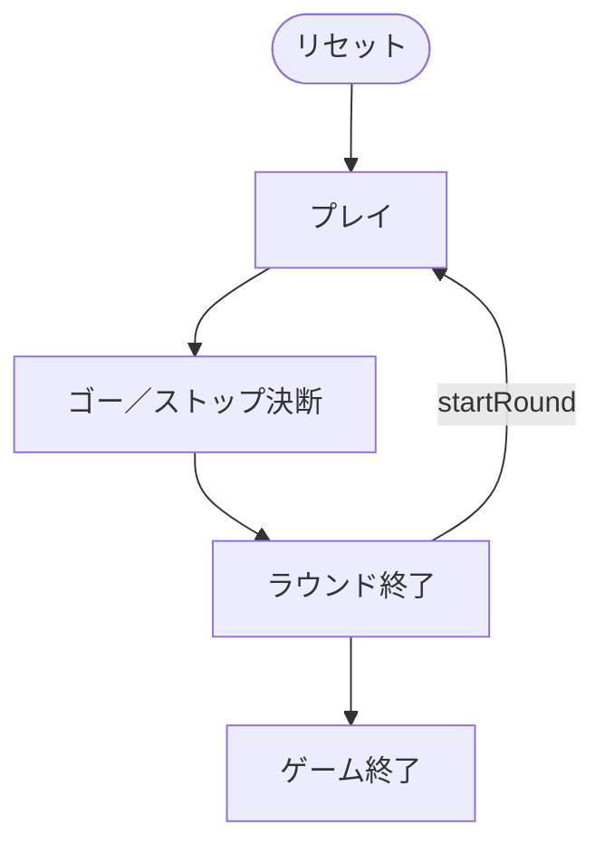

# ゴーストップ（Web版）遊び方

## ゲーム概要

ゴーストップ（Go-Stop / 고스톱）は、日本のこいこいと同じ**花札（48枚）**を使う韓国の 2 人用**合わせ（キャプチャ）ゲーム**です。手札の札と山札からめくった札で、場に出ている**同じ月（花）の札**を捕獲し、集めた札を**光（광）・五鳥（고도리）・띠（帯）・열끗（タネ）・피（カス）**の 5 カテゴリで採点します。目標点に到達するたびに、続けて得点を伸ばす「**ゴー（Go）**」か、その場で得点を確定する「**ストップ（Stop）**」かを選びます。ゴーは倍率が上がりますが、相手に逆転されると**光バク・ピバク・ゴーバク**の罰則で失点する危険もあります。目標点に先に到達したプレイヤーが勝ちです。

## 起動方法

```sh
go run ./cmd/trumpcards web         # CLI経由でWebサーバーを起動
go run ./cmd/trumpcards web --open  # サーバー起動 + ブラウザを開く
go run ./cmd/server                 # 直接Webサーバーを起動
```

ブラウザで `http://localhost:8080` にアクセスし、ナビゲーションバーから「ゴーストップ」を選択します。
ナビバーのJA/ENボタンで日本語・英語を切り替えられます。

## ルール

### デッキと配布

- **デッキ**: 花札48枚（12か月 × 各4枚：光・タネ・短冊・カス）。
- **プレイヤー**: 2人（あなた = 席0、CPU = 席1）。
- **配布**: 各プレイヤーに **10枚**、場に **8枚**を表向きに置きます。

### 手番と捕獲（capture）

1. 手札から1枚を出し、場にある**同じ月**の札を捕獲します。同じ月の札が場に**2枚**あるときは、どちらを取るか選びます（Web では捕獲候補がハイライトされるのでタップして選択）。
2. 続けて山札から1枚めくり、同じ月の札があれば同様に捕獲します。
3. 一致する札がなければ、出した札・めくった札は場に残ります。

### 得点カテゴリ（韓国式）

| カテゴリ | 内容 |
|----------|------|
| 光（gwang / 광） | 光札の枚数に応じた点。3枚で3点、雨を含むと減点、5枚で15点など |
| 五鳥（godori / 고도리） | 梅・藤・芒の 3 枚の鳥札を揃えると 5 点 |
| 띠（tti） | 短冊札5枚で1点、以降1枚ごと+1。赤短・青短・草短の組でボーナス |
| 열끗（yeol） | タネ札5枚で1点、以降1枚ごと+1 |
| 피（pi） | カス札10枚で1点、以降1枚ごと+1（双피は2枚分） |

各カテゴリの合計が**基本点**となり、ゴー倍率とバク倍率を掛けて最終得点になります。

### ゴー / ストップ

- 目標点に到達すると **ゴー／ストップ決断フェーズ**になります。
  - **ゴー（Go）**: 続行して得点を伸ばします。ゴーの回数に応じて得点倍率が上がります（ゴー1回で+1点＆以降2倍など）。ただし相手が先に目標点へ達してストップすると失点します。
  - **ストップ（Stop）**: その時点の得点を確定してラウンドを終えます。
- どちらのプレイヤーも目標点に届かず手札を使い切ると、そのラウンドは引き分け（0点）です。

### バク（罰則）

ストップしたときに相手の状況に応じて、支払い（得点）が倍増します。

- **光バク（gwang-bak）**: 勝者が光の点を得ているのに、敗者の光が0点のとき、支払いが2倍。
- **ピバク（pi-bak）**: 敗者の피が規定枚数未満のとき、支払いが2倍。
- **ゴーバク（go-bak）**: ゴーを宣言した側が逆転されて負けたとき、支払いが2倍。

### 勝敗

- ラウンドの得点は累計され、**目標点**（設定で 3 / 5 / 7 / 10 から選択）に先に到達したプレイヤーが勝ちです。

## ゲームの流れ

ゲームの進行は `internal/domain/GoStop.go` のフェーズ機械そのものです。各ノードは同ファイルの `GoStopPhase` 定数、矢印ラベルはその遷移を行うメソッド名です。



## 画面の操作方法

- **手札をタップ**: 同じ月の場札が1枚以下なら即座に捕獲します。2枚一致する場合は、続けて捕獲する場札をタップして選びます。
- **ゴー / ストップボタン**: ゴー／ストップ決断フェーズで表示されます。
- **内訳チップ**: 光/五鳥/띠/열/피 の各カテゴリの得点がチップで表示されます。
- **バクバッジ**: ラウンド終了時、適用された光バク・ピバク・ゴーバクがバッジで表示されます。
- **次のラウンド**: ラウンド終了後に次の配札を行います。
- **設定**: CPU難易度、目標点、フロントエンドヒントの有無を変更できます。
- **リセット**: 現在の設定で新しいゲームを開始します。

## CLI モード

画面右上のトグルで CLI モードに切り替えると、テキストコマンドでプレイできます。詳細は [CUI版マニュアル](../cui/gostop.md) を参照してください。
