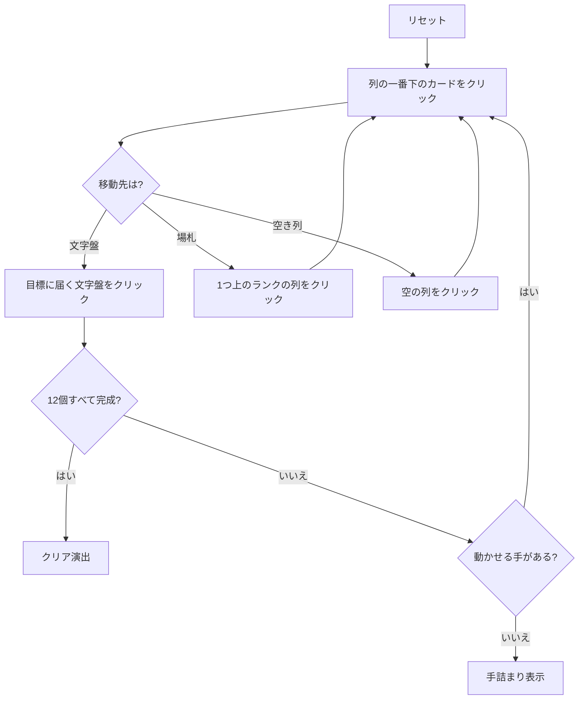

# グランドファーザーズ・クロック（Web版）遊び方

## ゲーム概要

12 個の基礎札を時計の文字盤に見立てたイギリス発祥のソリティア。各文字盤は「その位置の時刻」のランクで完成させる — 1 時の文字盤は A、12 時の文字盤は Q で止める。

**山札は無い。** 52 枚すべてが最初から場に出ており（文字盤 12 枚 + タブロー 8 列×5 枚 = 52）、運の要素は配り方だけ。

## 起動方法

1. `go run ./cmd/trumpcards web` でサーバーを起動する
2. ブラウザで `http://localhost:8080` を開く
3. ゲーム一覧または左サイドバーから「グランドファーザーズ・クロック」を選ぶ

## ルール

- 52 枚 1 組。固定の 12 枚が文字盤に置かれ、残り 40 枚が 8 列×5 枚に配られる
- 文字盤は**同じスートで昇順**、**K の次は A に折り返す**
- 各文字盤の目標ランクはその時刻: 1 時→A、…、12 時→Q。カードの下に `→数字` で表示される
- **目標に達した文字盤は完成**（`✔` が付く）で、それ以上カードを受け付けない
- タブローは**スートを無視して降順**に 1 枚ずつ。空き列には任意のカードを置ける
- 12 個すべて完成でクリア

## ゲームの流れ

## 画面の操作方法

| 操作 | 説明 |
|------|------|
| 列の一番下のカードをクリック | そのカードを移動元として選択する（もう一度押すと解除） |
| 文字盤をクリック | 選択中のカードをその文字盤に置く。完成済みの文字盤は押せない |
| 別の列をクリック | 選択中のカードをその列に重ねる（スート無視の降順） |
| ドラッグ＆ドロップ | クリック 2 回と同じ移動をドラッグでも行える |
| ヒントボタン | 文字盤 → 場札の順に手を 1 つ提示する |
| 自動完成ボタン | 文字盤へ送れる札がなくなるまで自動で送る |
| 元に戻すボタン | 直前の 1 手を取り消す |
| 手詰まり脱出ボタン | 手詰まりから抜けるのに必要な手数だけまとめて戻す |
| ギブアップ / リセットボタン | 確認ダイアログのうえで投了 / やり直す |
| CLI トグル | 同じゲームをコマンド入力で操作するモードに切り替える |

キーボードショートカット: `h` ヒント / `a` 自動完成 / `z` 元に戻す / `g` ギブアップ（確認あり）。

## 画面構成

- **上部**: フェーズ表示、手数、完成した文字盤の数（`完成 3/12`）
- **中央上段**: 12 個の文字盤。上に時刻、下に目標ランク `→数字` と完成印
- **中央下段**: 8 列の場札。列番号 `#0`〜`#7` はヒント表示の列番号と一致する
- **下部**: ヒント表示、アクションログ、設定、キーボードショートカット一覧

## 遊び方のコツ

- **1〜4 時の文字盤（10/J/Q/K 始まり）は K→A の折り返しを通る。** A・2・3・4 を折り返し先として残す
- 空き列は貴重。降順に長く繋がった列を作る足場として使い、埋め潰さない
- 同じランクのカードでも行き先の文字盤が複数ありうる。どちらに送るかで後半の詰まり方が変わる
- ヒントは文字盤への手を優先して 1 つ返すだけで最善手ではない。詰まったら元に戻すで分岐をやり直す
