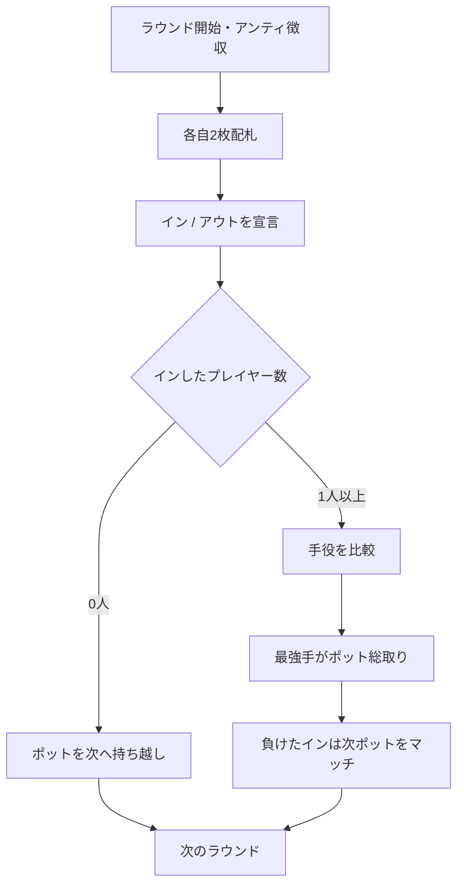

# ガッツ（Web版）遊び方

## ゲーム概要

ガッツ（Guts）はアメリカのホームポーカー文化から生まれた、シンプルながらスリリングなポット・ヴァイイング（vying）ゲームです。各プレイヤーは2枚の手札を持ち、全員が同時に「イン（残る）」か「アウト（降りる）」かを宣言します。残った者同士が手役を比べ、最強手がポットを総取り。ただしインして負けたプレイヤーはポット額をマッチして次ラウンドに積み増すため、勝負が続くほどポットが膨らむ「ポット爆発」が最大の特徴です。

## 起動方法

```sh
go run ./cmd/trumpcards web  # CLI経由でWebサーバーを起動
go run ./cmd/server          # 直接Webサーバーを起動
```

ブラウザで `http://localhost:8080` にアクセスし、ナビゲーションバーから「ガッツ」を選択します。
ナビバーの JA/EN ボタンで日本語・英語を切り替えられます。

## ルール

### 基本ルール

1. 全員がアンティを支払い、標準52枚デッキから各自2枚の手札が配られます。
2. あなたの2枚を見て、「イン（残る）」か「アウト（降りる）」を宣言します。CPU は手札の強さで自動判断します。
3. 「イン」したプレイヤー同士が手役を比較します。
   - **ペア** はノーペアに勝ちます。
   - ペア同士はランクの高い方が勝ち。
   - ノーペア同士はハイカード → キッカーの順で比較（A が最強）。
4. 最強手のプレイヤーがポットを総取りします。
5. 「イン」して負けたプレイヤーは、その時点のポット額を **マッチ**（支払い）して、次ラウンドのポットの種銭に積みます。
6. 誰も「イン」しなかったラウンドは、ポットが丸ごと次ラウンドへ持ち越されます。

### ポットのエスカレーション

マッチによりポットが膨らむため、ラウンドが進むほどリスクが高まります。規定ラウンド数を消化するか、アンティを払えるプレイヤーが2人未満になるとゲーム終了。最終的にチップが最も多いプレイヤーが勝者です。

## ゲームの流れ



## 画面の操作方法

- **イン / アウト**: 宣言フェーズで「イン（残る）」または「アウト（降りる）」ボタンをクリックします。
- **次のラウンド**: 結果表示後に「次のラウンド」をクリックして続行します（チップは引き継がれます）。
- **ヒント**: 宣言フェーズで手札の強さに応じたイン/アウトの助言を表示（オプション）。
- **アクションログ**: これまでの配札・宣言・精算の履歴を確認できます。

## 画面構成

- **フェーズ表示**: 現在のフェーズ、ラウンド番号、ポット額、アンティ、チップ残高
- **プレイヤー一覧**: 各プレイヤーのチップ・宣言状態（イン／アウト／勝者／マッチ）。結果フェーズではインで残ったプレイヤーの手札と役名を公開
- **結果表示**: ラウンドの勝敗とポットの行方。誰もインしなかったラウンドでは、次へ持ち越されるポット額と連続持ち越し回数を表示（CUI と同じ値）

## 遊び方のコツ

- ペアは非常に強い手です。ペアが来たら基本的にインで問題ありません。
- ノーペアでもハイカードが J 以上あれば、参加人数が少ないラウンドでは勝機があります。
- ポットが大きく膨らんでいるときのインはハイリスク・ハイリターン。マッチ負担を意識して宣言しましょう。
- ヒントを有効にすると、手札の強さに基づく推奨宣言が表示されます。
