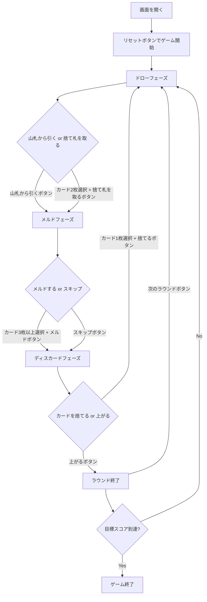

# ハンド・アンド・フット（Web版）遊び方

## ゲーム概要

ハンド・アンド・フットは4人2チームで対戦するカナスタ系のラミーゲームです。4デッキ＋8枚のジョーカー（計216枚）を使用し、各プレイヤーは「ハンド（手札22枚）」と「フット（伏せ札13枚）」の2束を持ちます。ハンドを使い切るとフットに移行します。同ランクのカードを集めてメルド（3枚以上の組）を作り、7枚以上の「カナスタ」を完成させ、赤（クリーン）カナスタと黒（ダーティ）カナスタを揃えて上がります。先に目標スコア（デフォルト5000点）に到達したチームが勝利します。

## 起動方法

```sh
go run ./cmd/trumpcards web
# または
go run ./cmd/server
```

ブラウザで `http://localhost:8080` を開き、ナビゲーションから「ハンド・アンド・フット」を選択してください。

## ルール

### 基本ルール

- **デッキ**: 標準52枚×4デッキ＋ジョーカー8枚＝216枚
- **プレイヤー**: 4人、2チーム（座席0/2がチーム0、座席1/3がチーム1）
- **配布**: 各プレイヤーにハンド22枚＋フット13枚
- **ハンドとフット**: ハンドを使い切るとフット13枚を手札にして続行
- **ワイルドカード**: 2とジョーカーはワイルド
- **赤3**: ハート3・ダイヤ3は自動的にチームの場に出される
- **黒3**: 捨てるだけ（メルド不可、相手のピックアップをブロック）

### メルド（チーム共有）

- メルドはチームで共有して管理します
- 同ランク3枚以上で構成
- ナチュラルカード最低2枚必要
- ワイルドカードは最大3枚まで
- カナスタ = 7枚以上のメルド
  - 赤（クリーン）カナスタ＝ワイルドなし
  - 黒（ダーティ）カナスタ＝ワイルドあり

### 上がり条件

- チームが赤カナスタ1組以上＋黒カナスタ1組以上を完成していること
- 上がるプレイヤーはフットに到達済みであること

### 得点

| ボーナス | 点数 |
|----------|------|
| 赤（クリーン）カナスタ | 500点 |
| 黒（ダーティ）カナスタ | 300点 |
| 上がりボーナス | 100点 |
| 赤3（1枚あたり） | 100点 |

### CPU難易度

- Easy: ランダムプレイ
- Normal: 基本戦略
- Hard: 戦略的プレイ

## ゲームの流れ



## 画面の操作方法

### ドローフェーズ

1. 「山札から引く」ボタンをクリック
2. または、手札からナチュラルカード2枚を選択し「捨て札を取る」ボタンをクリック

### メルドフェーズ

1. 手札からメルドするカード3枚以上を選択し「メルド」ボタンをクリック
2. メルドしない場合は「スキップ」ボタンをクリック

チームがまだ開場していない場合、選択したカードの合計点が**初回メルドの最低点**（累積スコアで決まる）に届くまで「メルド」ボタンは押せません。選択中の合計点と最低点はボタンの上に表示されます。

### ディスカードフェーズ

1. 手札からカード1枚を選択し「捨てる」ボタンをクリック
2. 赤・黒カナスタが揃っている場合は「上がる」ボタンで上がれます

### キーボードショートカット

| キー | アクション | 有効条件 |
|------|-----------|----------|
| ← → | カード選択移動 | 人間の手番 |
| Space | カード選択/解除 | 人間の手番 |
| Enter | 確定 | カード選択中 |
| Escape | 選択解除 | カード選択中 |

## 画面構成

```
┌──────────────────────────────────┐
│ ゲームタイトル / フェーズ表示     │
├──────────────────────────────────┤
│ 設定パネル (CPU難易度/目標スコア) │
├────────────────┬─────────────────┤
│ 捨て札エリア   │ スコアテーブル   │
│ チームメルド   │ (チーム/フット)  │
│ 赤3表示       │ CPU情報         │
├────────────────┴─────────────────┤
│ 手札エリア (カード選択)          │
│ アクションボタン                 │
└──────────────────────────────────┘
```

## 遊び方のコツ

- 上がるには赤カナスタと黒カナスタの両方が必要です。バランスよく作りましょう
- ハンドを使い切るまではフットに触れません。ハンドの整理を優先しましょう
- 赤（クリーン）カナスタは500点と高得点。ワイルドを温存して狙いましょう
- 捨て札の山が大きい時は積極的に取りましょう
- ワイルドカードを捨てると山がフリーズします
- 黒3で相手の山取りをブロックできます
- チーム戦なのでパートナーのメルドと連携して点を伸ばしましょう

