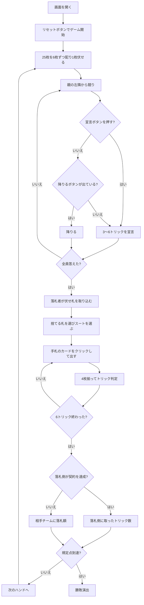

# ハーゼンプフェファー（Web版）遊び方

## ゲーム概要

アメリカのドイツ系移民に伝わるユーカー派生の切り札トリックテイキング。**25枚**（ユーカーの24枚 + ジョーカー1枚）を4人2対2で**6枚ずつ**配り、余った1枚を伏せます。**ジョーカーが全カード中最強の切り札（Best Bower）**になり、**競りは全員参加が義務**——3人が降りたら親は降りられません。

## 起動方法

```sh
go run ./cmd/trumpcards web  # CLI経由でWebサーバーを起動
go run ./cmd/server          # 直接Webサーバーを起動
```

ブラウザで `http://localhost:8080` にアクセスし、ナビゲーションバーから「ハーゼンプフェファー」を選択します。
ナビバーのJA/ENボタンで日本語・英語を切り替えられます。

## ルール

- **25枚**（9〜A の24枚 + **ジョーカー1枚**）、**4人2対2**（向かい合う席が味方）
- **6枚ずつ**配り、**余った1枚を伏せます**。1ハンドは**6トリック**（ユーカーの5ではありません）
- **札の強さ（切り札）**: **ジョーカー（Best Bower）> 切り札の J（Right Bower）> 同色の J（Left Bower）> A > K > Q > 10 > 9**
- **ジョーカーと Left Bower は切り札スート扱い**です。切り札がリードされたら、どちらもフォロー義務があります
- **競りは 3〜6 トリック**、上回らないと通りません。**3人が降りたら親は降りられません**（そのときは降りるボタンが出ません）
- 落札者は**伏せ札を手に入れて7枚**になり、**1枚捨てて切り札を宣言**します
- **達成すると取ったトリック数がそのまま得点**、落とすと**相手に落札額**が入ります
- 先に規定点（既定10点）に達したチームの勝ち

## ゲームの流れ



## 画面の操作方法

| 操作 | 説明 |
|------|------|
| 宣言ボタン（3〜6） | そのトリック数で宣言する（**上回れる額だけ表示されます**） |
| 降りるボタン | 競りから降りる（**親が降りられない場面では表示されません**） |
| 手札のカードをクリック（捨て札フェーズ） | 捨てる札を選ぶ（黄色の枠が付きます） |
| 切り札ボタン（♠♣♥♦の4つ） | 選んだ札を捨てて切り札を宣言する（**札を選ぶまで押せません**） |
| 手札のカードをクリック（プレイ中） | そのカードを出す（出せる札には緑の枠が付きます） |
| 次のハンドへボタン | ハンド終了後、次のハンドを配る |
| ヒントボタン | 宣言額・捨て札・打つべき札を提示する |
| ギブアップボタン | 投了する |
| リセットボタン | 確認ダイアログのうえで最初からやり直す |
| CLI トグル | 同じゲームをコマンド入力で操作するモードに切り替える |

### キーボードショートカット

| キー | アクション | 有効条件 |
|------|-----------|---------|

（このゲーム固有のキーボードショートカットはありません）

## 画面構成

```
┌────────────────────────────────────────────┐
│  ハンド: 2   10点先取   切り札: ♥           │
├────────────────────────────────────────────┤
│ ジョーカーが全カード中最強の切り札です      │
│ 得点: あなたのチーム 3 － 相手 5            │
├────────────────────────────────────────────┤
│  あなた T0 : 宣言降り / 獲得1               │
│  CPU1  T1 [落札]: 宣言4 / 獲得1             │
│  CPU2  T0 : 宣言降り / 獲得0                │
│  CPU3  T1 : 宣言降り / 獲得0                │
├────────────────────────────────────────────┤
│              現在のトリック                 │
├────────────────────────────────────────────┤
│  あなたの手札（出せる札に緑の枠）           │
└────────────────────────────────────────────┘
```

- **上部**: ハンド数、目標点、切り札（競り中は伏せ札の枚数）
- **ルール帯**: ジョーカーが最強という序列。**知らないと打ち方が変わります**
- **中央上**: 各プレイヤーのチーム番号（**T0があなたの味方**）、**落札者**の印、宣言と獲得トリック数
- **中央**: 現在のトリック
- **ハンド終了時**: 契約を**達成したのか落としたのか**を明示します
- **下部**: 自分の手札。**フォロー義務を満たす札だけ**に緑の枠が付きます

## 遊び方のコツ

- **ジョーカーは1枚しかない。** 持っているなら確実な1トリックです
- **Left Bower を数え忘れない。** 同色の J は切り札なので、切り札の枚数は「そのスートの枚数 + 1」になります
- **親のときは競りを見る。** 3人が降りたら降りられないので、弱い手でも受ける覚悟が要ります
- **上限の6を宣言すると誰も上回れません**
- **落札したら伏せ札で1枚強くなります**
- **多く取っても損はしません。** 契約を超えたぶんもそのまま得点になります
- **相手の契約は落とさせる。** 落とせば落札額がまるごとこちらに入ります
