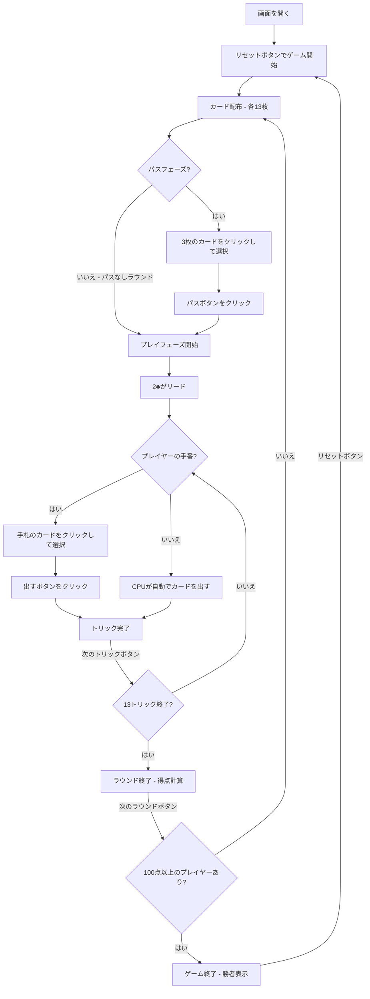

# ハーツ（Web版）遊び方

## ゲーム概要

4人（プレイヤー1人 + CPU 3人）で遊ぶトリックテイキング型カードゲームです。ハート（各1点）とQ♠（13点）を取らないようにし、誰かが100点以上になった時点で最も点数の低いプレイヤーが勝者です。

## 起動方法

```sh
go run ./cmd/trumpcards web  # CLI経由でWebサーバーを起動
go run ./cmd/server          # 直接Webサーバーを起動
```

ブラウザで `http://localhost:8080` にアクセスし、ナビゲーションバーから「ハーツ」を選択します。
ナビバーのJA/ENボタンで日本語・英語を切り替えられます。

## ルール

### 基本ルール

- 52枚のトランプを4人に配布（1人13枚）
- 各ラウンド開始時に3枚のカードをパスする（左→右→向かい→パスなし のローテーション）
- 2♣を持っているプレイヤーが最初のトリックをリードする
- リードされたスートに従う（フォロー必須）。なければ任意のカードを出せる
- トリックの最高ランクのカード（リードスート）を出したプレイヤーがトリックを取る
- ハートはブレイクされるまでリードできない（ハートブレイク）

### 得点

- ハート（♥）各1点（計13点）
- スペードのクイーン（Q♠）13点
- 1ラウンドの合計は26点

### シュート・ザ・ムーン

- 1人のプレイヤーが26点すべてを取った場合、そのプレイヤーは0点、他の3人に+26点が加算される

### オムニバス・ハーツ（オプション）

- 設定パネルの「オムニバス (J♦ = -10点)」チェックボックスで有効化
- J♦を獲得すると-10点（プレイヤーにとって有利）
- シュート・ザ・ムーンのしきい値は16点（26 - 10）に変更される
- J♦は最初のトリックでポイントカードとして扱われる（出せない）
- 有効時、J♦を獲得したプレイヤーの内訳に「♦J−10」が表示される（ペナルティ札一覧には含まれない）

### ゲーム終了

- いずれかのプレイヤーが100点（デフォルト）以上に達した時点でゲーム終了
- 最も点数の低いプレイヤーが勝者

### CPU難易度

- **Easy**: ランダムにカードを出す
- **Normal**: ポイントカード（ハート・Q♠）を避ける戦略（デフォルト）
- **Hard**: 戦略的なプレイ（ボイド作り、カウンティング等）

## ゲームの流れ



## 画面の操作方法

### カードのパス（パスフェーズ）

1. 画面下部の手札エリアに自分のカードが表示されます
2. パスしたいカードを3枚クリックすると選択状態になり、カードが少し上に浮き上がります（緑枠）
3. 3枚選択すると **「パス」** ボタンが有効化されます
4. **「パス」** ボタンをクリックしてカードをパスします

### カードのプレイ（プレイフェーズ）

1. 手札のカードをクリックして選択します
2. フォロー必須のルールに従い、出せないカードは選択できません
3. **「出す」** ボタンをクリックしてカードを場に出します

### ヒント

- パスフェーズまたはプレイフェーズで **「ヒント」** ボタンをクリックすると、CPUのHard戦略に基づく推奨カードが表示されます
- パスフェーズでは推奨する3枚のカード、プレイフェーズでは推奨する1枚のカードが黄色のメッセージで表示されます

### トリック・ラウンドの進行

1. トリックが完了すると結果が表示されます
2. **「次のトリック」** ボタンで次のトリックに進みます
3. ラウンドが完了すると得点が表示されます
4. **「次のラウンド」** ボタンで次のラウンドに進みます

### キーボードショートカット

ゲーム中、以下のキーボードショートカットが使用できます。

| キー | アクション | 有効条件 |
|------|-----------|---------|
| `1`〜`9`, `0` | カード選択/解除（1=1枚目, ..., 9=9枚目, 0=10枚目） | パスフェーズ / プレイヤーの手番 |
| `Enter` | パス実行 / カードを出す | パスフェーズ / プレイヤーの手番 |
| `Escape` | 選択クリア | パスフェーズ / プレイヤーの手番 |

※ テキスト入力欄にフォーカスがある場合、ショートカットは無効になります。

## 画面構成

```
┌────────────────────────────────────────────┐
│  ▶ 設定 (クリックで展開)                   │
│    CPU難易度:    [Normal▼]                 │
│    ポイント上限: [100▼]                    │
├────────────────────────────────────────────┤
│           CPU プレイヤーエリア              │
│ ┌──────────┐ ┌──────────┐ ┌──────────┐    │
│ │ CPU 1    │ │ CPU 2    │ │ CPU 3    │    │
│ │ 26点     │ │ 18点     │ │ 31点     │    │
│ └──────────┘ └──────────┘ └──────────┘    │
├────────────────────────────────────────────┤
│              ゲーム情報                     │
│  ラウンド 3 / トリック 5                    │
│  パス方向: 左  ハートブレイク: はい          │
├────────────────────────────────────────────┤
│           現在のトリック                    │
│  CPU 1: ♣10   CPU 2: ♣K                  │
├────────────────────────────────────────────┤
│         フッター: あなた (26点)              │
│  [♠2][♣5][♥9][♦J]...                     │
│  [リセット] [ヒント] [出す] [次のトリック]    │
└────────────────────────────────────────────┘
```

- **CPU プレイヤーエリア**: 各 CPU の累計得点と今ラウンドの得点を表示
  - 手番の CPU は金色枠
- **ゲーム情報**: 現在のラウンド、トリック番号、パス方向、ハートブレイク状態
- **現在のトリック**: トリックに出されたカード
- **フッター（あなたの手札）**:
  - クリックで選択（緑枠 + 上に浮き上がる）
  - フォロー必須のカードのみ選択可能
- **設定パネル（▶ 設定）**:
  - 「CPU難易度」セレクト: Easy / Normal / Hard から選択
  - 「ポイント上限」: ゲーム終了のポイント上限を設定
  - 次のリセット時に設定が適用される

## 遊び方のコツ

- Q♠を持っている場合は、早めにスペードの高いカードを処理しておきましょう
- ハートや高いカードを避けるために、特定のスートをボイド（手札からなくす）にする戦略が有効です
- パスフェーズでは、Q♠やハートの高いカード、特定スートの残り枚数が少ないカードをパスすると良いでしょう
- シュート・ザ・ムーンを狙う場合は、高いカードを多く保持し、すべてのポイントカードを確実に取れる手札構成が必要です
- 他のプレイヤーがシュート・ザ・ムーンを狙っている兆候があれば、ポイントカードを1枚でも取って阻止しましょう
- 迷った時はヒントボタンでCPUのHard戦略に基づく推奨カードを確認できます
