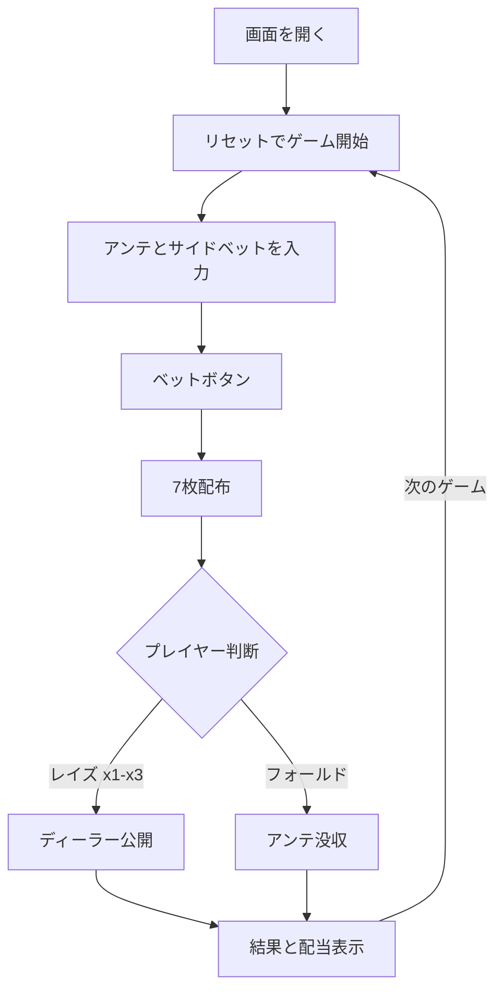

# ハイカードフラッシュ（Web版）遊び方

## ゲーム概要

プレイヤー対ディーラーの1対1テーブルゲーム。7枚ずつ配られたカードから「同じスートの最大枚数（フラッシュ長）」で勝負します。フラッシュが長いほど高倍率のレイズが許可されます。

## 起動方法

```sh
go run ./cmd/trumpcards web  # CLI経由でWebサーバーを起動
go run ./cmd/server          # 直接Webサーバーを起動
```

ブラウザで `http://localhost:8080` にアクセスし、ナビゲーションバーから「ハイカードフラッシュ」を選択します。
ナビバーのJA/ENボタンで日本語・英語を切り替えられます。

## ルール

### 基本ルール

- アンテとオプションのサイドベット（Flush Bonus / Straight Flush Bonus）を置く
- 7枚ずつカードが配られ、プレイヤーはハンドを見てから判断
- 「レイズ x1 / x2 / x3」または「フォールド」を選択（最大倍率はフラッシュ枚数に依存）

### レイズ上限

| 最長フラッシュ | 最大レイズ倍率 |
|--------------|----------------|
| 2〜4枚 | 1倍 |
| 5枚 | 2倍 |
| 6〜7枚 | 3倍 |

### ディーラークオリファイ

3枚以上のフラッシュかつ9以上の高位カードでクオリファイ。未クオリファイの場合はアンテのみ1:1配当、レイズはプッシュ。

### サイドベット配当

**Flush Bonus**: 4枚=1:1 / 5枚=10:1 / 6枚=50:1 / 7枚=100:1

**Straight Flush Bonus**: 3枚=8:1 / 4枚=60:1 / 5枚=100:1 / 6枚=1000:1 / 7枚=8000:1

## ゲームの流れ



## 画面の操作方法

### ベットフェーズ

1. アンテ・Flush Bonus・Straight Flush Bonus を数値入力欄に設定
2. 「ベット」ボタンを押す

### アクションフェーズ

1. 自分のフラッシュ枚数と最大倍率がフッターに表示される
2. 「レイズ x1」「レイズ x2」「レイズ x3」（許可された倍率のみ表示）または「フォールド」を選択

### 結果フェーズ

1. プレイヤー／ディーラー双方のハンドとフラッシュ長が表示される
2. 配当内訳と合計が表示される
3. 「次のゲーム」ボタンで再スタート

### キーボードショートカット

| キー | アクション | 有効条件 |
|------|-----------|---------|
| `B` | ベット | ベットフェーズ |
| `1` | レイズ x1 | アクションフェーズ（常時） |
| `2` | レイズ x2 | アクションフェーズ（5枚以上のフラッシュ） |
| `3` | レイズ x3 | アクションフェーズ（6枚以上のフラッシュ） |
| `F` | フォールド | アクションフェーズ |
| `R` | 次のゲーム | 結果フェーズ |

## 画面構成

```
┌────────────────────────────────────────────┐
│  ハイカードフラッシュ          チップ:1000  │
├────────────────────────────────────────────┤
│  🟡 PLAYER (5枚フラッシュ)                  │
│  [S5][S6][S7][S11][S13][H9][C4]            │
│                                            │
│  🔴 DEALER (3枚フラッシュ) (Qualified)      │
│  [C4][C6][C9][H8][D11][S2][D13]            │
├────────────────────────────────────────────┤
│  [レイズ x1] [レイズ x2] [フォールド]      │
└────────────────────────────────────────────┘
```

## 遊び方のコツ

- 6枚以上のフラッシュなら必ずレイズ x3
- 5枚フラッシュは確実にレイズ x2
- 4枚フラッシュは1倍レイズが安全
- 3枚フラッシュではQ-high以上の場合のみレイズ、それ以外はフォールド
- Straight Flush Bonus は配当が極大なので、コインの余裕があれば少額置いておく価値あり
- Hint をオンにすると、ハンド状態から推奨アクションを表示できる
