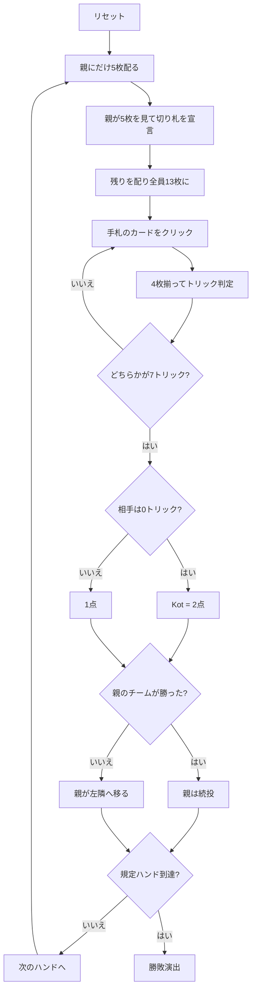

# ホクム（Web版）遊び方

## ゲーム概要

イランで最も広く遊ばれている切り札トリックテイキング。52枚を4人に13枚ずつ配る**2対2のパートナー戦**で、向かい合う席が味方。**13トリックを打ち切りません**——どちらかのチームが**7トリック**取った時点でハンドが即座に終わります。親（**ハケム**）は**最初の5枚だけ**を見て切り札を決めます。

## 起動方法

```sh
go run ./cmd/trumpcards web  # CLI経由でWebサーバーを起動
go run ./cmd/server          # 直接Webサーバーを起動
```

ブラウザで `http://localhost:8080` にアクセスし、ナビゲーションバーから「ホクム」を選択します。
ナビバーのJA/ENボタンで日本語・英語を切り替えられます。

## ルール

- **52枚**、**4人2対2**（向かい合う席が味方）、13枚ずつ
- **親にだけ先に5枚**配り、親はその5枚だけを見て切り札を宣言。そのあと残りを配って全員13枚に
- **7トリック先取でハンド終了。** 13トリックは消化しません（7 + 7 = 14 > 13 なので必ず決着します）
- ハンドを制すと **1点**、**相手を1トリックも取らせなければ Kot で2点**
- **親は負けたときだけ交代**します（勝っているあいだ切り札を選び続けます）
- ハンド終了のバナーには、**親が交代するかどうか**も併記されます（次に切り札を選ぶ席が変わるかが、次ハンドを待たずに分かります）
- フォロー義務あり。切り札 > リードのスート > その他
- 先に規定ハンド勝ち点（既定7）を取ったチームの勝ち

## ゲームの流れ



## 画面の操作方法

| 操作 | 説明 |
|------|------|
| 切り札ボタン（♠♣♥♦の4つ） | 切り札スートを宣言する（**あなたが親のときだけ表示**） |
| 手札のカードをクリック | そのカードを出す（出せる札だけ押せます） |
| 次のハンドへボタン | ハンド終了後、次のハンドを配る |
| ヒントボタン | 宣言すべきスート、または打つべき札を提示する |
| ギブアップボタン | 投了する |
| リセットボタン | 確認ダイアログのうえで最初からやり直す |
| CLI トグル | 同じゲームをコマンド入力で操作するモードに切り替える |

## 画面構成

- **上部**: ハンド数、目標ハンド勝ち点、切り札
- **トリック帯**: **7先取の競り合い**。13まで打たないので、進捗はここに出ます
- **中央上**: 各プレイヤーのチーム番号（**T0があなたの味方**）、**親**の印、獲得トリック数
- **中央**: 現在のトリック
- **ハンド終了時**: 通常の決着か **Kot（2点）** かを明示します
- **下部**: 自分の手札。**フォロー義務を満たす札だけ**に印が付きます

## 遊び方のコツ

- **親になったら長いスートを切り札にする。** 5枚しか見えないので、枚数がいちばん確かな情報です
- **7取れば終わり。** 8枚目以降は勝ち点が増えません
- **Kot は2倍。** 相手が0トリックのまま6-0まで来たら、最後の1つも取りにいく価値があります
- **逆に、1トリックだけでも取れば Kot を防げます**
- **味方が勝っているトリックでは強い札を温存する**
- **親を続けさせない。** 相手の親が続くかぎり切り札を選ばれ続けます
