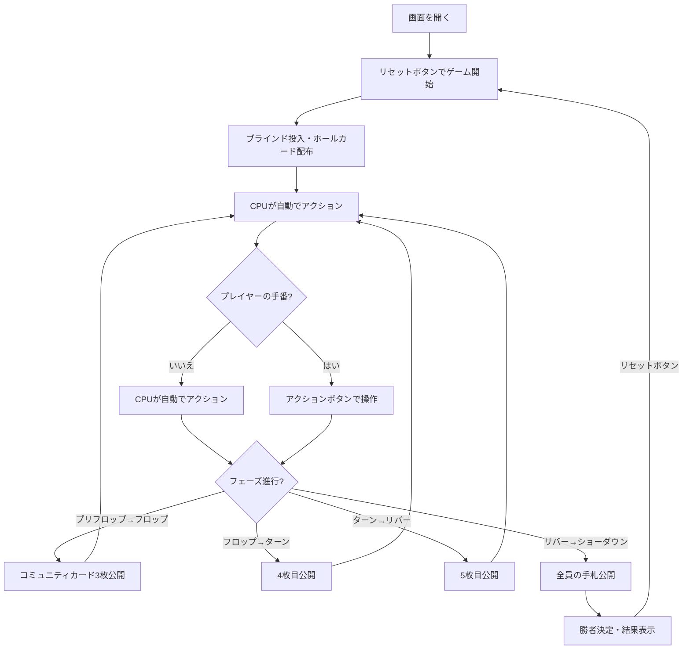

# テキサスホールデム（Web版）遊び方

## ゲーム概要

4人（プレイヤー1人 + CPU 3人）で遊ぶテキサスホールデムポーカーです。各CPUは異なるプレイスタイル（TAG/LAP/TAP/GTO）を持ち、ブラフを含む戦略的なプレイをします。GTOスタイルはボードテクスチャ分析に基づく混合戦略で意思決定します。サイドポットにも対応しています。

HUD統計（VPIP%/PFR%）が全プレイヤーに表示され、CPUのベットサイズはポット相対（半額～全額）で決定されます。トーナメントモードでは、指定ハンド数ごとにブラインドが自動的に上昇します。

## 起動方法

```sh
go run ./cmd/cli web        # CLI経由でWebサーバーを起動
go run ./cmd/server         # 直接Webサーバーを起動
```

ブラウザで `http://localhost:8080` にアクセスし、ナビゲーションバーから「テキサスホールデム」を選択します。
ナビバーのJA/ENボタンで日本語・英語を切り替えられます。

## ルール

### 基本ルール

- 52枚のトランプを使用
- 各プレイヤーに2枚のホールカード（手札）が配られる
- 場にコミュニティカード（共有カード）が最大5枚公開される
- ホールカード2枚 + コミュニティカード5枚の計7枚から、最強の5枚の組み合わせで役を作る
- 最も強い役を持つプレイヤーがポットを獲得する

### ゲームの進行

1. **ブラインド**: ディーラーの左隣がスモールブラインド（デフォルト5）、その左隣がビッグブラインド（デフォルト10）を強制ベット
2. **プリフロップ**: ホールカード2枚配布後、最初のベッティングラウンド
3. **フロップ**: コミュニティカード3枚公開後、ベッティングラウンド
4. **ターン**: コミュニティカード4枚目公開後、ベッティングラウンド
5. **リバー**: コミュニティカード5枚目公開後、最後のベッティングラウンド
6. **ショーダウン**: 残っているプレイヤーの手札を公開し、勝者を決定

### ベッティングアクション

| アクション | 説明 |
|-----------|------|
| フォールド | 手札を捨ててラウンドから降りる |
| チェック | ベットせずにパスする（未ベット時のみ） |
| コール | 現在のベット額に合わせる |
| ベット | 新たにベットする（未ベット時のみ） |
| レイズ | 現在のベット額を上げる |
| オールイン | 全チップを賭ける |

### 役一覧（強い順）

| 役 | 説明 |
|----|------|
| Royal Flush | 同じスートの10・J・Q・K・A |
| Straight Flush | 同じスートの5枚連番 |
| Four of a Kind | 同じ数字4枚 |
| Full House | 同じ数字3枚 + 同じ数字2枚 |
| Flush | 同じスート5枚 |
| Straight | 5枚連番 |
| Three of a Kind | 同じ数字3枚 |
| Two Pair | ペア2組 |
| One Pair | ペア1組 |
| High Card | 上記に該当しない最も高いカード |

### CPUプレイスタイル

| スタイル | 略称 | 特徴 |
|---------|------|------|
| Tight-Aggressive | TAG | 強い手のみ参加し、積極的にレイズ。ブラフ率15% |
| Loose-Passive | LAP | 多くの手に参加するが、主にコール。ブラフ率5% |
| Tight-Passive | TAP | 厳選した手のみ参加し、主にコール。ブラフ率5% |
| Loose-Aggressive | LAG | 多くの手に参加し、頻繁にレイズ。ブラフ率30% |
| Game Theory Optimal | GTO | ハンド強度とボードテクスチャに基づく確率的混合戦略。ドライボードでは2/3ポット、ウェットボードでは3/4ポットのベットサイズ |

## ゲームの流れ



## 画面の操作方法

### アクションの実行

自分の手番が来ると、画面下部にアクションボタンが表示されます。

**ベットが出ていない場合:**
- **「ベット」**: ベット額を入力してベットする
- **「チェック」**: パスする

**ベットが出ている場合:**
- **「コール」**: 現在のベット額に合わせる
- **「レイズ」**: ベット額を入力してレイズする

**常に選択可能:**
- **「フォールド」**: 降りる
- **「オールイン」**: 全チップを賭ける

### ベット額の入力

アクションボタンの上にある「ベット額」入力欄で金額を指定します。ベットまたはレイズ時にこの金額が使用されます。

## 画面構成

```
┌────────────────────────────────────────────┐
│ フェーズ: フロップ  ポット: 60  SB/BB: 5/10  ディーラー: Player 0 │
├────────────────────────────────────────────┤
│           コミュニティカード                │
│      [♠7] [♣10] [♥3]                    │
├────────────────────────────────────────────┤
│           CPU プレイヤーエリア              │
│ CPU 1 (TAG) チップ:980 ベット:20           │
│ [🂠] [🂠]                                │
│ CPU 2 (LAP) チップ:990 [フォールド]         │
│ [🂠] [🂠]                                │
│ CPU 3 (GTO) チップ:960 ベット:10           │
│ [🂠] [🂠]                                │
├────────────────────────────────────────────┤
│             CPU行動ログ                    │
│  Player 1: コール                         │
│  Player 2: フォールド                      │
│  Player 3: チェック                        │
├────────────────────────────────────────────┤
│         フッター: あなたの手札               │
│  チップ:970 ベット:20                       │
│  [♠A] [♥K]                               │
│                                            │
│  メッセージエリア                           │
│                                            │
│  ベット額: [20 ▲▼]                         │
│  [コール] [レイズ] [フォールド] [オールイン]  │
│  [リセット]                                │
└────────────────────────────────────────────┘
```

- **情報バー（上部）**: 現在のフェーズ、ポット額、SB/BB額、ディーラー位置（トーナメントモード時はハンド数とレベルアップ情報も表示）
- **コミュニティカード**: 場に公開された共有カード（フェーズに応じて0/3/4/5枚）
- **CPUプレイヤーエリア**: 各CPUのプレイスタイル、チップ、ベット額、状態
  - ショーダウン時にはCPUのホールカードと役名が表示される
- **CPU行動ログ**: CPUが行ったアクションの記録
- **結果エリア**: ショーダウン後、各プレイヤーの役と獲得チップを表示
- **フッター（あなたの手札）**:
  - ホールカード2枚が表示される
  - フォールド/オールイン状態のバッジ
  - ショーダウン時には役名が表示される
- **メッセージエリア**: ゲームの状態メッセージ
- **アクションボタン**: 手番時のみ表示

## HUD統計

各プレイヤーにはHUD（ヘッズアップディスプレイ）統計が表示されます：

- **VPIP** (Voluntarily Put $ In Pot): プリフロップで自発的にチップを入れた割合（コール/ベット/レイズ/オールイン）
- **PFR** (Pre-Flop Raise): プリフロップでレイズした割合（ベット/レイズ/オールイン）

統計はハンド数が1以上のプレイヤーに対してのみ表示されます。

## トーナメントモード

トーナメントモードを有効にすると、指定ハンド数ごとにブラインドが自動的に上昇します。情報バーにハンド数とレベルアップ情報が追加表示されます。

API経由で以下のパラメータを指定できます：

- **tournamentMode**: `true` でトーナメントモードを有効化
- **blindLevelHands**: ブラインドレベルアップまでのハンド数（デフォルト10）
- **blindMultiplier**: ブラインド倍率（百分率、デフォルト200 = 2倍）
- **bettingLimit**: ベッティングリミット（0=Fixed, 1=PotLimit, 2=NoLimit、デフォルト0）

### レスポンスのベッティングリミット関連フィールド

| フィールド | 型 | 説明 |
|------------|------|------|
| `bettingLimit` | int | 現在のベッティングリミット（0=Fixed, 1=PotLimit, 2=NoLimit） |
| `raiseCount` | int | 現在のベッティングラウンドでのレイズ回数 |
| `maxBetAmount` | int | 現在のベッティングリミットに基づく最大ベット額 |

## 遊び方のコツ

- ポジション（ディーラーからの距離）は重要です。後ろのポジションほど有利です
- 強い手（ペア、高いカード）はプリフロップでレイズして主導権を握りましょう
- LAGスタイルのCPUはブラフが多いので、良い手を持っているときはコールやレイズで対抗しましょう
- GTOスタイルのCPUは確率的な混合戦略を使うため、行動パターンが読みにくいです。ボードテクスチャに注意して対応しましょう
- TAGスタイルのCPUがレイズしてきたら、本当に強い手を持っている可能性が高いので注意しましょう
- HUD統計を活用して、CPUのプレイスタイルの傾向を把握しましょう
- トーナメントモードではブラインドが上がるため、早めにチップを稼ぐ戦略が重要です
- コミュニティカードとの組み合わせを常に確認し、フラッシュやストレートの可能性を見逃さないようにしましょう
- オールインは最後の手段として使いましょう。全チップを失うリスクがあります
