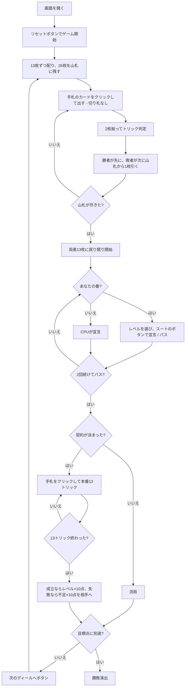

# ハネムーンブリッジ（Web版）遊び方

## ゲーム概要

**2人専用**のブリッジ。前半の**13トリックは得点になりません**——切り札なしで打ち、1トリックごとに**勝った人が先に、負けた人が次に**山札から1枚引きます。26枚の山札を使い切ると両者また13枚に戻り、そこで競りを行って後半13トリックの本番に入ります。先に目標点（既定100点）に届いた人の勝ちです。

## 起動方法

```sh
go run ./cmd/trumpcards web  # CLI経由でWebサーバーを起動
go run ./cmd/server          # 直接Webサーバーを起動
```

ブラウザで `http://localhost:8080` にアクセスし、ナビゲーションバーから「ハネムーンブリッジ」を選択します。
ナビバーのJA/ENボタンで日本語・英語を切り替えられます。

## ルール

- **52枚**、**2人専用**。13枚ずつ配ると、残りもちょうど**26枚**が山札になります
- **前半13トリックは得点になりません**。切り札なしで打ち、各トリックのあと**勝者が山札の1枚目、敗者が2枚目**を引きます。13 × 2 = 26 で山札を使い切り、両者また13枚に戻ります
- 山札が尽きたら**競り**。宣言は**レベル1〜7 × 5種**（♠ ♣ ♥ ♦ NT）で、**現在の契約を上回らないと通りません**
- **序列は ♠ < ♣ < ♥ < ♦ < NT。ノートランプがいちばん強い**ので、同じレベルでも♦の上に置けます
- **2回続けてパスすると競りが締まり**、落札者の相手からリードします。最初に両者ともパスするとそのディールは流れます
- 契約は「**6 + レベル**」トリック。成立で**レベル × 10点**、オーバートリックは1つ**5点**
- 失敗すると**不足トリック × 10点が相手に入ります**
- フォロー義務あり。切り札 > リードのスート > その他。同じスートなら A > K > Q > J > 10 > … > 2
- どちらかの累計が**目標点（既定100、範囲50〜500）に届いた時点**で終了します

## ゲームの流れ



## 画面の操作方法

| 操作 | 説明 |
|------|------|
| 手札のカードをクリック | そのカードを出す（出せる札には緑の枠が付きます） |
| レベル選択（プルダウン） | 宣言するレベルを選ぶ（**上回れるレベルだけ**が並びます） |
| スートのボタン（♠ ♣ ♥ ♦ NT の5つ） | 選んだレベルでそのスートを宣言する（**上回れない組み合わせは押せません**） |
| パスボタン | 競りを降りる |
| 次のディールへボタン | ディール終了後、次のディールを配る |
| ヒントボタン | 宣言すべき契約、打つべき札を提示する |
| ギブアップボタン | 投了する |
| リセットボタン | 確認ダイアログのうえで最初からやり直す |
| CLI トグル | 同じゲームをコマンド入力で操作するモードに切り替える |

**サーバが拒否する宣言はボタンに出しません。** 上回れる最小の契約はサーバから受け取っていて、レベルとスートの組み合わせがそれを下回るあいだボタンは押せません。上限（7NT）に張り付くとレベル選択そのものが消え、パスだけが残ります。

**前半の引き合いにも専用の操作はありません。** ふつうに手札をクリックして進みます。

### キーボードショートカット

| キー | アクション | 有効条件 |
|------|-----------|---------|

（このゲーム固有のキーボードショートカットはありません）

## 画面構成

```
┌────────────────────────────────────────────┐
│  ディール 1              目標 100点         │
├────────────────────────────────────────────┤
│ 前半13トリックは得点にならず、1枚ずつ引く   │
│ 山札 残り20枚（前半のトリックは得点外）      │
│ 契約: 未決定                                │
├────────────────────────────────────────────┤
│  あなた: 宣言なし / 獲得0 / 累計0           │
│  CPU1: 宣言なし / 獲得0 / 累計0             │
├────────────────────────────────────────────┤
│              現在のトリック                 │
├────────────────────────────────────────────┤
│  あなたの手札（出せる札に緑の枠）           │
├────────────────────────────────────────────┤
│  レベル[2▾] [2♠][2♣][2♥][2♦][2NT] [パス]   │
└────────────────────────────────────────────┘
```

- **上部**: ディール番号と目標点
- **規則帯**: このゲームの前半後半の違いそのもの。**前半は得点にならない**ことを常に出します
- **山札行**: 前半のあいだだけ出ます。使い切ると消えます
- **契約行**: 落札されると `契約: 4♥（あなた）／必要 10トリック` になります。**必要トリック数を併記**します
- **最小宣言行**: あなたの競りの番だけ出ます。**上回れる最小の契約**（または「パスしか選べません」）
- **中央上**: 各プレイヤーの**宣言 / 獲得数 / 累計得点**、**落札者**の印
- **中央**: 現在のトリック
- **下部**: 自分の手札。**フォロー義務を満たす札だけ**に緑の枠が付きます

## 遊び方のコツ

- **前半は安く出す。** 取っても得点にならないので、A や K は本番まで温存します
- **ただし取れば先に引ける。** 山札の上を引く権利には価値があります
- **契約は「6 + レベル」。** レベル1でも7トリック、つまり過半数が要ります
- **NT は同レベルで♦の上。** ♦で止められても、同じレベルの NT で上回れます
- **失敗の失点は不足 × 10点。** 3トリック足りないと相手に30点入ります。届かない契約は競り上げないほうが得です
- **オーバートリックは1つ5点。** 取れる手なら高いレベルのほうが伸びますが、落ちたときの失点は不足数で決まります
