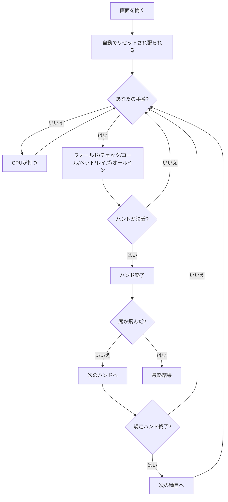

# H.O.R.S.E.（Web版）遊び方

## ゲーム概要

H.O.R.S.E. は**5つのポーカーを1つの卓で順に回すミックスゲーム**です（4/6/9人：あなた + CPU）。頭文字がそのまま種目の並びで、Hold'em → Omaha Hi-Lo → Razz → Stud → Stud Hi-Lo と一定ハンドごとに切り替わります。チップは種目をまたいで持ち越され、規則だけが入れ替わります。

## 起動方法

```sh
go run ./cmd/trumpcards web  # CLI経由でWebサーバーを起動
go run ./cmd/server          # 直接Webサーバーを起動
```

ブラウザで `http://localhost:8080` にアクセスし、ナビゲーションバーから「H.O.R.S.E.」を選択します。
ナビバーのJA/ENボタンで日本語・英語を切り替えられます。

## ルール

### 種目の並び

| 文字 | 種目 | 形 | 共有札 |
|------|------|----|--------|
| H | テキサスホールデム | 伏せ2枚 + 共有5枚 | あり |
| O | オマハ ハイロー | 伏せ4枚 + 共有5枚（手札からちょうど2枚） | あり |
| R | ラズ | スタッド7枚（最も低い手が勝ち） | なし |
| S | セブンカードスタッド | スタッド7枚 | なし |
| E | スタッド ハイロー | スタッド7枚（ハイとローで分ける） | なし |

- 1種目あたりのハンド数は 1〜10（既定2）。規定ハンドで次の文字へ進み、E の次は H に戻ります。
- 役の判定とベッティングの規則は、その種目を単体で遊ぶときとまったく同じです。

### チップと決着

- 席数は **4 / 6 / 9**。ポーカーの卓がこの3つしか作れないため、他の数は選べません。
- チップは種目をまたいで持ち越されます。**1席でも飛んだ時点でマッチ終了**で、最も多く持っている席の勝ちです。

## ゲームの流れ



## 画面の操作方法

### ベッティング

1. あなたの手番になると、フッターにベッティングの操作が出ます。操作はどの種目でも同じです。
2. **賭けられていなければ「チェック」と「ベット」**、賭けられていれば「コール」と「レイズ」が出ます。額は入力欄か 1/2ポット・ポット・マックスのボタンで決めます。
3. 「フォールド」「オールイン」はいつでも押せます。

### ハンドの区切り

- ハンドが決着すると「次のハンドへ」が出ます。押すと次が配られ、**規定ハンドを打ち切っていれば種目が変わります**。
- 種目が変わったことは画面上部の文字（H/O/R/S/E）と種目名で分かります。

### 設定

| 設定 | 範囲 | 説明 |
|------|------|------|
| 席数 | 4 / 6 / 9 | ポーカーの卓が作れる人数 |
| 種目ごとのハンド数 | 1 / 2 / 3 / 5 / 10 | 何ハンドで次の種目へ進むか |

### キーボードショートカット

| キー | アクション | 有効条件 |
|------|-----------|---------|
| Tab | 次の操作へフォーカス移動 | 常時 |
| Enter / Space | フォーカス中の操作を実行 | 自分の手番 |

## 画面構成

```
┌────────────────────────────────────────────┐
│ H.O.R.S.E.                                 │
│ R  ラズ  ハンド 1/2  通算 5  ポット 60     │
├────────────────────────────────────────────┤
│                  場（H/Oのみ）             │
│              [札] [札] [札]                │
├────────────────────────────────────────────┤
│  あなた      CPU1      CPU2      CPU3      │
│  980チップ   1010      1000      1010      │
│  [札][札][札] [札]     [札]      [札]      │
├────────────────────────────────────────────┤
│ [フォールド][チェック][ベット][オールイン] │
└────────────────────────────────────────────┘
```

- 席の下に並ぶのは**見えている札だけ**です。スタッド系では CPU のドアカードが見え、ホールデム系では何も見えません。
- 「場」はコミュニティカードで、スタッド系（R/S/E）では出ません。

## 遊び方のコツ

- **種目が変わった最初のハンドで手を止める。** 操作が同じなので、規則が変わったことに気付かないまま打ちがちです。ヒントもここでだけ強く出ます。
- **ラズは最も低い手が勝ち。** 高い手を作りにいくと、そのまま負けます。
- **オマハは手札からちょうど2枚。** 4枚あっても3枚は使えません。
- **飛ばないことが第一。** 1席でも飛べばマッチが終わるので、苦手な種目では素直に降り、得意な種目で押します。
