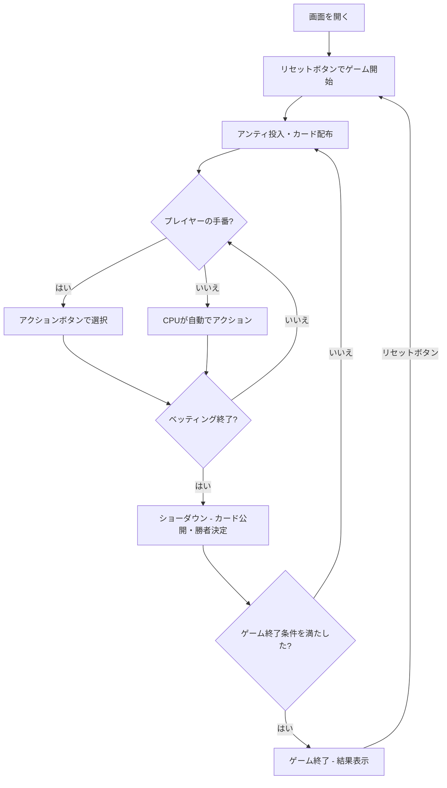

# インディアンポーカー（Web版）遊び方

## ゲーム概要

4人（プレイヤー1人 + CPU 3人）で遊ぶベッティング型カードゲームです。各プレイヤーに1枚ずつカードが配られ、自分のカードは見えず相手のカードだけが見える状態でベッティングを行います。カードのランクが最も高いプレイヤーがポットを獲得します。

## 起動方法

```sh
go run ./cmd/trumpcards web  # CLI経由でWebサーバーを起動
go run ./cmd/server          # 直接Webサーバーを起動
```

ブラウザで `http://localhost:8080` にアクセスし、ナビゲーションバーから「インディアンポーカー」を選択します。
ナビバーのJA/ENボタンで日本語・英語を切り替えられます。

## ルール

### 基本ルール

- 52枚のカードから各プレイヤーに1枚ずつ配布
- 自分のカードは見えない（額に貼り付けるイメージ）
- 他のプレイヤーのカードは見える
- カードのランクで勝敗を決定（2が最弱、Ace=14が最強）
- 各ラウンド開始時にアンティ（参加費）を投入

### ベッティング

- **フォールド**: 降りる（投入済みチップは失う）
- **チェック**: パスする（未ベット時のみ）
- **コール**: 現在のベット額に合わせる
- **ベット**: 最初の賭け金を出す
- **レイズ**: 現在のベット額を引き上げる
- **オールイン**: 全チップを賭ける

### ベッティングリミット

- **Fixed**: 固定額ベット
- **Pot Limit**: ポット額まで
- **No Limit**: 上限なし（デフォルト）

### ゲーム終了

- いずれかのプレイヤーのチップが0になった場合にゲーム終了

## ゲームの流れ



## 画面の操作方法

### ベッティングフェーズ

1. 他のプレイヤーのカードを確認します（自分のカードは「?」で表示）
2. 以下のアクションボタンから選択します：
   - **「フォールド」**: 降りる
   - **「チェック」**: パスする（ベットがない場合）
   - **「コール」**: 現在のベットに合わせる
   - **「ベット」**: 金額入力後にベットする
   - **「レイズ」**: 金額入力後にレイズする
   - **「オールイン」**: 全チップを賭ける

### ショーダウン

1. 全プレイヤーのカードが公開されます
2. 勝者とチップの移動が表示されます
3. 自動的に次のハンドが開始されます

### キーボードショートカット

| キー | アクション | 有効条件 |
|------|-----------|---------|

## 画面構成

```
┌────────────────────────────────────────────┐
│  ▶ 設定 (クリックで展開)                   │
│    アンティ:       [10]                     │
│    ベッティング:   [No Limit▼]             │
│    メタAI:        [ON]                      │
├────────────────────────────────────────────┤
│           CPU プレイヤーエリア              │
│ ┌──────────┐ ┌──────────┐ ┌──────────┐    │
│ │ CPU 1    │ │ CPU 2    │ │ CPU 3    │    │
│ │ 920チップ│ │ 680チップ│ │ 550チップ│    │
│ │ ♥K       │ │ ♠5       │ │ ♦10      │    │
│ │ ベット:30│ │ フォールド│ │ ベット:30│    │
│ └──────────┘ └──────────┘ └──────────┘    │
├────────────────────────────────────────────┤
│  ハンド #5 | ポット: 120 | アンティ: 10    │
├────────────────────────────────────────────┤
│     フッター: あなた (850チップ)            │
│  [???]  (自分のカードは見えない)            │
│  [フォールド] [チェック] [コール]           │
│  [ベット] [レイズ] [オールイン]             │
│  [リセット]                                │
└────────────────────────────────────────────┘
```

- **設定パネル（▶ 設定）**:
  - 「アンティ」: アンティ額を設定
  - 「ベッティング」: Fixed / Pot Limit / No Limit から選択
  - 「メタAI」: CPUのメタAI学習を有効/無効に切り替え
  - 次のリセット時に設定が適用される
- **CPU プレイヤーエリア**: 各 CPU のチップ、カード（表向き）、現在のベット状態
  - 手番の CPU は金色枠
- **ポット情報**: 現在のハンド番号、ポット合計、アンティ額
- **フッター（あなたのカード）**:
  - ベッティング中は「???」表示（自分のカードが見えない）
  - ショーダウン時にカードが公開される

## 遊び方のコツ

- 他のプレイヤーのカードを観察し、自分のカードの強さを推測しましょう
- 相手のカードが弱い場合、自分のカードが強い可能性が高いのでベットしましょう
- CPUのベッティングパターンから自分のカードの強さを推測できます
- オールインは慎重に。チップが0になるとゲーム終了です
- メタAIが有効な場合、CPUはあなたのプレイパターンを学習して戦略を調整します
