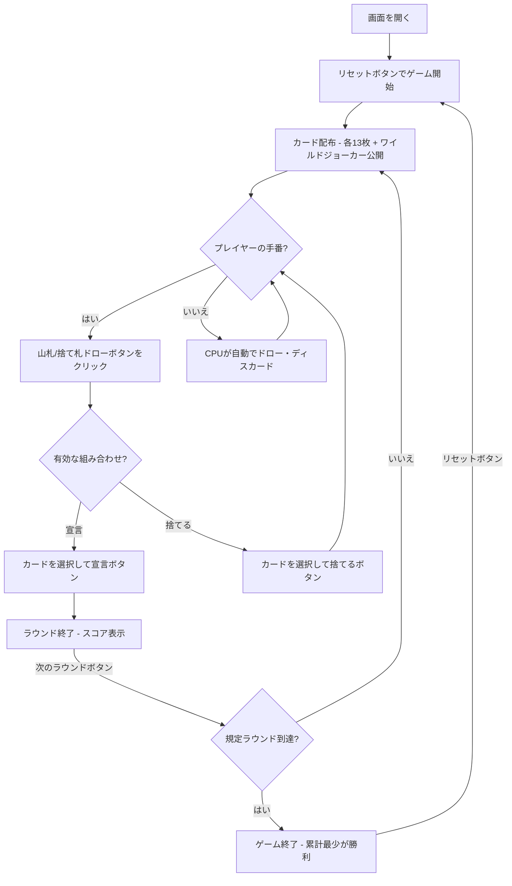

# インドラミー（Web版）遊び方

## ゲーム概要

2〜4人（プレイヤー1人 + CPU 1〜3人）で遊ぶインド発祥の13枚ラミーです。2デッキ + ジョーカー（計108枚）を使い、13枚の手札で有効な組み合わせ（2つ以上のシーケンス、うち少なくとも1つは純シーケンス）を作って宣言（上がり）を目指します。規定ラウンド消化時点で累計点が最も少ないプレイヤーが勝利します。

## 起動方法

```sh
go run ./cmd/trumpcards web  # CLI経由でWebサーバーを起動
go run ./cmd/server          # 直接Webサーバーを起動
```

ブラウザで `http://localhost:8080` にアクセスし、ナビゲーションバーから「インドラミー」を選択します。
ナビバーのJA/ENボタンで日本語・英語を切り替えられます。

## ルール

### 基本ルール

- 2デッキ + ジョーカー（108枚）を使用、2〜4人プレイ
- 各プレイヤーに13枚ずつ配り、1枚を表向きにして捨て札の山を開始、残りは山札（ストック）
- 手番ではまず山札または捨て札の山からカードを1枚ドローする
- その後、手札からカードを1枚捨てる。手札が有効な組み合わせなら宣言して上がる

### シーケンスとセット

- **シーケンス（連番）**: 同スート3枚以上の連続したカード
  - **純シーケンス**: ジョーカーを含まないシーケンス（上がりに最低1つ必須）
  - **不純シーケンス**: ワイルド／ジョーカーを含むシーケンス
- **セット**: 同ランク3〜4枚（異なるスート）

### ワイルドジョーカー

- 配り終えた後に1枚が表向きにされ、そのランクがワイルド（万能札）になる
- ワイルドランクのカードと印刷ジョーカーは、シーケンスやセットの穴埋めに使える

### デッドウッドと得点

- 有効な組み合わせに入らないカードの点（J/Q/K=10点、A=1点、その他=額面）の合計がデッドウッド（最大80点）
- 誰かが正しく宣言するとラウンド終了。宣言が無効なら宣言者にペナルティ

### ゲーム終了

- 規定ラウンド数（デフォルト3）を消化した時点で、累計点が最も少ないプレイヤーが勝利

### CPU難易度

- **Easy**: ランダムに近いプレイ
- **Normal**: 基本的なメルド戦略（デフォルト）
- **Hard**: 戦略的なプレイ

## ゲームの流れ



## 画面の操作方法

### ドローフェーズ

1. **「山札から引く」** ボタンでストックから1枚引く
2. **「捨て札から引く」** ボタンで捨て札の山のトップカードを引く

### ディスカード／宣言フェーズ

1. 手札のカードをクリックして選択（1枚）
2. **「捨てる」** ボタンで選択したカードを捨てる
3. 手札が有効な組み合わせなら、14枚目を選択して **「宣言」** ボタンで上がる

### ラウンド終了

1. **「次のラウンド」** ボタンで次のラウンドに進む

## 画面構成

```
┌────────────────────────────────────────────┐
│  ▶ 設定 (クリックで展開)                   │
│    プレイヤー数:  [4▼]                      │
│    CPU難易度:     [Normal▼]                │
│    ラウンド数:    [3▼]                      │
├────────────────────────────────────────────┤
│  ワイルドジョーカー: ♣5                     │
│  捨て札: ♥7                                 │
├────────────────────────────────────────────┤
│              CPU エリア                     │
│  CPU 1: 13枚 | 累計: 10                     │
├────────────────────────────────────────────┤
│  ラウンド 2/3 | 山札: 40枚                  │
├────────────────────────────────────────────┤
│         フッター: あなたの手札              │
│  [♠3][♠4][♠5][♥9]...                       │
│  [リセット] [山札から引く] [捨て札から引く] │
│  [捨てる] [宣言]                            │
└────────────────────────────────────────────┘
```

- **設定パネル（▶ 設定）**:
  - 「プレイヤー数」セレクト: 2〜4人
  - 「CPU難易度」セレクト: Easy / Normal / Hard
  - 「ラウンド数」: 規定ラウンド数を設定
  - 次のリセット時に設定が適用される
- **ワイルドジョーカー**: 今ラウンドのワイルドランクを示すカード
- **CPUエリア**: 各CPUの手札枚数とスコア（ラウンド／ゲーム終了時に手札を公開し、デッドウッドと純シーケンスの有無を表示）
- **手札の状況**（ディスカードフェーズ）: いまのデッドウッド点と純シーケンスの有無を常時表示。カードを選んでいなくても確認できます（CUI と同じ 2 情報）
- **フッター（あなたの手札）**: クリックで選択（緑枠 + 上に浮き上がる）
- **スコアテーブル**: 各プレイヤーのラウンドスコアと累積スコア

## 遊び方のコツ

- まず純シーケンス（ジョーカーなしの連番）を1つ確保しましょう。上がりの必須条件です
- ワイルドジョーカーはセットや不純シーケンスの穴埋めに温存すると効率的です
- デッドウッドの高いカード（J/Q/K=10点）は早めに処理しましょう
- 宣言は手札が確実に有効なときだけ。無効宣言はペナルティになります
- 相手の捨て札を見て、狙いのシーケンス／セットを推測しましょう
