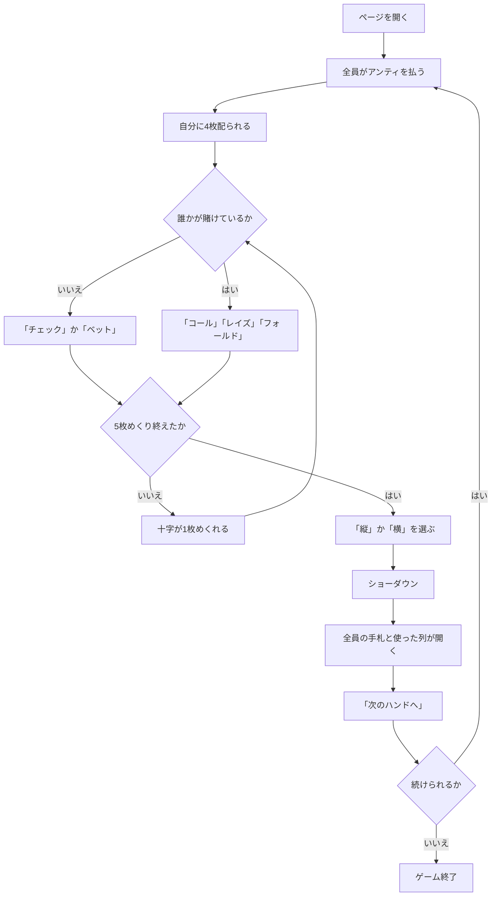

# アイアンクロス（Web版）遊び方

## ゲーム概要

アイアンクロス（クリスクロス）は、アメリカのホームポーカーで遊ばれるバリアントです。

**手札は 4 枚**、場のコミュニティは **5 枚**。ただし場の 5 枚は十字に並べられ、**使えるのは縦の 3 枚か横の 3 枚のどちらか一方だけ**です。

```
    [1]
[3] [0] [4]
    [2]
```

- **縦の列**: 上 `[1]` → 中央 `[0]` → 下 `[2]`
- **横の列**: 左 `[3]` → 中央 `[0]` → 右 `[4]`

**中央の 1 枚だけが両方の列に入ります。** どちらを選んでも半分は同じで、違うのは残りの 2 枚 — これがこのゲームの唯一にして最大の判断です。

## 起動方法

```sh
go run ./cmd/trumpcards web  # CLI経由でWebサーバーを起動
go run ./cmd/server          # 直接Webサーバーを起動
```

サーバ起動後、ブラウザで `http://localhost:8080/ironcross` を開きます。

## ルール

- 標準 52 枚。3〜7 席（既定 4 席）で、席 0 があなた、残りは CPU です。
- 開始時に全員がアンティ（既定 10）を払います。
- 各自に **4 枚**を伏せて配ります。十字の 5 枚も伏せて置かれます。
- **十字を 1 枚めくるたびにベットラウンド**が入ります（計 5 回）。
  - 誰も賭けていなければ **チェック** または **ベット**
  - 誰かが賭けていれば **コール** / **レイズ** / **フォールド**
  - **レイズは 1 ラウンド 3 回まで**です。
- **めくる順番は、上 → 下 → 左 → 右 → 中央**です。両方の列に入る中央が最後に開きます。
- 5 枚すべてが公開されたら、**縦か横かを選びます**。
- **手札 4 枚 + 選んだ列の 3 枚の 7 枚から、最良の 5 枚**で役を比べます。選ばなかった列の札は使えません。
- いちばん強い役の席がポットを取ります。同じ役なら山分けし、端数は若い席から配ります。
- チップが尽きた席は脱落し、あなたが賭けられなくなるか、残り 1 席になったら終了です。

## ゲームの流れ



## 画面の操作方法

| 操作 | 説明 |
|------|------|
| 「チェック」 | 賭けずに次へ。誰も賭けていないときだけ押せます |
| 「コール」 | 現在の賭け額に合わせます。必要額が表示されます |
| 「ベット」＋額入力 | 誰も賭けていないときに賭けます |
| 「レイズ」＋額入力 | 上乗せします。**1ラウンド3回まで**で、上限に達すると押せません |
| 「フォールド」 | 降ります |
| 「縦を使う」 | 上・中央・下の3枚を使います。**5枚出そろってからだけ押せます** |
| 「横を使う」 | 左・中央・右の3枚を使います |
| 「次のハンドへ」 | ショーダウン後、次のハンドを始めます |
| ヒントボタン | いまの場面の定石を表示します。列を選ぶ場面では**どちらが強いかを名指し**します |
| 棋譜ボタン | これまでの行動ログを表示します |
| リセットボタン | ゲームを最初からやり直します |

**押せる手はサーバが決めています。** チェックできるか、レイズが残っているか、列を選ぶ場面かは場況で変わるので、押せないときはボタンが出ません。

## 画面構成

- **フェーズ表示**: `BETTING`（ベット）/ `CHOOSE LINE`（列を選ぶ）/ `SHOWDOWN`（ショーダウン）/ `GAME END`（終了）
- **十字**: 実際の十字の形で並びます。伏せている位置は裏向きのまま残るので、**どの枝が開いたか**が常に分かります
- **列のハイライト**: 縦・横それぞれのボタンにカーソルを合わせると、その列の 3 枚が示されます
- **自分の手札**: 4 枚。常に表示されます
- **CPU の席**: **ショーダウンまで手札も選んだ列も伏せたまま**です。チップ・賭け額・降りたかどうかは見えます
- **ポット**と**コールに必要な額**
- **ショーダウン**: 全員の手札、使った列、選ばれた最良の 5 枚、獲得額

## 遊び方のコツ

- **中央の札は必ず使えます。** 中央が自分の手札と噛み合っているなら、どちらの列を選んでもその分は残ります。逆に中央が無関係なら、実質「2 枚だけ選ぶ」ゲームになります。
- **中央は最後にめくれます。** 上下左右が出そろっても、まだ勝負は決まりません。
- **弱いほうの列を選んでも修正されません。** 選んだ列がそのまま勝負に使われます。ここだけは取り返しがつきません。
- **降りどころが 5 回あります。** 噛み合わない手を 5 回ぶんのベットに付き合わせるのがいちばん高くつきます。
- **レイズの上限（3 回）を覚えておいてください。** 上限に達すると押し切れません。
